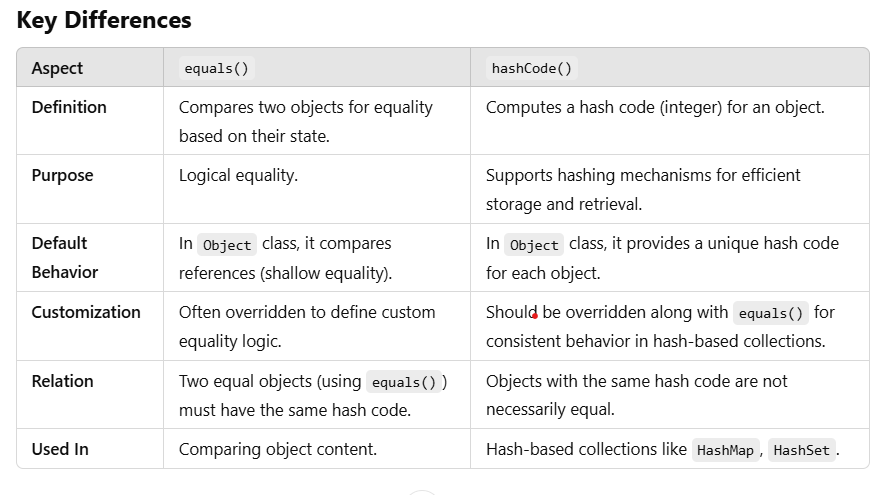
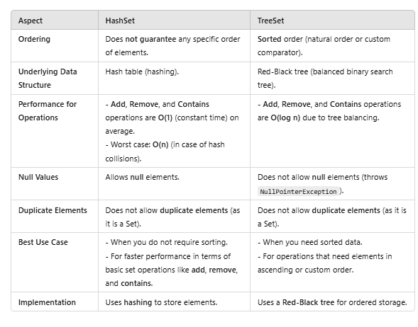
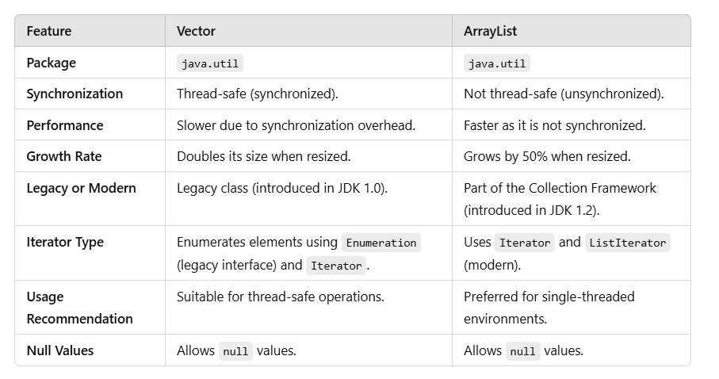
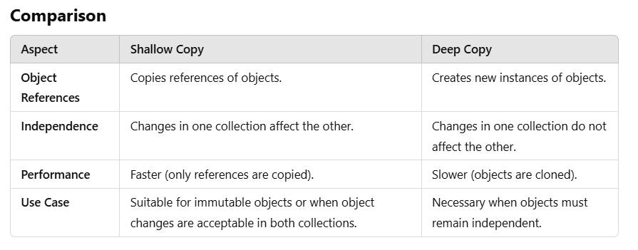
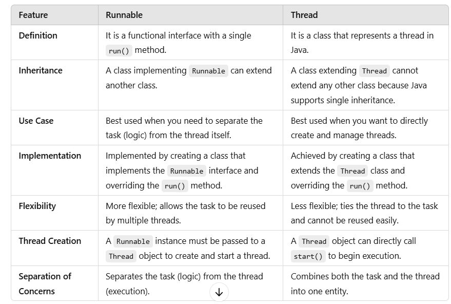

# java-interview-questions

**Java Basics**
**Object-Oriented Programming (OOP)**
**Java Collections Framework**
1. [What are the key features of Java?](https://github.com/hkrishna439/java-interview-questions#1-what-are-the-key-features-of-java)
2. [What is the difference between JDK, JRE, and JVM?](https://github.com/hkrishna439/java-interview-questions#2-what-is-the-difference-between-jdk-jre-and-jvm)
3. [Why is Java platform-independent?](https://github.com/hkrishna439/java-interview-questions#3-why-is-java-platform-independent)
4. [What is the purpose of the main method?](https://github.com/hkrishna439/java-interview-questions#4-what-is-the-purpose-of-the-main-method)
5. [What is the difference between static, final, and abstract?](https://github.com/hkrishna439/java-interview-questions#5-what-is-the-difference-between-static-final-and-abstract)
6. [Explain the difference between this and super.](https://github.com/hkrishna439/java-interview-questions#6-explain-the-difference-between-this-and-super)
7. [What are Java’s access modifiers?](https://github.com/hkrishna439/java-interview-questions#7-what-are-javas-access-modifiers)
8. [What is the difference between instance and local variables?](https://github.com/hkrishna439/java-interview-questions#8-what-is-the-difference-between-instance-and-local-variables)
9. [What is the purpose of the package keyword?](https://github.com/hkrishna439/java-interview-questions#9-what-is-the-purpose-of-the-package-keyword)
10. [What are the rules for Java identifiers?](https://github.com/hkrishna439/java-interview-questions#10-what-are-the-rules-for-java-identifiers)
11. [What is the use of the import statement?](https://github.com/hkrishna439/java-interview-questions#11-what-is-the-use-of-the-import-statement)
12. [What is a constructor in Java?](https://github.com/hkrishna439/java-interview-questions#12-what-is-a-constructor-in-java)
13. [Can a constructor be static or final?](https://github.com/hkrishna439/java-interview-questions#13can-a-constructor-be-static-or-final)
14. [What is the String class in Java?](https://github.com/hkrishna439/java-interview-questions#14-what-is-the-string-class-in-java)
15. [What is the difference between String, StringBuilder, and StringBuffer?](https://github.com/hkrishna439/java-interview-questions#15-what-is-the-difference-between-string-stringbuilder-and-stringbuffer)
16. [What is the difference between == and .equals()?](https://github.com/hkrishna439/java-interview-questions#16-what-is-the-difference-between--and-equals)
17. [How does Java handle null values?](https://github.com/hkrishna439/java-interview-questions#17-how-does-java-handle-null-values)
18. [What is the use of the instanceof operator?](https://github.com/hkrishna439/java-interview-questions#18-what-is-the-use-of-the-instanceof-operator)
19. [What is the difference between checked and unchecked exceptions?](https://github.com/hkrishna439/java-interview-questions#19-what-is-the-difference-between-checked-and-unchecked-exceptions)
20. [What is the purpose of the try-catch block?](https://github.com/hkrishna439/java-interview-questions#20-what-is-the-purpose-of-the-try-catch-block)
21. [Explain abstraction with an example.](https://github.com/hkrishna439/java-interview-questions#21-explain-abstraction-with-an-example)
22. [Explain encapsulation with an example.](https://github.com/hkrishna439/java-interview-questions#22-explain-encapsulation-with-an-example)
23. [Explain inheritance with an example.](https://github.com/hkrishna439/java-interview-questions#23-explain-inheritance-with-an-example)
24. [Explain polymorphism with an example.](https://github.com/hkrishna439/java-interview-questions#24-explain-polymorphism-with-an-example)
25. [What is the difference between an abstract class and an interface?](https://github.com/hkrishna439/java-interview-questions#25-what-is-the-difference-between-an-abstract-class-and-an-interface)
26. [Can an abstract class have a constructor?](https://github.com/hkrishna439/java-interview-questions#26-can-an-abstract-class-have-a-constructor)
27. [What are default methods in interfaces?](https://github.com/hkrishna439/java-interview-questions#27-what-are-default-methods-in-interfaces)
28. [Can an interface extend another interface?](https://github.com/hkrishna439/java-interview-questions#28-can-an-interface-extend-another-interface)
29. [What is multiple inheritance in Java?](https://github.com/hkrishna439/java-interview-questions#29-what-is-multiple-inheritance-in-java)
30. [What is the purpose of the Object class?](https://github.com/hkrishna439/java-interview-questions#30-what-is-the-purpose-of-the-object-class)
31. [What is the difference between hashCode() and equals()?](https://github.com/hkrishna439/java-interview-questions#31-what-is-the-difference-between-hashcode-and-equals)
32. [Can we override static methods in Java?](https://github.com/hkrishna439/java-interview-questions#32-can-we-override-static-methods-in-java)
33. [What is method hiding?](https://github.com/hkrishna439/java-interview-questions#33-what-is-method-hiding)
34. [What is the difference between final, finally, and finalize()?](https://github.com/hkrishna439/java-interview-questions#34-what-is-the-difference-between-final-finally-and-finalize)
35. [Can you override a private method in Java?](https://github.com/hkrishna439/java-interview-questions#35-can-you-override-a-private-method-in-java)
36. [Explain the super keyword with an example.](https://github.com/hkrishna439/java-interview-questions#36-explain-the-super-keyword-with-an-example)
37. [What is the difference between IS-A and HAS-A relationships?](https://github.com/hkrishna439/java-interview-questions#37-what-is-the-difference-between-is-a-and-has-a-relationships)
38. [How do you implement a singleton class in Java?](https://github.com/hkrishna439/java-interview-questions#38-how-do-you-implement-a-singleton-class-in-java)
39. [What is the Java Collections Framework?](https://github.com/hkrishna439/java-interview-questions#39-what-is-the-java-collections-framework)
40. [What is the difference between ArrayList and LinkedList?](https://github.com/hkrishna439/java-interview-questions#40-what-is-the-difference-between-arraylist-and-linkedlist)
41. [What is the difference between HashSet and TreeSet?](https://github.com/hkrishna439/java-interview-questions#41-what-is-the-difference-between-hashset-and-treeset)
42. [What is the difference between HashMap and Hashtable?](https://github.com/hkrishna439/java-interview-questions#42-what-is-the-difference-between-hashmap-and-hashtable)
43. [How does a HashMap work internally?](https://github.com/hkrishna439/java-interview-questions#43how-does-a-hashmap-work-internally)
44. [What are fail-fast and fail-safe iterators?](https://github.com/hkrishna439/java-interview-questions#44-what-are-fail-fast-and-fail-safe-iterators)
45. [What is the difference between Iterator and ListIterator?](https://github.com/hkrishna439/java-interview-questions#45-what-is-the-difference-between-iterator-and-listiterator)
46. [What is the purpose of Comparable and Comparator?](https://github.com/hkrishna439/java-interview-questions#46-what-is-the-purpose-of-comparable-and-comparator)
47. [What is the difference between Vector and ArrayList?](https://github.com/hkrishna439/java-interview-questions#47-what-is-the-difference-between-vector-and-arraylist)
48. [How is LinkedHashMap different from HashMap?](https://github.com/hkrishna439/java-interview-questions#48-how-is-linkedhashmap-different-from-hashmap)
49. [What is ConcurrentHashMap?](https://github.com/hkrishna439/java-interview-questions#49-what-is-concurrenthashmap)
50. [Explain TreeMap with an example.](https://github.com/hkrishna439/java-interview-questions#50-explain-treemap-with-an-example)
51. [What is the difference between queue and deque?](https://github.com/hkrishna439/java-interview-questions#51-what-is-the-difference-between-queue-and-deque)
52. [What is the PriorityQueue in Java?](https://github.com/hkrishna439/java-interview-questions#52-what-is-the-priorityqueue-in-java)
53. [Explain the Stack class with an example.](https://github.com/hkrishna439/java-interview-questions#53-explain-the-stack-class-with-an-example)
54. [How does HashSet handle duplicates?](https://github.com/hkrishna439/java-interview-questions#54-how-does-hashset-handle-duplicates)
55. [What are immutable collections in Java?](https://github.com/hkrishna439/java-interview-questions#55-what-are-immutable-collections-in-java)
56. [What are synchronized collections?](https://github.com/hkrishna439/java-interview-questions#56-what-are-synchronized-collections)
57. [Explain the Collections utility class.](https://github.com/hkrishna439/java-interview-questions#57-explain-the-collections-utility-class)
58. [What is the difference between Arrays and Collections classes?](https://github.com/hkrishna439/java-interview-questions#58-what-is-the-difference-between-arrays-and-collections-classes)
59. [How do you sort a list in Java?](https://github.com/hkrishna439/java-interview-questions#59-how-do-you-sort-a-list-in-java)
60. [Explain the forEach() method in Java.](https://github.com/hkrishna439/java-interview-questions#60-explain-the-foreach-method-in-java)

### 1. What are the key features of Java?

Java is a widely-used, high-level programming language known for its versatility, performance, and platform independence. Below are the key features of Java:

**1. Platform Independence**
* Java uses the "**Write Once, Run Anywhere" (WORA)** principle.
* Programs written in Java are compiled into **bytecode**, which can run on any system with a Java Virtual Machine (JVM), regardless of the underlying operating system or hardware.

**2. Object-Oriented Programming (OOP)**
*    Java is based on OOP principles like encapsulation, inheritance, and polymorphism.
*    It allows developers to model real-world entities, improving code reuse and maintainability.

**3. Simple and Easy to Learn**
*    Java has a clean syntax derived from C and C++, but without complex features like explicit pointers and memory management.
*    The automatic garbage collection simplifies memory management.

**4. Robust**
*    Java provides strong memory management, exception handling, and type-checking mechanisms to ensure fewer runtime errors.
*    Its automatic **garbage collector** helps prevent memory leaks.

**5. Secure**
- Java provides built-in security features like:
  *    **Bytecode verification:** Ensures code adheres to Java's rules.
  *    **Classloader:** Separates the loading of classes from the local filesystem.
  *    **Security manager:** Defines access controls for Java applications.

**6. Multithreading**
*    Java supports concurrent execution of multiple threads, allowing better utilization of CPU resources.
*    Its built-in thread model simplifies writing multi-threaded applications.

**7. Distributed Computing**
*    Java provides APIs like **RMI (Remote Method Invocation)** and **CORBA**, enabling the development of distributed applications.

**8. High Performance**
*    While Java is an interpreted language, the **Just-In-Time (JIT) Compiler** converts bytecode to native machine code at runtime, improving performance.

**9. Portability**
*    Java programs are hardware and OS-independent due to its bytecode and JVM architecture.
*    The standard library provides a consistent programming environment across different platforms.

**10. Dynamic and Extensible**
*    Java can dynamically link libraries and objects at runtime, making it more adaptable to evolving environments.
*    It supports **dynamic loading of classes**.

**11. Rich Standard Library**
- Java comes with an extensive set of libraries for various functionalities:
  *    **Data structures:** Collections Framework
  *    **I/O operations:** java.io, java.nio
  *    **Networking:** java.net
  *    **Concurrency:** java.util.concurrent
  *    **Database access:** JDBC (Java Database Connectivity)

**12. Scalability**
*    Java is well-suited for both small-scale applications (e.g., desktop programs) and large-scale enterprise systems (e.g., web servers and microservices).

**13. Support for Functional Programming**
- Java 8 introduced functional programming features like:
  *    Lambda expressions
  *    Streams API for processing collections
  *    Method references

**14. Tooling and Ecosystem**
*    A wide range of tools (Eclipse, IntelliJ IDEA, Maven, Gradle) supports Java development, deployment, and testing.
*    Frameworks like Spring, Hibernate, and JUnit enhance development productivity.

**15. Backward Compatibility**
*    Java maintains compatibility between versions, ensuring older applications run seamlessly on newer Java versions with minimal changes.

**16. Community and Support**
*    Java has a vast and active developer community, providing extensive resources, libraries, and frameworks.

### 2. What is the difference between JDK, JRE, and JVM?

The terms **JDK**, **JRE**, and **JVM** are essential components of the Java ecosystem. While they are interrelated, they serve distinct purposes. Here's a detailed explanation of each and their differences:

**1. JVM (Java Virtual Machine)**
- **Definition**: The JVM is the runtime engine that executes Java bytecode. It is responsible for providing an environment in which Java programs can run.
- **Key Responsibilities:**
  *   Converts **bytecode** (generated by the compiler) into machine-specific instructions.
  *   Handles **memory management** via Garbage Collection.
  *   Ensures platform independence by providing a layer of abstraction over the underlying hardware/OS.
- **Components:**
  - **Class Loader:** Loads class files into memory.
  - **Execution Engine:** Interprets or compiles bytecode to machine code (via JIT Compiler).
  - **Runtime Data Area:** Includes heap, stack, method area, and more.
  - **Platform Independence:** JVM ensures the Write Once, Run Anywhere (WORA) principle by abstracting the OS-specific implementation.

**Analogy:** **JVM is like a virtual machine that runs compiled Java programs, regardless of the underlying hardware.**

**2. JRE (Java Runtime Environment)**
- **Definition:** JRE provides the necessary runtime environment to execute Java applications. It includes the JVM and essential libraries required for running programs.
- **Components:**
  - **JVM**: Executes Java bytecode.
  - **Java Libraries**: Pre-built class libraries like java.lang, java.io, java.util, etc.
  - **Other Supporting Files**: Configuration and resource files for execution.
- **Usage**: If you're only running Java applications (not developing), you only need the JRE.
     
**Analogy: JRE is like the engine in a car, providing everything needed to drive (run) it.**


**3. JDK (Java Development Kit)**
* **Definition:** The JDK is a complete software development kit for Java, including the tools needed to develop, compile, debug, and run Java applications.
* **Components:**
  - **JRE**: For running Java applications.
  - **Development Tools**:
     - **javac**: Java compiler (converts Java code to bytecode).
     - **javadoc**: Documentation generator.
     - **jar**: Tool for packaging Java applications.
     - Debuggers, profilers, and other tools.
- **Usage:** Required for developers who want to write and compile Java code.

**Analogy: JDK is like a toolbox containing everything needed to build, debug, and run Java programs.**


### 3. Why is Java platform-independent?

Java is considered **platform-independent** because of its ability to run on any operating system or hardware without requiring changes to the code. This platform independence is achieved through the use of the **Java Virtual Machine (JVM)** and **bytecode**. Here’s a detailed explanation of how Java achieves platform independence:

**1. Compilation to Bytecode**
*    When a Java program is compiled, the Java compiler (**javac**) converts the source code (written in `.java` files) into an intermediate format called **bytecode** (stored in `.class` files).
*    **Bytecode** is a low-level, platform-neutral instruction set designed to be executed by the JVM.
   
**Key Point: Bytecode is not specific to any machine or operating system, making it universally portable.**

**2. Java Virtual Machine (JVM)**
*    The **JVM** is a runtime environment responsible for executing bytecode. It acts as an abstraction layer between the Java bytecode and the underlying hardware/operating system.
*    Each platform (Windows, macOS, Linux, etc.) has its own implementation of the JVM, tailored to that specific platform. However, the bytecode remains the same across all platforms.
*    The JVM translates bytecode into **machine-specific instructions** at runtime, allowing the program to run on any system with a JVM.
   
**Key Point: The JVM ensures that the same bytecode can run on any platform without modification.**

**3. "Write Once, Run Anywhere" (WORA) Principle**
- Java’s design philosophy is **"Write Once, Run Anywhere"**:
   - Developers write Java code once.
   - The compiled bytecode can be executed on any platform that has a compatible JVM.

**Key Point: The JVM handles all platform-specific details, enabling the same program to run seamlessly across different environments.**

**4. Standard Libraries**
*    Java includes a rich set of **standard libraries** (e.g., java.io, java.util, java.net) that abstract platform-specific operations like file handling and networking.
*    These libraries ensure that developers don’t have to worry about differences between operating systems.

**Key Point: Java provides a consistent programming environment, regardless of the platform.**

**5. Cross-Platform Development Tools**
- Java development tools like the **JDK** and frameworks like Spring further support platform independence by standardizing the development and deployment process across different systems.

**Platform Independence Workflow**
1. Write Java code in a `.java` file.
2. Compile the code with the **Java compiler** (javac) to produce platform-independent bytecode (`.class` file).
3. Run the bytecode on any platform using the **JVM** for that platform.

**Examples of Platform Independence**
* A `.class` file compiled on Windows can run on Linux or macOS without modification, as long as the target system has a compatible JVM.
* Enterprise applications written in Java can run on any server environment (e.g., AWS, Azure, or on-premises systems), making Java a popular choice for distributed systems and microservices.


### 4. What is the purpose of the main method?
The **main method** in Java is the **entry point** of any standalone Java application. It is where the **JVM (Java Virtual Machine)** starts program execution. Without a `main` method, the program cannot run as a standalone application.

The `main` method in Java serves as the **starting point** of the application. It is:

1. A special method recognized by the JVM for program execution.
2. Used to pass and process command-line arguments.
3. Essential for creating standalone Java applications.
```java
public static void main(String[] args) {
    // Program logic here
}

```

**Example: Main Method with Command-Line Arguments**
```java
public class MainExample {
    public static void main(String[] args) {
        if (args.length > 0) {
            System.out.println("First Argument: " + args[0]);
        } else {
            System.out.println("No arguments provided.");
        }
    }
}

```
**Execution**
1. Run the program:
```
java MainExample Hello

```
2. Output:
```
First Argument: Hello

```

### 5. What is the difference between static, final, and abstract?
In Java, `static`, `final`, and `abstract` are keywords that serve distinct purposes in the language. Here's a detailed comparison of their differences:

1. `static`
   - **Purpose:** Used to define variables, methods, or blocks that belong to the class rather than to any specific instance of the class.
   
   **Key Features:**


**Example:**
```java
class Example {
    static int count = 0; // Static variable

    static void displayCount() { // Static method
        System.out.println("Count: " + count);
    }

    static { // Static block
        System.out.println("Class loaded!");
    }
}

```
- **Usage:**
  *    To share data among all instances of a class (e.g., counters, configuration values).
  *    Utility methods like `Math.sqrt()` are often `static`.

2. `final`
- **Purpose:** Used to declare constants, prevent method overriding, or restrict inheritance.


**Example**
```java
final class FinalClass { // Final class
    final int value = 42; // Final variable

    final void displayValue() { // Final method
        System.out.println("Value: " + value);
    }
}

```
- **Usage:**
    - To define constants (`final int MAX_VALUE = 100;`).
    - To secure methods or classes from being modified in subclasses.

3. `abstract`
   **Purpose**: Used to define a blueprint for classes, methods, or concepts without providing a complete implementation.


**Example**
```java
abstract class Shape { // Abstract class
    abstract void draw(); // Abstract method (no body)
}

class Circle extends Shape {
    void draw() { // Implementation of abstract method
        System.out.println("Drawing a Circle");
    }
}

```

- **Usage:**
    - When creating a base class that provides partial functionality but requires subclasses to implement specific behaviors.


**Combination Usage**
- `final` and `static` together:
```java
static final int MAX_VALUE = 100; // Constant

```
- `abstract` and `static` cannot be used together:

    - A `static` method cannot be abstract because `static` methods belong to the class, while `abstract` methods must be implemented by subclasses.

### 6. Explain the difference between this and super.

In Java, `this` and `super` are keywords used in object-oriented programming to refer to the current object and the parent class, respectively. Here's a detailed explanation of their differences:

1. `this`
**Purpose:**
The `this` keyword refers to the **current instance** of the class. It is commonly used to:

   * Access instance variables when there is a naming conflict.
   * Call other constructors within the same class.
   * Pass the current instance as a parameter.


**Example**
```java
class Example {
    private int number;

    Example(int number) {
        this.number = number; // Resolves conflict between instance and parameter
    }

    void display() {
        System.out.println("Number: " + this.number); // Refers to the current instance variable
    }

    Example() {
        this(42); // Calls the other constructor
    }
}

public class Main {
    public static void main(String[] args) {
        Example example = new Example();
        example.display();
    }
}

```
**Output**
```
Number: 42

```
2. `super`
**Purpose**:
The `super` keyword refers to the **parent class (superclass)** of the current object. It is commonly used to:

   * Access parent class members (fields or methods) that are hidden in the subclass.
   * Call the parent class constructor.
   * Invoke a method from the parent class that has been overridden.


**Example**
```java
class Parent {
    String name = "Parent";

    Parent() {
        System.out.println("Parent Constructor");
    }

    void show() {
        System.out.println("Parent Method");
    }
}

class Child extends Parent {
    String name = "Child";

    Child() {
        super(); // Calls the Parent constructor
        System.out.println("Child Constructor");
    }

    void show() {
        super.show(); // Calls the Parent's show() method
        System.out.println("Child Method");
    }

    void displayNames() {
        System.out.println("Parent name: " + super.name); // Access Parent's name
        System.out.println("Child name: " + this.name);   // Access Child's name
    }
}

public class Main {
    public static void main(String[] args) {
        Child child = new Child();
        child.show();
        child.displayNames();
    }
}

```
**Output**
```
Parent Constructor
Child Constructor
Parent Method
Child Method
Parent name: Parent
Child name: Child

```


### 7. What are Java’s access modifiers?

Java's **access modifiers** are keywords used to set the level of access to classes, methods, and variables. They control visibility and accessibility in the object-oriented programming paradigm.

**1. Types of Access Modifiers**\
   Java provides four access modifiers:


**2. Access Modifier Details**\

`public`
  *    **Visibility**: Accessible from **anywhere** (within the same class, package, or outside the package).
  *    **Usage**: Used for methods, variables, and classes that need to be universally accessible.
  *    **Example**

```java
public class PublicExample {
    public int value = 10;

    public void display() {
        System.out.println("Public Method");
    }
}

// Access from anywhere:
PublicExample obj = new PublicExample();
obj.display(); // Allowed

```
`protected`
* **Visibility**: Accessible within the **same package** and by **subclasses** in other packages.
* **Usage**: Commonly used in inheritance to allow access to child classes while hiding from the outside world.
* **Example**:

```java
class Parent {
    protected void show() {
        System.out.println("Protected Method");
    }
}

public class Child extends Parent {
    public static void main(String[] args) {
        Child obj = new Child();
        obj.show(); // Allowed (inherited method)
    }
}

```
`default` (**Package-private**, **no modifier specified**)
* **Visibility**: Accessible only within the **same package**. No keyword is required to define it.
* **Usage**: Used to limit access to classes and members within the package.
* **Example**:

```java
class DefaultExample {
    void display() { // No modifier means default
        System.out.println("Default Method");
    }
}

// Accessible only within the same package
DefaultExample obj = new DefaultExample();
obj.display(); // Allowed

```
`private`
* **Visibility**: Accessible only within the **same class**. Not visible to subclasses or other classes, even in the same package.
* **Usage**: Used to enforce encapsulation and restrict access to sensitive data or methods.
* **Example**:

```java
public class PrivateExample {
    private int value = 42;

    private void display() {
        System.out.println("Private Method");
    }

    public void accessPrivate() {
        display(); // Allowed (within the same class)
    }
}

// Access outside the class:
PrivateExample obj = new PrivateExample();
// obj.display(); // Not allowed
obj.accessPrivate(); // Indirect access allowed

```
**4. Access Modifier Usage in Classes**
* **Top-level classes**: Only public or default (package-private) modifiers are allowed.
* **Inner classes**: Can use public, protected, default, or private.

**Top-Level Class Example:**
```java
public class PublicClass {} // Allowed
class DefaultClass {} // Allowed
// private class PrivateClass {} // Not allowed

```


### 8. What is the difference between instance and local variables?
In Java, **instance variables** and **local variables** serve different purposes and have distinct scopes, lifetimes, and behaviors. Here's a detailed explanation of the differences:

**1. Instance Variables**
* **Definition**: Variables declared inside a class but outside any method, constructor, or block.
* **Scope**: Belong to an object (instance of a class) and are accessible throughout the class.
* **Lifetime**: Exist as long as the object exists in memory (until garbage collection).
* **Default Value**: Automatically initialized with default values (e.g., `0` for int, `null` for objects).
* **Access Modifiers**: Can be marked `private`, `public`, `protected`, or `default` to control accessibility.
* **Use**: Hold data that is specific to an instance of a class.

**Example**

```java
class Example {
    int instanceVariable = 10; // Instance variable

    public void display() {
        System.out.println("Instance Variable: " + instanceVariable);
    }

    public static void main(String[] args) {
        Example obj = new Example(); // Create an object
        obj.display(); // Access instance variable through object
    }
}

```
**2. Local Variables**
* **Definition**: Variables declared inside a method, constructor, or block.
* **Scope**: Exist only within the block/method where they are declared.
* **Lifetime**: Created when the block is executed and destroyed when the block exits.
* **Default Value**: Not initialized automatically; must be explicitly assigned a value before use.
* **Access Modifiers**: Cannot have access modifiers; always local to the block.
* **Use**: Store temporary data or control logic within a method or block.
   
**Example**:
```java
class Example {
    public void calculate() {
        int localVariable = 5; // Local variable
        System.out.println("Local Variable: " + localVariable);
    }

    public static void main(String[] args) {
        Example obj = new Example();
        obj.calculate(); // Access local variable within the method
    }
}

```


**4. Combined Example**
```java
class VariablesExample {
    int instanceVar = 10; // Instance variable

    public void show() {
        int localVar = 20; // Local variable
        System.out.println("Instance Variable: " + instanceVar);
        System.out.println("Local Variable: " + localVar);
    }

    public static void main(String[] args) {
        VariablesExample obj = new VariablesExample();
        obj.show();
        
        // System.out.println(localVar); // Error: localVar not accessible here
    }
}

```
**Output**

```
Instance Variable: 10
Local Variable: 20

```

### 9. What is the purpose of the package keyword?
The `package` keyword in Java is used to organize classes and interfaces into namespaces, making it easier to manage and structure code. It helps avoid naming conflicts, improves code reusability, and simplifies maintenance by logically grouping related classes.

**Purpose of the** `package` **Keyword**
1. **Organization of Code:**

* Packages group related classes and interfaces into a single namespace, making the codebase easier to navigate.
* Example: In a banking application, you might have packages like `com.bank.accounts` and `com.bank.transactions`.
2. **Avoidance of Naming Conflicts:**

* Without packages, different classes with the same name could lead to naming conflicts. Packages prevent this by providing a unique namespace.

Example
```java
com.company1.utils.Logger
com.company2.utils.Logger

```
3. **Access Control:**

* Packages help define the accessibility of classes and members using access modifiers like `default` and `protected`.
* Example: Classes in the same package can access each other’s `default` and `protected` members.

4. **Reusability:**

- Classes in a package can be reused across different projects or modules by simply importing the package.
5. **Modularity:**

- Packages promote modular programming by dividing the codebase into smaller, manageable units.
6. **Ease of Deployment:**

- Packages simplify the deployment of large projects, as they allow for clear separation of functionality.


**How to Use the `package` Keyword**
1. **Declaring a Package**:

    - The package keyword is used at the beginning of a Java file to specify the package.
    - Syntax:
```java
package packageName;

```
2. **Example**

```java
package com.example.utils;

public class Utility {
    public void display() {
        System.out.println("Utility class in com.example.utils package");
    }
}

```
3. **Importing Packages:**
- To use classes from another package, you can import the package.

- Syntax:
```java
import packageName.ClassName; // Import specific class
import packageName.*;         // Import all classes in the package

```
- Example
```java
import com.example.utils.Utility;

public class Main {
    public static void main(String[] args) {
        Utility util = new Utility();
        util.display();
    }
}

```
4. **Default Package:**

* If no package is specified, the class belongs to the **default package**.
* **Note**: Classes in the default package cannot be imported by classes in other packages, which is why it’s discouraged for large projects.

**Benefits of Using Packages**
* **Organized Structure:**

    - Makes large codebases more manageable.
    - Example: Java's standard library uses packages (`java.util`, `java.io`, etc.).
* **Encapsulation:**

    - Packages can hide implementation details by using access modifiers effectively.
3. **Easier Collaboration:**

    - Teams can work on separate packages without interfering with each other's code.
4. **Scalability:**

    - Allows for the addition of new features without disturbing the existing code structure.

**Real-World Example**\
A banking application might use packages as follows:
```
com.bank.accounts      // Classes like SavingsAccount, CurrentAccount
com.bank.transactions  // Classes like FundTransfer, Payment
com.bank.customers     // Classes like Customer, CustomerProfile

```

### 10. What are the rules for Java identifiers?
In Java, **identifiers** are names given to variables, methods, classes, packages, and other entities. There are specific rules and conventions for naming these identifiers in Java.

**Rules for Java Identifiers:**
1. **Start with a Letter, Underscore, or Dollar Sign:**

* An identifier must begin with a letter (`A-Z` or `a-z`), an underscore (`_`), or a dollar sign (`$`).
* Example: `age`, `_count`, `$total`.

2. **Subsequent Characters:**

* After the first character, an identifier can contain letters (`A-Z`, `a-z`), digits (`0-9`), underscores (`_`), or dollar signs (`$`).
* Example: `firstName`, `totalAmount1`, `sum_$`.

3. **Cannot Be a Java Keyword:**

* Identifiers cannot be any of the reserved Java keywords (such as `int`, `class`, `public`, `static`, etc.).
* Example: `class`, `public`, `new` are invalid identifiers.

4. **Case Sensitivity:**

* Java identifiers are **case-sensitive**, meaning `Variable`, `variable`, and `VARIABLE` are considered different identifiers.
* Example: `total` and `Total` are two distinct identifiers.

5. **No Special Characters Except Underscore and Dollar Sign:**

* Identifiers cannot contain spaces or special characters like `@,` `#,` `%,` `&,` etc.
* Example: `first-name`, `#value` are invalid identifiers.

6. **Length of the Identifier:**

* An identifier can be of any length, but it is recommended to use meaningful, readable names to improve code clarity.

7. **Cannot Start with a Digit:**

* An identifier cannot begin with a digit (`0-9`), although it can contain digits after the first character.
* Example: `1stValue` is an invalid identifier, but `value1` is valid.

8. **Avoid Using Reserved Words (Not Keywords):**

* Java also reserves certain words that are not technically keywords but are still restricted. For example, `true`, `false`, and `null` are literal values and cannot be used as identifiers.
* Example: `true`, `null` are invalid identifiers.

**Examples of Valid and Invalid Identifiers:**\
**Valid Identifiers:**
```java
int totalAmount;         // Starts with a letter, contains letters and digits
String _firstName;       // Starts with an underscore
boolean $isActive;       // Starts with a dollar sign
int MAX_VALUE;           // All uppercase letters (commonly used for constants)

```
**Invalid Identifiers:**
```java
int 123abc;              // Starts with a digit
String class;            // `class` is a keyword
boolean @value;          // Contains an invalid character (@)
int first-name;          // Contains a hyphen (-)

```
**Java Identifier Naming Conventions:**\
Although not strictly required by the language, Java developers follow certain naming conventions for better readability and maintainability of the code:

  *    **Class names**: Use **PascalCase** (e.g., `MyClass`, `EmployeeDetails`).
  *    **Method and variable names**: Use camelCase (e.g., `calculateTotal()`, `firstName`).
  *    **Constant names**: Use **UPPER_SNAKE_CASE** (e.g., `MAX_VALUE`, `PI`).
  *    **Package names**: Typically all lowercase, often with reverse domain name (e.g., `com.mycompany.project`).


### 11. What is the use of the import statement?

The import statement in Java is used to allow access to classes, interfaces, or entire packages from another package, making it easier to use those classes in your program without needing to fully qualify their names each time.


**Uses of the** `import` **Statement**:
1. **Simplify Code:**

* Instead of using fully qualified class names (e.g., `java.util.ArrayList`), you can use shorter class names by importing them (e.g., `ArrayList`).

2. **Access Classes from Other Packages:**

* Java classes are grouped into packages. The `import` statement allows you to access those classes directly.
* Example:

```java
import java.util.Scanner;
Scanner sc = new Scanner(System.in);

```

3. **Improves Readability:**

* Using import makes the code more concise and readable, as it eliminates repetitive package prefixes.

4. **Supports Modular Programming:**

* Enables the reuse of existing libraries or utilities, fostering modular and scalable programming.

**Types of Import Statements:**
1. **Single Type Import:**

* Imports a specific class or interface from a package.
* Syntax:

```java
import packageName.ClassName;

```
* Example
```java
import java.util.ArrayList;
ArrayList<Integer> list = new ArrayList<>();

```

2. **Wildcard Import:**

* Imports all classes and interfaces from a package.
* Syntax

```java
import packageName.*;

```
* Example
```java
import java.util.*;
ArrayList<Integer> list = new ArrayList<>();
HashMap<String, String> map = new HashMap<>();

```
* **Note**: Wildcard imports can lead to namespace conflicts and are generally discouraged in favor of explicit imports.


3. **Static Import:**

* Imports static members (fields and methods) of a class so that they can be accessed directly without class qualification.
* Syntax:

```java
import static packageName.ClassName.staticMember;

```
* Example

```java
import static java.lang.Math.PI;
import static java.lang.Math.sqrt;

double radius = 5;
double area = PI * radius * radius;
double result = sqrt(area);

```

**Key Points About `import`:**
1. **No Need to Import `java.lang`:**

* Classes in the `java.lang` package (e.g., `String`, `Math`, `Object`) are automatically imported.

2. **Fully Qualified Names Can Bypass Import:**

* Instead of using `import`, you can use a class's fully qualified name in the code.
* Example:
```java
java.util.ArrayList<Integer> list = new java.util.ArrayList<>();

```
3. **Static Import for Constants and Utility Methods:**

* Static imports are especially useful for constants and utility methods, making the code cleaner.
* Example
```java
import static java.lang.Math.*;

double value = pow(2, 3); // No need to write Math.pow()

```
4. **Custom Packages:**

* If you define your own packages, you can use the import statement to use classes from those packages in other parts of your project.
* Example:
```java
package mypackage;

public class MyClass {
    public void display() {
        System.out.println("Hello from MyClass");
    }
}

```
```java
import mypackage.MyClass;

public class Main {
    public static void main(String[] args) {
        MyClass obj = new MyClass();
        obj.display();
    }
}

```


### 12. What is a constructor in Java?

A **constructor** in Java is a special method used to initialize objects. It is called automatically when an object is created. Unlike regular methods, constructors do not have a return type (not even `void`) and must have the same name as the class.

**Characteristics of Constructors:**
1. **Same Name as the Class:**

    - The constructor's name must match the class name exactly.
2. **No Return Type:**

   - Constructors do not have a return type, not even void.
3. **Called Automatically:**

    - Constructors are invoked automatically when an object is instantiated.
4. **Overloading Allowed:**

    - Multiple constructors can exist in a class with different parameter lists (constructor overloading).


**Types of Constructors:**
1. **Default Constructor (No-Argument Constructor):**

    - If no constructor is defined explicitly, Java provides a default constructor that initializes the object with default values.

```java
public class Example {
    int number;
    String text;

    // Default constructor
    public Example() {
        number = 0;
        text = "Default";
    }
}

public class Main {
    public static void main(String[] args) {
        Example obj = new Example();
        System.out.println("Number: " + obj.number); // Output: 0
        System.out.println("Text: " + obj.text);    // Output: Default
    }
}

```

2. **Parameterized Constructor:**

    - A constructor that accepts arguments to initialize an object with specific values.

```java
public class Example {
    int number;
    String text;

    // Parameterized constructor
    public Example(int num, String txt) {
        number = num;
        text = txt;
    }
}

public class Main {
    public static void main(String[] args) {
        Example obj = new Example(42, "Hello");
        System.out.println("Number: " + obj.number); // Output: 42
        System.out.println("Text: " + obj.text);    // Output: Hello
    }
}

```
3. **Copy Constructor:**

    - Used to create a new object as a copy of an existing object. Java does not provide a built-in copy constructor, but you can implement one manually.

```java
public class Example {
    int number;
    String text;

    // Parameterized constructor
    public Example(int num, String txt) {
        number = num;
        text = txt;
    }

    // Copy constructor
    public Example(Example obj) {
        this.number = obj.number;
        this.text = obj.text;
    }
}

public class Main {
    public static void main(String[] args) {
        Example obj1 = new Example(42, "Hello");
        Example obj2 = new Example(obj1); // Copy constructor called
        System.out.println("Number: " + obj2.number); // Output: 42
        System.out.println("Text: " + obj2.text);    // Output: Hello
    }
}

```


**Best Practices:**
1. **Use Parameterized Constructors for Flexibility:**

    - Parameterized constructors make it easier to create objects with specific values.
2. **Use `this` Keyword:**

    - Use this to differentiate between class fields and constructor parameters if their names are the same.

```java
public class Example {
    int number;

    public Example(int number) {
        this.number = number; // Distinguishes between field and parameter
    }
}

```
3. **Avoid Heavy Logic in Constructors:**

    - Keep constructors simple and avoid including complex logic that could make the code harder to maintain.

4. Use **constructor chaining** (this(...)) to call one constructor from another within the same class to avoid duplicate code.

Example of Constructor Chaining:
```java
public class Employee {
    String name;
    int id;

    // Constructor chaining
    public Employee() {
        this("Default Name", 0); // Calls the parameterized constructor
    }

    public Employee(String name, int id) {
        this.name = name;
        this.id = id;
    }

    public void display() {
        System.out.println("Name: " + name + ", ID: " + id);
    }

    public static void main(String[] args) {
        Employee emp1 = new Employee();
        Employee emp2 = new Employee("John", 101);

        emp1.display(); // Output: Name: Default Name, ID: 0
        emp2.display(); // Output: Name: John, ID: 101
    }
}

```


**Common Use Case:**\
Constructors are commonly used to enforce object immutability by requiring all essential values to be set at the time of object creation.

```java
public class Person {
    private final String name;
    private final int age;

    // Parameterized constructor
    public Person(String name, int age) {
        this.name = name;
        this.age = age;
    }

    public String getName() {
        return name;
    }

    public int getAge() {
        return age;
    }
}

```
**Constructor Overloading:**\
Java allows overloading of constructors, which means you can have multiple constructors with different parameter lists.

Example:
```java
public class Person {
    String name;
    int age;

    // Default Constructor
    public Person() {
        this.name = "Default Name";
        this.age = 0;
    }

    // Parameterized Constructor
    public Person(String name) {
        this.name = name;
        this.age = 0;
    }

    // Another Parameterized Constructor
    public Person(String name, int age) {
        this.name = name;
        this.age = age;
    }

    public void display() {
        System.out.println("Name: " + name + ", Age: " + age);
    }

    public static void main(String[] args) {
        Person p1 = new Person();
        Person p2 = new Person("Bob");
        Person p3 = new Person("Charlie", 30);

        p1.display(); // Output: Name: Default Name, Age: 0
        p2.display(); // Output: Name: Bob, Age: 0
        p3.display(); // Output: Name: Charlie, Age: 30
    }
}

```

**Why Use Constructors?**
1. **Object Initialization:**
    - Ensures the object is in a valid state after creation.
2. **Code Simplicity:**
   - Automatically sets up the object during creation, reducing manual initialization.
3. **Overloaded Flexibility:**
   - Allows multiple ways of initializing an object by overloading constructors.

### 13.Can a constructor be static or final?

**1. Static Constructor:**
*    **No, constructors cannot be static in Java.**
*    A constructor is meant to initialize an instance of a class, and it operates on instance-level data.
*    The `static` keyword is used for class-level methods or fields, which are shared among all instances and are not tied to any specific object.
*    Since constructors are inherently tied to the creation of objects (instances), making them static contradicts their purpose.

**Why Not Static?**
- A `static` method can be called without creating an instance of a class, but constructors are specifically designed to create instances. Hence, they cannot be static.

**2. Final Constructor:**
*    **No, constructors cannot be declared as `final` in Java.**
*    The final keyword prevents method overriding. However, constructors are not inherited and cannot be overridden by subclasses. Thus, there is no reason or provision to declare a constructor as `final`.

**Why Not Final?**
* The `final` keyword is applicable only to methods, classes, and variables, and it serves no purpose for constructors because:
    1. Constructors are not inherited.
    2. Constructors are not designed to be overridden.


**What Can Be Done Instead?**
* You can use the `final` keyword for fields or methods to enforce immutability or prevent method overriding.
* Static initialization blocks (`static { ... }`) can be used to initialize class-level static data, but they are not constructors.

**Example: Static Initialization Block**\
If you need something like a "static constructor" for class-level initialization:
```java
public class StaticExample {
    static int staticValue;

    // Static block for initialization
    static {
        staticValue = 100;
        System.out.println("Static block executed.");
    }

    public StaticExample() {
        System.out.println("Constructor executed.");
    }

    public static void main(String[] args) {
        System.out.println("Static value: " + staticValue);
        StaticExample obj = new StaticExample();
    }
}

```
**Output:**
```
Static block executed.
Static value: 100
Constructor executed.

```

### 14. What is the String class in Java?
The `String` class in Java represents a sequence of characters. It is a widely used class in Java, and all string literals (e.g., "`Hello`") are instances of the `String` class. Strings are immutable, meaning once created, their content cannot be changed.

**Key Features of the String Class:**
1. **Immutability:**

    - A String object cannot be modified after it is created. Any modification results in the creation of a new string.

Example:
```java
String str = "Hello";
str = str + " World";
System.out.println(str); // Output: Hello World

```
2. **Stored in String Pool:**

    - String literals are stored in the **String Constant Pool** for memory efficiency. If a string with the same value already exists, the reference to the existing object is returned.
3. **Java’s Built-in Methods:**

    - The `String` class provides many methods for string manipulation, such as concatenation, comparison, length calculation, substring extraction, etc.
4. **Implements `Serializable` and `Comparable`:**

   - Strings can be serialized and compared lexicographically using the `Comparable` interface.

**Creating Strings:**
1. **Using String Literals:**
```java
String str = "Hello";

```
2. Using the `new` Keyword:
```java
String str = new String("Hello");

```
This creates a new object in the heap, even if the same string exists in the pool.


**Example: Using the String Class**
```java
public class StringExample {
    public static void main(String[] args) {
        String str1 = "Java";
        String str2 = new String("Java");

        // String methods
        System.out.println("Length: " + str1.length());              // Output: Length: 4
        System.out.println("Char at 2: " + str1.charAt(2));          // Output: Char at 2: v
        System.out.println("Substring: " + str1.substring(1, 3));    // Output: Substring: av
        System.out.println("Equals: " + str1.equals(str2));          // Output: Equals: true
        System.out.println("Contains 'va': " + str1.contains("va")); // Output: Contains 'va': true

        // Immutability demonstration
        String str3 = str1.concat(" Programming");
        System.out.println("Original: " + str1);                     // Output: Original: Java
        System.out.println("New String: " + str3);                  // Output: New String: Java Programming
    }
}

```
**Advantages of String Immutability:**
1. **Security:**

    - Strings used in sensitive operations (e.g., passwords or database connections) cannot be modified.
2. **Thread Safety:**

    - Immutable objects are inherently thread-safe.
3. **String Pool Efficiency:**

    - Reduces memory overhead as duplicate literals point to the same object.

### 15. What is the difference between String, StringBuilder, and StringBuffer?


**1. String**
*    **Definition**: Strings are immutable, meaning their value cannot be changed once created.
*    **Usage**: Suitable when the content of the string is not frequently modified.
*    **Examples**:

```java
String str = "Hello";
str = str + " World"; // Creates a new object
System.out.println(str); // Output: Hello World

```
**Advantages:**

* Immutable strings are thread-safe.
* Efficient memory management using String Pool.
**Disadvantages:**

- Poor performance for frequent modifications due to the creation of new objects.

**2. StringBuilder**
*    **Definition**: A mutable class for creating and manipulating strings.
*    **Thread-Safety**: Not thread-safe (not synchronized).
*    **Usage**: Suitable for single-threaded environments where frequent string modifications are needed.
   
**Example:**
```java
StringBuilder sb = new StringBuilder("Hello");
sb.append(" World"); // Modifies the same object
System.out.println(sb.toString()); // Output: Hello World

```
**Advantages:**\
    - Faster than String and StringBuffer due to no synchronization overhead.\
**Disadvantages:**\
    - Cannot be safely used in multi-threaded environments.

**3. StringBuffer**
*    **Definition**: A thread-safe, mutable class for creating and modifying strings.
*    **Thread-Safety**: Thread-safe due to synchronized methods.
*    **Usage**: Suitable for multi-threaded environments where string modifications are needed.
   
**Example**:
```java
StringBuffer sb = new StringBuffer("Hello");
sb.append(" World"); // Modifies the same object
System.out.println(sb.toString()); // Output: Hello World

```
**Advantages**:\
    - Ensures thread safety in multi-threaded applications.\
**Disadvantages**:\
    - Slower than StringBuilder due to synchronization overhead.


**Performance Comparison**
1. **String:**

    - Inefficient for frequent modifications.
    - Every modification creates a new object.
2. **StringBuilder:**

    - Fastest for single-threaded operations.
    - Avoids object creation for every modification.
3. **StringBuffer:**

    - Slower than StringBuilder due to synchronization but ensures thread safety.


**Example: Comparing Usage**
```java
public class StringComparison {
    public static void main(String[] args) {
        // String (Immutable)
        String str = "Java";
        str = str + " Programming";
        System.out.println("String: " + str);

        // StringBuilder (Mutable, not thread-safe)
        StringBuilder sb = new StringBuilder("Java");
        sb.append(" Programming");
        System.out.println("StringBuilder: " + sb);

        // StringBuffer (Mutable, thread-safe)
        StringBuffer sbf = new StringBuffer("Java");
        sbf.append(" Programming");
        System.out.println("StringBuffer: " + sbf);
    }
}

```
**Output:**
```
String: Java Programming
StringBuilder: Java Programming
StringBuffer: Java Programming

```
### 16. What is the difference between == and .equals()?

The difference between `==` and `.equals()` in Java lies in what they compare and how they are implemented. Here's a detailed explanation:

**1. == Operator**
* **Purpose**: Compares memory references (object identity).
* **Usage**: Checks if two references point to the same memory location.
* **Scope**:
  - For **primitives**, compares the actual value.
  - For **objects**, compares the references.
     
**Example:**
```java
String str1 = new String("Hello");
String str2 = new String("Hello");

System.out.println(str1 == str2); // Output: false (different memory locations)

```
- In this case, even though the content of `str1` and `str2` is the same, `==` returns `false` because they are two different objects in memory.

**2.** `.equals()` **Method**
* **Purpose**: Compares content (object equality).
* **Usage**: Checks if two objects are logically "equal."
* **Default Behavior**:
  - In the base `Object class`, `.equals()` is equivalent to `==` unless overridden.
  
- **Override**: Classes like `String`, `Integer`, etc., override `.equals()` to compare values instead of references.

**Example**
```java
String str1 = new String("Hello");
String str2 = new String("Hello");

System.out.println(str1.equals(str2)); // Output: true (content is the same)

```
- Here, `.equals()` returns `true` because the content of `str1` and `str2` is identical.


**Example: Comparing Strings**

```java
public class ComparisonExample {
    public static void main(String[] args) {
        String s1 = "Java";
        String s2 = "Java";
        String s3 = new String("Java");

        // Using ==
        System.out.println(s1 == s2); // true (same reference in String Pool)
        System.out.println(s1 == s3); // false (different memory locations)

        // Using .equals()
        System.out.println(s1.equals(s2)); // true (same content)
        System.out.println(s1.equals(s3)); // true (same content)
    }
}

```
**Custom Objects**\
By default, `.equals()` in user-defined classes behaves like `==` unless explicitly overridden.

Example:
```java
class Person {
    String name;

    Person(String name) {
        this.name = name;
    }
}

public class CustomEqualsExample {
    public static void main(String[] args) {
        Person p1 = new Person("Alice");
        Person p2 = new Person("Alice");

        System.out.println(p1 == p2);          // false (different objects)
        System.out.println(p1.equals(p2));    // false (default equals is same as ==)
    }
}

```
To compare objects logically:
```java
class Person {
    String name;

    Person(String name) {
        this.name = name;
    }

    @Override
    public boolean equals(Object obj) {
        if (this == obj) return true;
        if (obj == null || getClass() != obj.getClass()) return false;
        Person person = (Person) obj;
        return name.equals(person.name);
    }
}

public class CustomEqualsExample {
    public static void main(String[] args) {
        Person p1 = new Person("Alice");
        Person p2 = new Person("Alice");

        System.out.println(p1.equals(p2));    // true (logical equality)
    }
}

```
### 17. How does Java handle null values?
Java provides several ways to handle null values effectively. Understanding and managing `null` is crucial to avoid common runtime exceptions like `NullPointerException`. Below are the details:

**1. What is null in Java?**
* **Definition**: `null` is a special literal in Java representing the absence of a value or an uninitialized object reference.
* It can be assigned to any reference type but not to primitives.

**2. Null Handling and Common Scenarios**\
**a. Checking for** `null`
- Before accessing an object or calling its methods, check whether it is null.

**Example:**
```java
String name = null;
if (name != null) {
    System.out.println(name.length());
} else {
    System.out.println("Name is null");
}

```
**b. Avoiding** `NullPointerException`
- A NullPointerException occurs when attempting to access or modify a null object.

**Common Scenarios:**

1. Accessing methods or fields of a `null` object.
2. Using `null` in a collection without checking.
3. Auto-unboxing a `null` value to a primitive.

**Example of Exception:**
```java
String name = null;
System.out.println(name.length()); // Throws NullPointerException

```
**c. Using `Optional` (from Java 8)**
- Purpose: `Optional` is a container object used to represent optional or absent values.
- It provides a more expressive way to handle `null`.

**Example**
```java
import java.util.Optional;

public class OptionalExample {
    public static void main(String[] args) {
        Optional<String> optionalName = Optional.ofNullable(null);
        System.out.println(optionalName.orElse("Default Name")); // Outputs: Default Name
    }
}

```
**d. Default Initialization**
- Local variables must be explicitly initialized; otherwise, they cannot be used.
- Instance and static variables are initialized to null by default if they are references.
Example:
```java
class Example {
    String name; // Defaults to null

    void printName() {
        System.out.println(name); // Safe to access, prints: null
    }
}

```
**e. Using Ternary Operator**
- Simplify null checks with a ternary operator.

**Example:**

```java
String name = null;
String displayName = (name != null) ? name : "Default Name";
System.out.println(displayName); // Outputs: Default Name

```
**3. Best Practices for Handling null**
1. **Initialize Objects Properly:**

   - Always initialize variables with meaningful defaults or valid objects.
2. **Use Optional for Return Values:**

    - For methods that may return null, consider returning Optional instead.

Example:
```java
public Optional<String> getName() {
    return Optional.ofNullable(null);
}

```
3. **Check Parameters for `null` in Methods:**
    - Validate input arguments explicitly to prevent unexpected behavior.

**Example**

```java
public void printLength(String text) {
    if (text == null) {
        throw new IllegalArgumentException("Input cannot be null");
    }
    System.out.println(text.length());
}

```
4. **Leverage Annotations:**

    - Use annotations like `@NonNull` or `@Nullable` (from libraries like Lombok or Checker Framework) to enforce null constraints during compile time.
5. **Use Collections Carefully:**

    - Avoid inserting `null` into collections, as it can lead to unpredictable results in certain cases like sorting.


**4. Null-Safe Techniques**
**a. Null-Safe Navigation (Ternary Alternative)**

Example:
```java
String name = null;
System.out.println(name != null ? name.toUpperCase() : "Default Name");

```
**b. Null-Safe API with Java 8**\
**Stream Example:**
```java
List<String> names = Arrays.asList("Alice", null, "Bob");
names.stream()
     .filter(Objects::nonNull) // Skip null values
     .forEach(System.out::println);

```
**5. How Java Frameworks Handle null**
1. **Spring Framework:**

    - Use `@Nullable` for parameters or return values that can be `null`.
    - Use dependency injection to manage object initialization and avoid `null`.
2. **Hibernate:**

    - Supports null values for optional database fields.
    - Use `@NotNull` to enforce non-null constraints.


**6. Tools for Null Checks**
* **IDE Support**: Modern IDEs like IntelliJ IDEA and Eclipse warn about potential `null` references.
* **Static Analysis Tools**: Tools like FindBugs, SpotBugs, or SonarQube detect possible `null` pointer issues at compile time.


### 18. What is the use of the instanceof operator?
The `instanceof` operator in Java is used to check whether an object is an instance of a specific class or a subclass thereof. It is a binary operator that returns a boolean value (`true` or `false`). This operator helps ensure type safety and avoid runtime exceptions like `ClassCastException`.

**Syntax**
```java
object instanceof ClassName

```
* `object`: The reference to the object being checked.
* `ClassName`: The class or interface to be checked against.

**Key Features**
1. **Returns** `true` **if the object is an instance of the given class or subclass**.
2. **Returns** `false` **if the object is** `null`.
3. Can also be used to check if an object implements a specific interface.

**Examples**\
**1. Basic Usage**
```java
class Animal {}
class Dog extends Animal {}

public class InstanceofExample {
    public static void main(String[] args) {
        Animal animal = new Dog();
        
        System.out.println(animal instanceof Dog);   // true
        System.out.println(animal instanceof Animal); // true
        System.out.println(animal instanceof String); // false
    }
}

```
**2. Preventing `ClassCastException`**
    - The instanceof operator is often used to ensure safe casting.

**Example:**
```java
class Animal {}
class Dog extends Animal {}

public class SafeCastingExample {
    public static void main(String[] args) {
        Animal animal = new Dog();

        if (animal instanceof Dog) {
            Dog dog = (Dog) animal; // Safe downcasting
            System.out.println("Animal is a Dog.");
        }
    }
}

```
**3. Checking for Interface Implementation**
```java
interface Flyable {}
class Bird implements Flyable {}

public class InterfaceCheck {
    public static void main(String[] args) {
        Flyable bird = new Bird();
        
        System.out.println(bird instanceof Flyable); // true
        System.out.println(bird instanceof Bird);    // true
    }
}

```
**Special Cases**
1. **With** `null`
   - The `instanceof` operator always returns `false` for `null`.

**Example**
```java
Dog dog = null;
System.out.println(dog instanceof Dog); // false

```
2. **With Parent-Child Relationships**
   - If a child object is referenced by a parent class, instanceof still detects the actual type.

**Example**
```java
Animal animal = new Dog();
System.out.println(animal instanceof Dog);    // true
System.out.println(animal instanceof Animal); // true

```
3. **With Interfaces**
   - instanceof works seamlessly with interfaces.

**Example**:
```java
interface Movable {}
class Car implements Movable {}

Movable movable = new Car();
System.out.println(movable instanceof Movable); // true
System.out.println(movable instanceof Car);     // true

```
**Common Use Cases**
1. **Type Checking for Polymorphism:**

    - When dealing with polymorphic references, use `instanceof` to determine the actual object type.
2. **Avoiding Runtime Errors:**

    - Prevents `ClassCastException` by ensuring safe type casting.
3. **Dynamic Type Identification:**

    - Helps identify the runtime type of objects for specific operations.
4. **Checking Interface Implementation:**

    - Verify if an object implements a specific interface.


**Limitations and Considerations**
1. **Overuse Can Indicate Poor Design:**
    - Excessive use of instanceof might suggest the need for better design patterns, such as polymorphism or the use of abstract methods.
2. **Compile-Time Type Must Be Compatible:**
   - If the reference type is not related to the class being checked, the code will fail at compile time.
   
Example:
```java
String str = "Hello";
System.out.println(str instanceof Dog); // Compilation Error: Dog is unrelated to String

```
### 19. What is the difference between checked and unchecked exceptions?

In Java, exceptions are classified into two types: **checked exceptions** and **unchecked exceptions**. They differ in how they are handled by the programmer and the compiler.

**1. Checked Exceptions**\
Checked exceptions are exceptions that **must be handled** by the programmer. These exceptions are checked at compile time, meaning the compiler forces the programmer to either catch the exception using a `try-catch` block or declare it in the method signature using the `throws` keyword.

* **Subclass of** `Exception` but not `RuntimeException`.
* Typically represent recoverable conditions and external errors (e.g., file not found, network issues, etc.).

**Examples of Checked Exceptions:**
* `IOException`
* `SQLException`
* `ClassNotFoundException`
* `FileNotFoundException`

**How to handle checked exceptions:**
- Use a `try-catch` block to catch the exception:

```java
try {
    // code that might throw a checked exception
    FileReader file = new FileReader("file.txt");
} catch (IOException e) {
    // handle exception
    e.printStackTrace();
}

```
- Declare the exception in the method signature using `throws`

```java
public void readFile() throws IOException {
    FileReader file = new FileReader("file.txt");
}

```
**2. Unchecked Exceptions**
Unchecked exceptions, also known as **runtime exceptions**, are exceptions that **do not need to be explicitly handled** by the programmer. These exceptions are checked at **runtime** rather than compile time, meaning the compiler does not require the programmer to catch them or declare them in the method signature.

* **Subclass of** `RuntimeException`.
* Typically represent programming errors or logic errors, such as incorrect inputs or violations of invariants.
* These exceptions usually cannot be recovered from within the program, and they indicate issues that should be fixed during development rather than handled at runtime.

**Examples of Unchecked Exceptions:**
* `NullPointerException`
* `ArrayIndexOutOfBoundsException`
* `ArithmeticException`
* `IllegalArgumentException`

**How to handle unchecked exceptions:**
While you don't have to explicitly catch or declare unchecked exceptions, you can still handle them using a `try-catch` block if needed:
```java
try {
    int result = 10 / 0; // ArithmeticException (divide by zero)
} catch (ArithmeticException e) {
    e.printStackTrace();
}

```


**When to Use Checked and Unchecked Exceptions:**
* **Checked Exceptions**: Use checked exceptions when the program can recover from the exception or when the exception is caused by external factors, like file access or network issues, where handling it might allow the program to continue operating.

* **Unchecked Exceptions**: Use unchecked exceptions for programming errors that are typically the result of logic mistakes, invalid arguments, or improper state (e.g., `NullPointerException`, `ArithmeticException`). These are often not recoverable and should be fixed in the code rather than handled at runtime.

**Example of Both Types:**\
**Checked Exception Example (IOException):**
```java
public void readFile() throws IOException {
    FileReader file = new FileReader("file.txt");  // Might throw IOException
}

```
You must handle or declare `IOException` using `try-catch` or throws.

**Unchecked Exception Example (NullPointerException):**
```java
public void processData(String data) {
    System.out.println(data.length());  // Might throw NullPointerException if data is null
}

```
You are not required to handle or declare `NullPointerException`, but it’s best to ensure `data` is not `null` to avoid it.

### 20. What is the purpose of the try-catch block?

The **try-catch block** in Java is used for handling exceptions in a controlled manner. It allows you to write code that can potentially throw exceptions (runtime or checked exceptions), while also providing a mechanism to catch and handle those exceptions without crashing the program. This helps to maintain normal program flow even when unexpected situations arise.

**Purpose of the try-catch Block:**
1. **Exception Handling:**

    - The main purpose of a `try-catch` block is to handle exceptions that might occur during the execution of code inside the `try` block. It prevents the application from crashing by catching exceptions and allowing the program to recover from them.
2. **Graceful Degradation:**

    - When an exception occurs, instead of terminating the program, a `try-catch` block can help handle the exception and allow the application to continue executing other tasks or provide a meaningful error message.
3. **Separation of Error Handling:**

    - The `try` block contains the code that might throw an exception, while the `catch` block is used to handle the exception. This separates normal code execution from error handling, making the program more readable and maintainable.
4. **Error Logging:**

    - The `catch` block provides a place where you can log the exception details, making it easier to debug issues by inspecting the exception message and stack trace.

**Syntax of try-catch Block:**

```java
try {
    // Code that may throw an exception
    int result = 10 / 0;  // ArithmeticException (divide by zero)
} catch (ArithmeticException e) {
    // Code to handle the exception
    System.out.println("Exception occurred: " + e.getMessage());
}

```
**How it works:**
1. The code in the `try` block is executed first.
2. If an exception occurs during the execution of the `try` block, the remaining code in the `try` block is skipped, and the control moves to the `catch` block.
3. If the exception type matches the type specified in the `catch` block (or any of its parent types), the code in the `catch` block is executed.
4. After the `catch` block is executed, the program continues with the code after the entire `try-catch `block.


**Example**
```java
public class TryCatchExample {
    public static void main(String[] args) {
        try {
            // Code that may throw an exception
            int[] numbers = {1, 2, 3};
            int result = numbers[5];  // ArrayIndexOutOfBoundsException
        } catch (ArrayIndexOutOfBoundsException e) {
            // Handle exception
            System.out.println("Exception caught: " + e.getMessage());
        }
        
        System.out.println("Program continues after exception.");
    }
}

```
**Output**
```
Exception caught: Index 5 out of bounds for length 3
Program continues after exception.

```
In this example:

* The `try` block attempts to access an array index that doesn't exist, causing an `ArrayIndexOutOfBoundsException`.
* The `catch` block catches the exception and prints an error message.
* The program continues execution after the `catch` block, demonstrating graceful error handling.


**Benefits of Using try-catch:**
* **Prevent Application Crashes:** By handling exceptions, the application doesn't terminate abruptly when an error occurs.
* **Error Reporting:** You can catch specific exceptions and report them, either through logging or user-friendly messages.
* **Clean Code:** Separating error handling from normal logic makes the code cleaner and easier to maintain.
* **Flexible Error Handling:** Multiple `catch` blocks can be used to handle different types of exceptions in different ways.

**Important Points:**
- **Multiple catch blocks:** A try block can have multiple `catch` blocks to handle different types of exceptions.

```java
try {
    // code
} catch (IOException e) {
    // Handle IOException
} catch (SQLException e) {
    // Handle SQLException
}

```
- **Catch-all Exception:** A generic `Exception` can be caught to handle any exception not already handled.
```java
try {
    // code
} catch (Exception e) {
    // Handle all exceptions
}

```

- Finally block: Optionally, a `finally` block can be used to execute code after the `try-catch` block, regardless of whether an exception occurred or not. This is useful for cleanup operations (e.g., closing file streams or database connections).

```java
try {
    // code
} catch (Exception e) {
    // handle exception
} finally {
    // cleanup code, always executed
}

```

### 21. Explain abstraction with an example.

Abstraction is one of the core principles of Object-Oriented Programming (OOP). It is the concept of hiding the implementation details and showing only the essential features of an object. Abstraction allows a user to interact with an object or class through a simplified interface, without needing to understand the complexities behind it.

In Java, **abstraction** can be achieved using:

1. Abstract classes
2. Interfaces

By abstracting out complex implementation details, we can focus on what the object does rather than how it does it.

**Key Features of Abstraction:**
1. **Hides Complexity:** Only essential features are exposed, while the internal workings are hidden.
2. **Provides a Simple Interface:** A simplified way to interact with an object.
3. **Achieved with Abstract Classes or Interfaces:** Abstract classes can have both abstract methods (methods without a body) and concrete methods (methods with a body). Interfaces provide a contract that any implementing class must follow.

**Example 1: Abstraction using Abstract Class**\
Consider a scenario where we want to model a Vehicle. A vehicle has some common properties like `speed`, `color`, etc., but how it moves (e.g., `drive()`) can vary between different types of vehicles (e.g., car, bike).

In this example, we will use an abstract class to provide a common template for all vehicles, leaving the specifics of how the vehicle moves to be defined by the concrete subclasses.

```java
// Abstract class
abstract class Vehicle {
    // Common properties
    String color;
    int speed;

    // Concrete method
    public void start() {
        System.out.println("Vehicle started.");
    }

    // Abstract method (does not have implementation)
    public abstract void move();  // Different vehicles will implement this method in their way
}

// Concrete class 1
class Car extends Vehicle {
    public Car(String color, int speed) {
        this.color = color;
        this.speed = speed;
    }

    // Implementing the abstract method
    public void move() {
        System.out.println("Car is driving at speed " + speed + " km/h");
    }
}

// Concrete class 2
class Bike extends Vehicle {
    public Bike(String color, int speed) {
        this.color = color;
        this.speed = speed;
    }

    // Implementing the abstract method
    public void move() {
        System.out.println("Bike is moving at speed " + speed + " km/h");
    }
}

public class AbstractionExample {
    public static void main(String[] args) {
        // Create instances of Car and Bike
        Vehicle car = new Car("Red", 120);
        Vehicle bike = new Bike("Black", 80);

        // Start the vehicles
        car.start();
        bike.start();

        // Move the vehicles (different implementations)
        car.move();  // "Car is driving at speed 120 km/h"
        bike.move(); // "Bike is moving at speed 80 km/h"
    }
}

```
**Explanation:**
* **Abstract Class** `Vehicle`: This class has an abstract method `move()` that does not have an implementation. The concrete classes Car and `Bike` provide their specific implementations of the `move()` method.
* **Concrete Classes** `Car` **and** `Bike`: These classes inherit from `Vehicle` and provide implementations for the abstract `move()` method.
* `start()` method: This is a concrete method in the `Vehicle` class, which all vehicles can use without modification.

**Output:**
```
Vehicle started.
Vehicle started.
Car is driving at speed 120 km/h
Bike is moving at speed 80 km/h

```

**Example 2: Abstraction using Interfaces**\
An interface in Java defines a contract that implementing classes must follow. It can have only abstract methods (in earlier versions of Java), but with Java 8, interfaces can also have default and static methods with implementations.

In this example, we’ll model **Shape** objects (like a `Circle` and a `Rectangle`).
```java
// Interface
interface Shape {
    // Abstract method
    void draw();

    // Default method (from Java 8 onwards)
    default void color() {
        System.out.println("Coloring the shape...");
    }
}

// Concrete class 1
class Circle implements Shape {
    public void draw() {
        System.out.println("Drawing a Circle");
    }
}

// Concrete class 2
class Rectangle implements Shape {
    public void draw() {
        System.out.println("Drawing a Rectangle");
    }
}

public class AbstractionExample {
    public static void main(String[] args) {
        Shape circle = new Circle();
        Shape rectangle = new Rectangle();

        circle.draw();     // Drawing a Circle
        circle.color();    // Coloring the shape...
        
        rectangle.draw();  // Drawing a Rectangle
        rectangle.color(); // Coloring the shape...
    }
}

```
**Explanation:**
* **Interface `Shape`:** This defines the abstract method `draw() `and a default method `color()`. All classes implementing `Shape` must provide their own implementation of `draw()`, but they can inherit the default` color()` method.
* **Concrete Classes** `Circle` **and** `Rectangle`: These classes implement the `Shape` interface and provide their specific implementations of the `draw()` method.

**Output**
```
Drawing a Circle
Coloring the shape...
Drawing a Rectangle
Coloring the shape...
```

**Key Differences Between Abstract Class and Interface for Abstraction:**
1. **Abstract Class:**

   1. Can have both abstract and concrete methods.
   2. Can have instance variables.
   3. A class can extend only one abstract class (since Java supports single inheritance).
   4. Abstract classes are used when there is a "is-a" relationship.

2. **Interface:**

   1. Can only have abstract methods (until Java 8, but now it can have default and static methods).
   2. Cannot have instance variables, only constants (static final variables).
   3. A class can implement multiple interfaces (supports multiple inheritance).
   4. Interfaces are used when a class needs to follow a certain contract, but doesn't necessarily have an "is-a" relationship.

### 22. Explain encapsulation with an example.

**Encapsulation** is one of the fundamental principles of Object-Oriented Programming (OOP). It is the process of bundling the data (variables) and methods (functions) that operate on that data into a single unit, typically a class. Encapsulation also involves restricting direct access to some components of an object to maintain control over its data and protect it from unintended interference.

**Key Features of Encapsulation:**
1. **Data Hiding**: The internal details of an object (its state) are hidden from the outside world. Only the relevant information is exposed through public methods.
2. **Controlled Access**: Access to the data is provided using getter and setter methods.
3. **Improved Security**: It helps prevent unauthorized access or accidental modification of data.

**Benefits of Encapsulation:**
* Improves **code maintainability** and **readability**.
* Protects the integrity of the object's state by enforcing rules on how data is accessed and modified.
* Promotes modularization by allowing you to change the internal implementation of a class without affecting the external code.

**Example: Encapsulation in a Class**\
Let’s consider a simple example of a **Bank Account**. A bank account has private data such as `accountNumber`, `balance`, etc. Users can access and update these fields only through controlled methods.

```java
class BankAccount {
    // Private fields (data hiding)
    private String accountNumber;
    private double balance;

    // Constructor to initialize account
    public BankAccount(String accountNumber, double initialBalance) {
        this.accountNumber = accountNumber;
        if (initialBalance >= 0) {
            this.balance = initialBalance;
        } else {
            System.out.println("Initial balance cannot be negative.");
            this.balance = 0;
        }
    }

    // Getter for account number (read-only field)
    public String getAccountNumber() {
        return accountNumber;
    }

    // Getter for balance
    public double getBalance() {
        return balance;
    }

    // Method to deposit money (controlled access)
    public void deposit(double amount) {
        if (amount > 0) {
            balance += amount;
            System.out.println("Deposited: " + amount);
        } else {
            System.out.println("Deposit amount must be positive.");
        }
    }

    // Method to withdraw money (controlled access)
    public void withdraw(double amount) {
        if (amount > 0 && amount <= balance) {
            balance -= amount;
            System.out.println("Withdrew: " + amount);
        } else if (amount > balance) {
            System.out.println("Insufficient balance.");
        } else {
            System.out.println("Withdrawal amount must be positive.");
        }
    }
}

public class EncapsulationExample {
    public static void main(String[] args) {
        // Create a BankAccount object
        BankAccount account = new BankAccount("1234567890", 5000);

        // Access account details using getter methods
        System.out.println("Account Number: " + account.getAccountNumber());
        System.out.println("Balance: " + account.getBalance());

        // Deposit money
        account.deposit(1000);
        System.out.println("Balance after deposit: " + account.getBalance());

        // Withdraw money
        account.withdraw(2000);
        System.out.println("Balance after withdrawal: " + account.getBalance());

        // Attempt an invalid operation
        account.withdraw(10000); // Insufficient balance
    }
}

```
**Explanation:**
1. **Private Fields:**
    - The fields `accountNumber` and `balance` are declared `private`. This means they cannot be accessed directly from outside the class.

2. **Public Methods:**
   - Methods like `getBalance()`, `deposit()`, and `withdraw()` are public and allow controlled access to the private fields.
   - These methods validate input before performing any operation, ensuring the object's state remains consistent.

3. **Data Hiding:**
   - Direct access to `balance` is restricted. You can only modify it using controlled methods that implement business rules (e.g., ensuring deposits are positive and withdrawals do not exceed the balance).

**Output:**
```yaml
Account Number: 1234567890
Balance: 5000.0
Deposited: 1000.0
Balance after deposit: 6000.0
Withdrew: 2000.0
Balance after withdrawal: 4000.0
Insufficient balance.
```

**Advantages of Encapsulation:**
1. **Improved Security**: Private data can only be accessed through authorized methods.
2. **Flexibility**: Internal implementation can change without affecting external code.
3. **Code Reusability**: Methods encapsulate behavior, making the code modular and reusable.

Encapsulation ensures that objects maintain control over their state while providing a well-defined interface for interaction.

### 23. Explain inheritance with an example.
**Inheritance** is one of the fundamental concepts of Object-Oriented Programming (OOP) in Java. It allows a class (child or subclass) to inherit the properties (fields) and behaviors (methods) of another class (parent or superclass).

This mechanism promotes **code reuse** and establishes a relationship between classes, enabling hierarchical classifications.

**Key Features of Inheritance:**
1. **Code Reusability**: Subclasses can reuse code from their parent class, reducing redundancy.
2. **Method Overriding**: Subclasses can provide a specific implementation of a method that is already defined in the parent class.
3. **Polymorphism**: Inheritance is a foundation for achieving polymorphism in Java.

**Syntax:**\
To create a subclass, use the `extends` keyword:
```java
class Parent {
    // Parent class members
}

class Child extends Parent {
    // Child class members
}

```
**Example: Inheritance in Action**\
Let’s consider a real-world example of **Vehicle** and its subclasses **Car** and **Bike**.
```java
// Parent class
class Vehicle {
    // Common properties of all vehicles
    private String brand;
    private int speed;

    // Constructor
    public Vehicle(String brand, int speed) {
        this.brand = brand;
        this.speed = speed;
    }

    // Method to display vehicle information
    public void displayInfo() {
        System.out.println("Brand: " + brand + ", Speed: " + speed + " km/h");
    }

    // Method to simulate starting the vehicle
    public void start() {
        System.out.println(brand + " is starting...");
    }
}

// Child class - Car
class Car extends Vehicle {
    private int numberOfDoors;

    public Car(String brand, int speed, int numberOfDoors) {
        super(brand, speed); // Call the parent class constructor
        this.numberOfDoors = numberOfDoors;
    }

    // Additional behavior specific to Car
    public void openTrunk() {
        System.out.println("Opening the trunk...");
    }

    @Override
    public void displayInfo() {
        super.displayInfo(); // Call the parent class method
        System.out.println("Number of doors: " + numberOfDoors);
    }
}

// Child class - Bike
class Bike extends Vehicle {
    private boolean hasCarrier;

    public Bike(String brand, int speed, boolean hasCarrier) {
        super(brand, speed);
        this.hasCarrier = hasCarrier;
    }

    // Additional behavior specific to Bike
    public void doWheelie() {
        System.out.println("Doing a wheelie...");
    }

    @Override
    public void displayInfo() {
        super.displayInfo();
        System.out.println("Has carrier: " + hasCarrier);
    }
}

// Main class
public class InheritanceExample {
    public static void main(String[] args) {
        // Create objects of Car and Bike
        Car car = new Car("Toyota", 180, 4);
        Bike bike = new Bike("Yamaha", 120, true);

        // Display information and behaviors
        System.out.println("Car Details:");
        car.displayInfo();
        car.start();
        car.openTrunk();

        System.out.println("\nBike Details:");
        bike.displayInfo();
        bike.start();
        bike.doWheelie();
    }
}

```
**Explanation:**
1. **Vehicle Class:**

    - It is the parent class, containing properties (`brand` and `speed`) and behaviors (`displayInfo()` and `start()`) common to all vehicles.

2. **Car and Bike Classes:**

    - They are child classes that extend `Vehicle`.
    - They add specific properties and methods, like `openTrunk()` for Car and `doWheelie()` for `Bike`.

3. **Method Overriding:**

    - Both `Car` and `Bike` override the `displayInfo() `method to include their unique properties while retaining common details from the parent class.

4. **super Keyword:**

    - Used to call the parent class constructor or methods.

**Output:**
```yaml
Car Details:
Brand: Toyota, Speed: 180 km/h
Number of doors: 4
Toyota is starting...
Opening the trunk...

Bike Details:
Brand: Yamaha, Speed: 120 km/h
Has carrier: true
Yamaha is starting...
Doing a wheelie...
```
**Advantages of Inheritance:**
1. **Reusability**: Common code resides in the parent class, avoiding duplication in subclasses.
2. **Extensibility**: New functionalities can be added in subclasses without altering existing code.
3. **Polymorphism**: Inheritance enables method overriding, which is a key feature of polymorphism.

**When Not to Use Inheritance:**
1. Avoid using inheritance when classes have weak or no logical relationships. Instead, prefer **composition**.
2. Be cautious about tightly coupling the child class to the parent class, which may reduce flexibility.


### 24. Explain polymorphism with an example.

**Polymorphism** means "many forms." In Java, it allows objects to be treated as instances of their parent class while still executing their specific behaviors. It is a key feature of Object-Oriented Programming (OOP) that enables code flexibility and reusability.

**Types of Polymorphism in Java:**
1. **Compile-Time Polymorphism (Method Overloading):**

    - Achieved by defining multiple methods with the same name but different parameter lists in the same class.
    - Resolved during compile time.

2. **Run-Time Polymorphism (Method Overriding):**

    - Achieved when a subclass provides a specific implementation of a method defined in its parent class.
    - Resolved during runtime using **dynamic method dispatch**.

**Example of Compile-Time Polymorphism (Method Overloading):**
```java
class Calculator {
    // Method to add two integers
    public int add(int a, int b) {
        return a + b;
    }

    // Method to add three integers
    public int add(int a, int b, int c) {
        return a + b + c;
    }

    // Method to add two double values
    public double add(double a, double b) {
        return a + b;
    }
}

public class CompileTimePolymorphismExample {
    public static void main(String[] args) {
        Calculator calc = new Calculator();

        // Call different versions of the add method
        System.out.println("Sum of two integers: " + calc.add(10, 20));
        System.out.println("Sum of three integers: " + calc.add(10, 20, 30));
        System.out.println("Sum of two doubles: " + calc.add(10.5, 20.3));
    }
}

```
**Output**
```
Sum of two integers: 30
Sum of three integers: 60
Sum of two doubles: 30.8

```
**Example of Run-Time Polymorphism (Method Overriding):**
```java
// Parent class
class Animal {
    // Method to make a sound
    public void sound() {
        System.out.println("Animals make sound");
    }
}

// Child class - Dog
class Dog extends Animal {
    @Override
    public void sound() {
        System.out.println("Dog barks");
    }
}

// Child class - Cat
class Cat extends Animal {
    @Override
    public void sound() {
        System.out.println("Cat meows");
    }
}

public class RunTimePolymorphismExample {
    public static void main(String[] args) {
        // Parent class reference pointing to child class objects
        Animal animal1 = new Dog();
        Animal animal2 = new Cat();

        // Call the overridden methods
        animal1.sound(); // Calls Dog's sound method
        animal2.sound(); // Calls Cat's sound method
    }
}

```
**Output**

```
Dog barks
Cat meows

```


**Advantages of Polymorphism:**
1. **Code Reusability**: Reuse methods in different forms, avoiding redundancy.
2. **Flexibility**: Write code in terms of the parent class and achieve specific behaviors at runtime.
3. **Extensibility**: Add new functionality in subclasses without affecting existing code.


**Real-World Analogy:**
Imagine a **remote control** (parent class) that operates various devices like a **TV** or **Air Conditioner** (subclasses). The button actions (methods) remain the same (like turning on), but the actual behavior (displaying video vs. cooling the air) varies depending on the device.

This is **polymorphism** in action: the same action (calling a method) performs different tasks depending on the object.

### 25. What is the difference between an abstract class and an interface?

Both **abstract** classes and **interfaces** are used to achieve abstraction in Java. However, they serve different purposes and have distinct characteristics.

**Abstract Class**
An **abstract class** is a class that can have both **abstract methods** (without implementation) and **concrete methods** (with implementation). It is meant to be inherited by subclasses to provide specific implementations of its abstract methods.

**Key Features:**
1. Can have both **abstract** and **non-abstract** methods.
2. Supports fields (with or without modifiers) and can have state (variables).
3. Can have constructors.
4. Supports all types of access modifiers (`public`, `protected`, `private`, etc.) for its methods and fields.
5. Allows inheritance using the `extends` keyword (single inheritance).

**Example**:
```java
abstract class Animal {
    // Abstract method (no implementation)
    abstract void sound();

    // Concrete method (has implementation)
    void eat() {
        System.out.println("This animal eats food.");
    }
}

class Dog extends Animal {
    @Override
    void sound() {
        System.out.println("Dog barks");
    }
}

public class AbstractClassExample {
    public static void main(String[] args) {
        Animal myDog = new Dog();
        myDog.sound(); // Dog barks
        myDog.eat();   // This animal eats food.
    }
}

```
**Interface**
An **interface** is a completely abstract class that defines a contract (set of methods) that a class must implement. It cannot have any concrete methods until Java 8 introduced default and static methods.

**Key Features:**
1. **By default, all methods are** `abstract` (until Java 8; default and static methods are now allowed).
2. **Fields are implicitly** `public`, `static`, and `final`.
3. A class can implement multiple interfaces (multiple inheritance).
4. Methods are implicitly `public` and cannot have access modifiers other than `public`.

**Example**:
```java
interface Animal {
    // Abstract method
    void sound();

    // Default method (introduced in Java 8)
    default void eat() {
        System.out.println("This animal eats food.");
    }
}

class Cat implements Animal {
    @Override
    public void sound() {
        System.out.println("Cat meows");
    }
}

public class InterfaceExample {
    public static void main(String[] args) {
        Animal myCat = new Cat();
        myCat.sound(); // Cat meows
        myCat.eat();   // This animal eats food.
    }
}

```


**When to Use:**
- **Use** abstract classes **when:**
    - You want to share code (concrete methods) between related classes.
    - You need constructors or non-static fields.
- **Use** interfaces **when:**
    - You want to define a contract for unrelated classes to implement.
    - You need to achieve multiple inheritance.

**Example Combining Both:**
```java
abstract class Vehicle {
    abstract void move();

    void fuel() {
        System.out.println("Vehicles need fuel.");
    }
}

interface Electric {
    void chargeBattery();

    default void ecoMode() {
        System.out.println("Electric vehicle in eco mode.");
    }
}

class Tesla extends Vehicle implements Electric {
    @Override
    void move() {
        System.out.println("Tesla moves silently.");
    }

    @Override
    public void chargeBattery() {
        System.out.println("Tesla is charging.");
    }
}

public class CombinedExample {
    public static void main(String[] args) {
        Tesla myTesla = new Tesla();
        myTesla.move();
        myTesla.fuel();
        myTesla.chargeBattery();
        myTesla.ecoMode();
    }
}

```
**Output**

```
Tesla moves silently.
Vehicles need fuel.
Tesla is charging.
Electric vehicle in eco mode.

```

### 26. Can an abstract class have a constructor?

Yes, an **abstract class** can have a constructor in Java.

**Purpose of a Constructor in an Abstract Class**\
Although you cannot instantiate an abstract class directly, its constructor is called when a subclass is instantiated. The constructor is typically used to initialize fields or perform setup tasks that are shared across subclasses.

**Example**
```java
abstract class Vehicle {
    String type;

    // Constructor for the abstract class
    Vehicle(String type) {
        this.type = type;
        System.out.println("Vehicle constructor called: " + type);
    }

    // Abstract method
    abstract void move();
}

class Car extends Vehicle {
    Car(String type) {
        super(type); // Calls the abstract class constructor
    }

    @Override
    void move() {
        System.out.println("Car moves on roads.");
    }
}

public class AbstractClassConstructorExample {
    public static void main(String[] args) {
        Vehicle myCar = new Car("Four-Wheeler");
        myCar.move();
    }
}

```
**Output**
```
Vehicle constructor called: Four-Wheeler
Car moves on roads.

```
**Key Points**
1. **Abstract Class Constructor Invocation:**

    - The constructor of an abstract class is invoked when a subclass object is created using the super keyword.

2. **Use Cases:**

    - Initialize fields common to all subclasses.
    - Set up resources or configurations needed for the hierarchy.

3. **Cannot Instantiate Directly:**

    - While an abstract class can have a constructor, you cannot create an instance of an abstract class directly.

4. **Mandatory Constructor Call:**

    - If the abstract class has a parameterized constructor, its subclasses must call it explicitly using super().

**Why Use a Constructor in an Abstract Class?**
* To ensure consistent initialization logic for all subclasses.
* To enforce specific initialization steps that subclasses might need.

### 27. What are default methods in interfaces?

**Default methods** in interfaces were introduced in **Java 8** to allow interfaces to have methods with implementations. This feature bridges the gap between interfaces and abstract classes by enabling interfaces to provide some default behavior without breaking existing code.

**Key Features**
1. **Defined with the `default` keyword:**

    - A default method is declared using the `default` keyword in an interface.
    - It must have a method body.
2. **Backward Compatibility:**

    - It enables adding new methods to an interface without requiring all implementing classes to modify their code.
3. **Can Be Overridden:**

    - Implementing classes can override default methods to provide their own implementation.
4. **Multiple Inheritance:**

    - If a class implements multiple interfaces with conflicting default methods, the class must explicitly override the method.

**Syntax**
```java
public interface MyInterface {
    default void myDefaultMethod() {
        System.out.println("Default implementation");
    }
}

```
**Example**
```java
interface Vehicle {
    void move(); // Abstract method

    default void fuel() {
        System.out.println("Vehicles need fuel.");
    }
}

class Car implements Vehicle {
    @Override
    public void move() {
        System.out.println("Car moves on roads.");
    }

    // Optionally, override the default method
    @Override
    public void fuel() {
        System.out.println("Car runs on petrol or diesel.");
    }
}

class Bicycle implements Vehicle {
    @Override
    public void move() {
        System.out.println("Bicycle moves using pedals.");
    }
}

public class DefaultMethodExample {
    public static void main(String[] args) {
        Vehicle car = new Car();
        car.move();  // Car moves on roads.
        car.fuel();  // Car runs on petrol or diesel.

        Vehicle bicycle = new Bicycle();
        bicycle.move(); // Bicycle moves using pedals.
        bicycle.fuel(); // Vehicles need fuel.
    }
}

```
**Output**
```
Car moves on roads.
Car runs on petrol or diesel.
Bicycle moves using pedals.
Vehicles need fuel.

```
**Multiple Inheritance Conflict**
If a class implements multiple interfaces with the same default method, the class must override the method to resolve the conflict.

**Example**:
```java
interface A {
    default void show() {
        System.out.println("Default method in A");
    }
}

interface B {
    default void show() {
        System.out.println("Default method in B");
    }
}

class C implements A, B {
    @Override
    public void show() {
        System.out.println("Resolving conflict by overriding in C");
    }
}

public class MultipleInheritanceExample {
    public static void main(String[] args) {
        C obj = new C();
        obj.show();
    }
}

```
**Output**
```
Resolving conflict by overriding in C
```

**Advantages of Default Methods**
1. **Backward Compatibility:**

    - Allows evolving interfaces without breaking existing code.
2. **Multiple Inheritance:**

    - Provides behavior sharing without the need for abstract classes.
3. **Simplifies Code:**
    - Reduces boilerplate by providing reusable default implementations.

**Key Points to Remember**
1. Default methods cannot override methods from `java.lang.Object` (like `toString()` or `equals()`).
2. They are not abstract but can be overridden by implementing classes.
3. If a class implements an interface and provides its own implementation for a default method, the class's method is used.

### 28. Can an interface extend another interface?

Yes, **an interface can extend another interface** in Java. This is how you can create hierarchical relationships among interfaces, enabling one interface to inherit the methods of another.

**Key Points**
1. **Inheritance in Interfaces:**

    - An interface can inherit another interface using the extends keyword.
    - Unlike classes, interfaces can extend multiple interfaces.
2. **All Methods Are Inherited:**

    - The child interface inherits all methods (abstract and default) from the parent interface.
    - The child interface can also declare additional methods.
3. **No Method Implementation:**

    - The child interface cannot provide method implementations (unless using default methods).
4. **Classes Implementing Child Interfaces:**

    - A class implementing a child interface must implement all methods from both the child and parent interfaces.

**Key Takeaways**
1. Interfaces can extend other interfaces (single or multiple) using the `extends` keyword.
2. A class implementing the child interface must implement all methods from the entire interface hierarchy.
3. This feature allows better abstraction, modularity, and flexibility in design.


### 29. What is multiple inheritance in Java?
**Multiple inheritance** refers to a feature where a class can inherit properties and behavior (methods) from more than one parent class or interface. Java supports multiple inheritance with **interfaces** but **does not allow it with classes** to avoid ambiguity problems, such as the **diamond problem**.

**Multiple Inheritance with Classes**
Java **does not support multiple inheritance** with classes directly. This decision was made to prevent conflicts and ambiguities when multiple parent classes define methods or fields with the same name. This issue is commonly referred to as the **diamond problem**.

**Example: Diamond Problem in Classes**
```java
class A {
    void show() {
        System.out.println("Class A");
    }
}

class B {
    void show() {
        System.out.println("Class B");
    }
}

// Error: Java does not support multiple inheritance
class C extends A, B {
    // Ambiguity: Which `show` method should be inherited?
}

```
**How Java Handles Multiple Inheritance**\
**With Interfaces**\
Java supports multiple inheritance with **interfaces** because interfaces only declare method signatures (no implementation in classic interfaces). Since Java 8, interfaces can also include default and static methods, but ambiguities can still be resolved explicitly.

**Example: Multiple Inheritance with Interfaces**
```java
interface InterfaceA {
    default void display() {
        System.out.println("Display from InterfaceA");
    }
}

interface InterfaceB {
    default void display() {
        System.out.println("Display from InterfaceB");
    }
}

class MyClass implements InterfaceA, InterfaceB {
    @Override
    public void display() {
        // Resolving ambiguity
        InterfaceA.super.display();  // Calling InterfaceA's method
        InterfaceB.super.display();  // Calling InterfaceB's method
    }
}

public class MultipleInheritanceExample {
    public static void main(String[] args) {
        MyClass obj = new MyClass();
        obj.display();
    }
}

```
**Output**
```
Display from InterfaceA
Display from InterfaceB

```

**Why Java Does Not Support Multiple Inheritance with Classes**
1. **Diamond Problem:**
    - If a class inherits from two parent classes with methods of the same signature, it creates ambiguity about which method to use.
2. **Complexity:**
    - Resolving conflicts in the method and field inheritance can make the language complex and error-prone.
3. **Better Alternatives:**
   - Composition and interfaces provide safer and more manageable ways to achieve the same functionality.

**Multiple Inheritance Alternatives in Java**\
**1. Composition**\
   Instead of extending multiple classes, a class can **contain objects** of other classes and reuse their functionality.

```java
class A {
    void displayA() {
        System.out.println("Display from A");
    }
}

class B {
    void displayB() {
        System.out.println("Display from B");
    }
}

class C {
    A a = new A();
    B b = new B();

    void show() {
        a.displayA();
        b.displayB();
    }
}

public class CompositionExample {
    public static void main(String[] args) {
        C obj = new C();
        obj.show();
    }
}

```
**Output**
```
Display from A
Display from B

```
**2. Using Interfaces**\
   Interfaces allow multiple inheritance and provide flexibility for achieving abstraction and polymorphism.

**Example**
```java
interface Animal {
    void eat();
}

interface Bird {
    void fly();
}

class Bat implements Animal, Bird {
    @Override
    public void eat() {
        System.out.println("Bat eats insects.");
    }

    @Override
    public void fly() {
        System.out.println("Bat can fly.");
    }
}

public class InterfaceExample {
    public static void main(String[] args) {
        Bat bat = new Bat();
        bat.eat();
        bat.fly();
    }
}

```
**Output**
```
Bat eats insects.
Bat can fly.

```

### 30. What is the purpose of the Object class?

The `Object` class is the root of the class hierarchy in Java. Every class in Java is either a direct or indirect subclass of the `Object` class. It provides a set of methods that are common to all objects in Java, which makes it a fundamental building block of the Java programming language.

**Key Purposes of the Object Class**
1. **Inheritance:**

    - All classes in Java implicitly inherit from the `Object` class, either directly or indirectly.
    - This ensures that every Java object has a standard set of behaviors.
2. **Common Methods:**

    - The `Object` class provides essential methods that all Java objects can use or override to define their own behavior.
    - These methods include `toString()`, `equals()`, `hashCode()`, `clone()`, and others.
3. **Polymorphism:**

    - Since the `Object` class is the root of the hierarchy, a reference of type `Object` can hold a reference to any Java object. This is useful for generic programming.
4. **Synchronization:**

    - Methods like `wait()`, `notify()`, and `notifyAll()` are defined in the `Object` class to facilitate thread synchronization, as every Java object can be used as a monitor for synchronization.


**Examples of Object Class Methods**
1. `toString()`\
   The default implementation returns the class name followed by the hash code. It can be overridden for custom behavior.
```java
class Person {
    String name;
    int age;

    Person(String name, int age) {
        this.name = name;
        this.age = age;
    }

    @Override
    public String toString() {
        return "Person{name='" + name + "', age=" + age + "}";
    }
}

public class ToStringExample {
    public static void main(String[] args) {
        Person person = new Person("Alice", 30);
        System.out.println(person); // Calls toString() implicitly
    }
}

```
2. `equals()`

```java
class Person {
    String name;

    Person(String name) {
        this.name = name;
    }

    @Override
    public boolean equals(Object obj) {
        if (this == obj) return true;
        if (obj == null || getClass() != obj.getClass()) return false;
        Person person = (Person) obj;
        return name.equals(person.name);
    }
}

public class EqualsExample {
    public static void main(String[] args) {
        Person p1 = new Person("Alice");
        Person p2 = new Person("Alice");
        System.out.println(p1.equals(p2)); // true
    }
}

```
3. `hashCode()`\
   Often overridden along with `equals()` to ensure consistent behavior when objects are used in hash-based collections.
```java
class Person {
    String name;

    Person(String name) {
        this.name = name;
    }

    @Override
    public int hashCode() {
        return name.hashCode();
    }
}

public class HashCodeExample {
    public static void main(String[] args) {
        Person person = new Person("Alice");
        System.out.println(person.hashCode()); // Prints hash code based on name
    }
}

```
**Importance in Java**
* The `Object` class methods are the backbone of Java's object-oriented capabilities, enabling consistent behavior across all objects.
* Overriding these methods (like `equals`, `hashCode`, `toString`) is common practice to define specific object behaviors for use cases like comparison, debugging, and storage in collections.

By providing these fundamental methods, the `Object` class ensures uniformity and simplifies the design of the Java language.


### 31. What is the difference between hashCode() and equals()?

The `hashCode()` and `equals()` methods are two fundamental methods in Java's `Object` class. They play a crucial role in determining object equality and how objects are managed in collections like `HashMap`, `HashSet`, and `Hashtable`




**Contract Between** `equals()` **and** `hashCode()`
1. If two objects are equal (`equals()` returns `true`), they must have the same hash code.
2. If two objects have the same hash code, they might not be equal (`equals()` can return `false`).

Failure to maintain this contract can lead to unexpected behavior in hash-based collections like `HashMap` or `HashSet`.

**Examples**\
**Default Behavior**

```java
class Person {
    String name;

    Person(String name) {
        this.name = name;
    }
}

public class DefaultExample {
    public static void main(String[] args) {
        Person p1 = new Person("Alice");
        Person p2 = new Person("Alice");

        System.out.println(p1.equals(p2)); // false (default behavior compares references)
        System.out.println(p1.hashCode() == p2.hashCode()); // false (default hash codes differ)
    }
}

```
Overriding `equals()` and `hashCode()`
```java
class Person {
    String name;

    Person(String name) {
        this.name = name;
    }

    @Override
    public boolean equals(Object obj) {
        if (this == obj) return true;
        if (obj == null || getClass() != obj.getClass()) return false;
        Person person = (Person) obj;
        return name.equals(person.name);
    }

    @Override
    public int hashCode() {
        return name.hashCode();
    }
}

public class CustomExample {
    public static void main(String[] args) {
        Person p1 = new Person("Alice");
        Person p2 = new Person("Alice");

        System.out.println(p1.equals(p2)); // true (custom equality based on name)
        System.out.println(p1.hashCode() == p2.hashCode()); // true (consistent hash codes)
    }
}

```

**Hash-Based Collections**\
If `equals()` and` hashCode()` are not implemented correctly, hash-based collections like `HashSet` and `HashMap` may not behave as expected.

**Example Without Proper Overrides**
```java
class Person {
    String name;

    Person(String name) {
        this.name = name;
    }
}

public class CollectionExample {
    public static void main(String[] args) {
        HashSet<Person> set = new HashSet<>();
        Person p1 = new Person("Alice");
        Person p2 = new Person("Alice");

        set.add(p1);
        set.add(p2);

        System.out.println(set.size()); // Output: 2 (Objects are treated as different)
    }
}

```
**Example With Proper Overrides**
```java
class Person {
    String name;

    Person(String name) {
        this.name = name;
    }

    @Override
    public boolean equals(Object obj) {
        if (this == obj) return true;
        if (obj == null || getClass() != obj.getClass()) return false;
        Person person = (Person) obj;
        return name.equals(person.name);
    }

    @Override
    public int hashCode() {
        return name.hashCode();
    }
}

public class CollectionExample {
    public static void main(String[] args) {
        HashSet<Person> set = new HashSet<>();
        Person p1 = new Person("Alice");
        Person p2 = new Person("Alice");

        set.add(p1);
        set.add(p2);

        System.out.println(set.size()); // Output: 1 (Objects are treated as equal)
    }
}

```
### 32. Can we override static methods in Java?

No, **static methods cannot be overridden** in Java. However, they can be redeclared (hidden) in a subclass. This is because static methods belong to the class and not to any specific instance, and method overriding in Java applies only to instance methods.

**Why Can't Static Methods Be Overridden?**
1. **Binding at Compile-Time (Static Binding):** Static methods are resolved during compile-time using the reference type, not the actual object. Overriding involves runtime polymorphism (dynamic binding), which is not applicable to static methods.
2. **Class-Level Association:** Since static methods belong to the class, they are not tied to a specific instance. Overriding requires an instance context to determine the correct method to invoke.

**What Happens When You Declare a Static Method with the Same Name in a Subclass?**\
This is known as **method hiding**, not overriding. The static method in the subclass hides the static method in the superclass, and which method gets called depends on the type of the reference at compile-time.

**Example of Method Hiding**
```java
class Parent {
    static void display() {
        System.out.println("Static method in Parent");
    }
}

class Child extends Parent {
    static void display() {
        System.out.println("Static method in Child");
    }
}

public class Main {
    public static void main(String[] args) {
        Parent obj1 = new Parent();
        Parent obj2 = new Child();

        obj1.display(); // Output: Static method in Parent
        obj2.display(); // Output: Static method in Parent (method hiding)
    }
}

```
In the above example:

* `obj1.display()` calls` Parent`'s `display()` method because the reference type is `Parent`.
* `obj2.display()` also calls `Parent`'s `display()` method because `static` methods are resolved based on reference type, not the actual object.


**Key Points**
1. Static methods are not overridden; they are hidden.
2. To use runtime polymorphism, you must use instance methods.
3. Always use static methods when the behavior is tied to the class and does not require object state.

### 33. What is method hiding?
Method hiding occurs when a **static method** in a subclass has the **same name** and **method** **signature** as a static method in its superclass. Unlike instance methods (which support overriding), static methods belong to the class and are resolved at **compile-time** based on the reference type, not the object.

**Key Characteristics of Method Hiding**
1. **Static Context:** It applies only to static methods.
2. **No Polymorphism:** It does not support runtime polymorphism. The method that gets called is determined at compile-time.
3. **Reference Type Matters:** The version of the method that is executed depends on the type of the reference, not the object.

**Example of Method Hiding**
```java
class Parent {
    static void display() {
        System.out.println("Static method in Parent");
    }
}

class Child extends Parent {
    static void display() {
        System.out.println("Static method in Child");
    }
}

public class Main {
    public static void main(String[] args) {
        Parent obj1 = new Parent();
        Parent obj2 = new Child();
        Child obj3 = new Child();

        obj1.display(); // Output: Static method in Parent
        obj2.display(); // Output: Static method in Parent (method hiding)
        obj3.display(); // Output: Static method in Child
    }
}

```
**Explanation of the Example**
1. `obj1.display()`: The reference type is `Parent`, so `Parent`'s `display()` method is called.
2. `obj2.display()`: Even though the object is of type `Child`, the reference type is `Parent`, so `Parent`'s `display()` method is called.
3. `obj3.display()`: Both the reference and the object are of type `Child`, so `Child`'s `display()` method is called.


**Key Takeaways**
* Static methods cannot be overridden but can be hidden.
* Method hiding depends on the `reference type`, while overriding depends on the `object type`.
* Use method hiding carefully to avoid confusion, as it does not follow the same polymorphic behavior as overriding.

### 34. What is the difference between final, finally, and finalize()?


**Detailed Explanation**
1. `final`
- **Purpose**:
   - **Variables**: Prevents reassignment. (Makes the variable a constant.)
   - **Methods**: Prevents overriding by subclasses.
   - **Classes**: Prevents inheritance.

- Example:
```java
final class FinalClass { } // Cannot be subclassed

class Parent {
    final void display() {
        System.out.println("This method cannot be overridden");
    }
}

public class Main {
    public static void main(String[] args) {
        final int number = 10; // Cannot reassign
        // number = 20; // Compilation error
    }
}

```

2. `finally`
- **Purpose**: Used to execute important cleanup code like closing resources, regardless of whether an exception occurred or was caught.
- **Behavior**:
  - Executes after the `try` block, even if there is a `return` statement or an exception in the `try` block.
  
- Example:
```java
public class Main {
    public static void main(String[] args) {
        try {
            int result = 10 / 0; // Exception occurs
        } catch (ArithmeticException e) {
            System.out.println("Exception caught: " + e.getMessage());
        } finally {
            System.out.println("Finally block always executes.");
        }
    }
}

```
3. `finalize()`
- **Purpose**:
   - Called by the garbage collector before destroying an object to allow cleanup of resources.
   - Deprecated in Java 9 due to unpredictability.
- **Usage**: Rarely used. Developers prefer explicit cleanup (e.g., `try-with-resources` or closing resources in `finally`).
   
- Example:
```java
public class Main {
    @Override
    protected void finalize() throws Throwable {
        System.out.println("Finalize method called before garbage collection.");
    }

    public static void main(String[] args) {
        Main obj = new Main();
        obj = null; // Eligible for GC
        System.gc(); // Request garbage collection
    }
}

```


**Key Takeaways**
* Use `final` for defining constants, preventing inheritance, or restricting method overriding.
* Use `finally` for resource cleanup during exception handling.
* Avoid relying on `finalize()`; instead, use modern techniques like `try-with-resources` for resource management.

### 35. Can you override a private method in Java?

No, **you cannot override a private method in Java** because private methods are not accessible outside the class in which they are declared.

**Reason**
- **Private methods** are specific to the class they are defined in and are not visible to subclasses or other classes. Since overriding requires the method in the subclass to have the same signature and visibility, private methods cannot participate in this process.

**What Happens If You Declare a Method with the Same Name in a Subclass?**\
If you define a method with the same name in a subclass, it is not an override but a **new method** **specific to the subclass**. This is called **method hiding**, and the subclass method does not affect or override the private method in the superclass.

**Example**
```java
class Parent {
    private void display() {
        System.out.println("Private method in Parent class");
    }
}

class Child extends Parent {
    // This is not overriding; it is a new method
    public void display() {
        System.out.println("Public method in Child class");
    }
}

public class Main {
    public static void main(String[] args) {
        Parent parent = new Parent();
        // parent.display(); // Compilation error: display() has private access in Parent

        Child child = new Child();
        child.display(); // Calls the display() method in Child class
    }
}

```
**Output**
```
Public method in Child class
```
**Key Takeaways:**
1. **Private methods** cannot be overridden because they are not inherited by subclasses.
2. Declaring a method with the same name in a subclass creates a **new method**, not an overridden one.
3. The concept of overriding only applies to methods that are visible to the subclass (e.g., `protected`, `public`).

### 36. Explain the super keyword with an example.

The `super` keyword in Java is used to refer to the **immediate parent class** of the current object. It provides access to:

1. **Parent class members** (fields and methods) that are hidden by the child class.
2. **Parent class constructor** to initialize the parent class.

**Uses of** `super`
1. **Access Parent Class Fields**

    - If a child class defines a field with the same name as a field in the parent class, you can use `super` to access the parent class version.
2. **Invoke Parent Class Methods**

    - If a child class overrides a method in the parent class, you can use `super` to call the parent class method.
3. **Call Parent Class Constructor**

    - Used in the child class constructor to initialize the parent class by explicitly invoking its constructor.

**Example 1: Access Parent Class Fields**
```java
class Parent {
    String name = "Parent Class";
}

class Child extends Parent {
    String name = "Child Class";

    public void displayNames() {
        System.out.println("Child name: " + name); // Access child class field
        System.out.println("Parent name: " + super.name); // Access parent class field
    }
}

public class Main {
    public static void main(String[] args) {
        Child child = new Child();
        child.displayNames();
    }
}

```
**Output**
```
Child name: Child Class
Parent name: Parent Class
```
**Example 2: Invoke Parent Class Methods**
```java
class Parent {
    public void showMessage() {
        System.out.println("Message from Parent class");
    }
}

class Child extends Parent {
    public void showMessage() {
        System.out.println("Message from Child class");
    }

    public void displayMessages() {
        super.showMessage(); // Calls parent class method
        this.showMessage(); // Calls child class method
    }
}

public class Main {
    public static void main(String[] args) {
        Child child = new Child();
        child.displayMessages();
    }
}

```
**Output**
```
Message from Parent class
Message from Child class

```
**Example 3: Call Parent Class Constructor**

```java
class Parent {
    public Parent() {
        System.out.println("Parent class constructor called");
    }
}

class Child extends Parent {
    public Child() {
        super(); // Calls Parent class constructor
        System.out.println("Child class constructor called");
    }
}

public class Main {
    public static void main(String[] args) {
        Child child = new Child();
    }
}

```
**Output**
```
Parent class constructor called
Child class constructor called

```
**Key Points**
1. `super` **must be the first statement** in the constructor if you are calling the parent class constructor.
2. You can use `super` to access parent class members, even if they are shadowed by child class members.
3. If you don’t explicitly call the parent class constructor using `super`, Java automatically calls the **default constructor** of the parent class.

### 37. What is the difference between IS-A and HAS-A relationships?
In Java, **IS-A** and **HAS-A** represent two types of relationships between classes. These relationships are foundational for object-oriented programming.

**1. IS-A Relationship**
* Definition: Represents **inheritance** or generalization.
* It is a parent-child relationship where a subclass (child) **inherits** the behavior and properties of a superclass (parent).
* Achieved using the `extends` keyword (for classes) or `implements` keyword (for interfaces).
* Example: "**A Dog IS-A Animal**."

**Key Characteristics:**
* Facilitates code reuse through inheritance.
* Polymorphism is achieved with IS-A.
* Focuses on **what the subclass is**.

**Example**
```java
class Animal {
    void eat() {
        System.out.println("This animal eats food.");
    }
}

class Dog extends Animal {
    void bark() {
        System.out.println("Dog barks.");
    }
}

public class Main {
    public static void main(String[] args) {
        Dog dog = new Dog();
        dog.eat();  // Inherited method
        dog.bark(); // Specific to Dog class
    }
}

```
**Output**
```
This animal eats food.
Dog barks.
```
**2. HAS-A Relationship**
* **Definition**: Represents **composition** or aggregation.
* It is a relationship where a class contains a reference to another class as a **field**.
* Focuses on **what the class has** rather than what it is.
* Example: "**A Car HAS-A Engine.**"
   
Key Characteristics:
* Used to achieve code reuse without inheritance.
* Helps in designing modular and loosely coupled systems.
* Focuses on **what the class possesses**.

* Example:
```java
class Engine {
    void start() {
        System.out.println("Engine starts.");
    }
}

class Car {
    Engine engine = new Engine(); // Car HAS-A Engine

    void drive() {
        engine.start();
        System.out.println("Car is moving.");
    }
}

public class Main {
    public static void main(String[] args) {
        Car car = new Car();
        car.drive();
    }
}

```
**Output**
```
Engine starts.
Car is moving.
```


**When to Use IS-A or HAS-A?**
1. **IS-A:**
    - Use when there is a clear parent-child relationship.
    - Example: "A Rectangle IS-A Shape."

2. **HAS-A:**
   - Use when a class requires functionality provided by another class but does not need to inherit it.
   - Example: "A Library HAS-A Collection of Books."

By carefully analyzing the relationship between classes, you can decide whether to use inheritance (IS-A) or composition (HAS-A).

### 38. How do you implement a singleton class in Java?
A **singleton class** ensures that only **one instance** of the class is created and provides a **global point of access** to it. Singleton is widely used in scenarios like logging, caching, thread pools, and configuration settings.

**Key Characteristics of a Singleton Class**
1. Only one instance of the class exists throughout the application.
2. Instance is globally accessible.
3. Class controls its instance creation.

**Steps to Implement a Singleton Class**
1. **Private Constructor:** Restricts instantiation of the class from other classes.
2. **Static Instance Variable:** Holds the single instance of the class.
3. **Public Static Method:** Provides access to the instance.

**1. Eager Initialization**\
   The instance is created at the time of class loading.
```java
class Singleton {
    // Static instance created eagerly
    private static final Singleton INSTANCE = new Singleton();

    // Private constructor
    private Singleton() {}

    // Public method to provide access to the instance
    public static Singleton getInstance() {
        return INSTANCE;
    }
}

public class Main {
    public static void main(String[] args) {
        Singleton singleton1 = Singleton.getInstance();
        Singleton singleton2 = Singleton.getInstance();

        System.out.println(singleton1 == singleton2); // true
    }
}

```
**Pros:**
* Simple to implement.
* Thread-safe without synchronization.

**Cons:**
- Instance is created even if it's never used, which may waste resources.

**2. Lazy Initialization**\
   Instance is created only when it is needed.
```java
class Singleton {
    private static Singleton instance;

    private Singleton() {}

    public static Singleton getInstance() {
        if (instance == null) {
            instance = new Singleton();
        }
        return instance;
    }
}

public class Main {
    public static void main(String[] args) {
        Singleton singleton1 = Singleton.getInstance();
        Singleton singleton2 = Singleton.getInstance();

        System.out.println(singleton1 == singleton2); // true
    }
}

```
**Pros:**
    - Instance is created only when needed.
**Cons:**
    - Not thread-safe.

**3. Thread-Safe Singleton**\
   To make lazy initialization thread-safe, synchronize the getInstance() method.

```java
class Singleton {
    private static Singleton instance;

    private Singleton() {}

    public static synchronized Singleton getInstance() {
        if (instance == null) {
            instance = new Singleton();
        }
        return instance;
    }
}

```
**Cons:**
- Synchronization can impact performance in multithreaded environments.

**4. Double-Checked Locking**\
   Optimizes the thread-safe implementation.

```java
class Singleton {
    private static volatile Singleton instance;

    private Singleton() {}

    public static Singleton getInstance() {
        if (instance == null) { // First check
            synchronized (Singleton.class) {
                if (instance == null) { // Second check
                    instance = new Singleton();
                }
            }
        }
        return instance;
    }
}

```
**Pros:**
- Reduces synchronization overhead.
- Thread-safe and efficient.

**5. Bill Pugh Singleton (Using Inner Static Class)**\
   The most efficient and widely used approach.

```java
class Singleton {
    private Singleton() {}

    // Inner static helper class
    private static class Holder {
        private static final Singleton INSTANCE = new Singleton();
    }

    public static Singleton getInstance() {
        return Holder.INSTANCE;
    }
}

```
**Pros:**
* Instance is created lazily and is thread-safe without synchronization.
* Leverages the JVM's class-loading mechanism.


**Usage**\
Singletons are used in scenarios where a single shared resource, such as a database connection pool, logging service, or configuration, is needed throughout the application.


### 39. What is the Java Collections Framework?

The **Java Collections Framework (JCF)** is a set of classes and interfaces in Java that provides a standard architecture for managing groups of objects. It includes algorithms and data structures like lists, sets, maps, and queues, making it easier to perform common operations such as sorting, searching, and traversing collections.

**Key Components of the Java Collections Framework**\
**1. Interfaces**\
These define the abstract data types. Some important interfaces are:

* **Collection**: The root interface for most collections.
* **List**: An ordered collection allowing duplicate elements. Example: `ArrayList`, `LinkedList`.
* **Set**: A collection that doesn't allow duplicate elements. Example: `HashSet`, `TreeSet`.
* **Map**: A collection of key-value pairs. Example: `HashMap`, `TreeMap`.
* **Queue**: A collection designed for holding elements before processing. Example: `PriorityQueue`, `LinkedList`.

**2. Implementations (Classes)**\
These are concrete implementations of the interfaces, providing specific functionalities:

* **ArrayList**: A resizable array.
* **LinkedList**: A doubly-linked list.
* **HashSet**: A set backed by a hash table.
* **TreeSet**: A sorted set implemented using a tree structure.
* **HashMap**: A map backed by a hash table.
* **TreeMap**: A sorted map implemented using a red-black tree

**3. Algorithms**\
   Utility methods in the Collections class provide algorithms to operate on collections:

* Sorting (`Collections.sort()`).
* Searching (`Collections.binarySearch()`).
* Shuffling (`Collections.shuffle()`).
* Reversing (`Collections.reverse()`).

**Advantages of the Java Collections Framework**
1. **Unified Architecture:** A common interface allows switching between different data structures without altering the code.
2. **Predefined Methods:** Reduces development time by providing pre-built methods for operations like sorting and searching.
3. **Efficiency**: Collections are optimized for performance.
4. **Flexibility**: Offers a wide variety of data structures tailored to different use cases.
5. **Thread-Safe Options:** Provides classes like Vector and Hashtable and utilities like Collections.synchronizedList() for multi-threaded environments.

**Basic Example: Using List**
```java
import java.util.ArrayList;
import java.util.Collections;

public class Main {
    public static void main(String[] args) {
        // Creating a list
        ArrayList<String> list = new ArrayList<>();
        list.add("Apple");
        list.add("Banana");
        list.add("Orange");

        // Sorting the list
        Collections.sort(list);
        System.out.println("Sorted List: " + list);

        // Searching an element
        int index = Collections.binarySearch(list, "Banana");
        System.out.println("Index of 'Banana': " + index);
    }
}

```
**Output**
```
Sorted List: [Apple, Banana, Orange]
Index of 'Banana': 1

```
**Hierarchy of the Collections Framework**

```
java.util
  ├── Collection
  │     ├── List
  │     │     ├── ArrayList
  │     │     └── LinkedList
  │     ├── Set
  │     │     ├── HashSet
  │     │     └── TreeSet
  │     └── Queue
  │           └── PriorityQueue
  └── Map
        ├── HashMap
        └── TreeMap

```

**Real-World Use Cases**
* **List**: Managing ordered data like a to-do list.
* **Set**: Removing duplicate entries from a data set.
* **Map**: Storing key-value pairs like a dictionary or configuration settings.
* **Queue**: Implementing task schedulers or message queues.

The Java Collections Framework provides a robust foundation for working with data structures, making Java development more efficient and versatile.

### 40. What is the difference between ArrayList and LinkedList?

Both **ArrayList** and **LinkedList** are implementations of the List interface in Java Collections Framework, but they differ in their internal workings, performance, and use cases.


**Detailed Explanation with Examples**\
**1. Random Access Performance**
*    **ArrayList** provides constant time `O(1)` access to elements by index since it uses a resizable array.
*    **LinkedList** requires traversing the list `(O(n))`, as elements are not stored contiguously.

**Example**
```java
import java.util.ArrayList;
import java.util.LinkedList;

public class Main {
    public static void main(String[] args) {
        ArrayList<String> arrayList = new ArrayList<>();
        LinkedList<String> linkedList = new LinkedList<>();

        // Adding elements
        arrayList.add("A");
        linkedList.add("A");

        // Random access
        System.out.println("ArrayList: " + arrayList.get(0)); // Fast
        System.out.println("LinkedList: " + linkedList.get(0)); // Slower
    }
}

```
**2. Insertion Performance**
*    **ArrayList** requires shifting elements when inserting or deleting in the middle of the list.
*    **LinkedList** can insert or delete without shifting but requires node traversal to find the position.

**Example**
```java
import java.util.ArrayList;
import java.util.LinkedList;

public class Main {
    public static void main(String[] args) {
        ArrayList<Integer> arrayList = new ArrayList<>();
        LinkedList<Integer> linkedList = new LinkedList<>();

        // Adding elements to the middle of the list
        for (int i = 0; i < 10000; i++) {
            arrayList.add(i);
            linkedList.add(i);
        }

        long startTime = System.nanoTime();
        arrayList.add(5000, 999); // Slow due to shifting
        long endTime = System.nanoTime();
        System.out.println("ArrayList Insertion: " + (endTime - startTime) + " ns");

        startTime = System.nanoTime();
        linkedList.add(5000, 999); // Fast as no shifting
        endTime = System.nanoTime();
        System.out.println("LinkedList Insertion: " + (endTime - startTime) + " ns");
    }
}

```
**Key Points to Remember**
* Use **ArrayList** when frequent read operations or random access is required.
* Use **LinkedList** when frequent insertions and deletions are needed.
* **Memory considerations:** **ArrayList** uses less memory compared to **LinkedList** due to the absence of node pointers.
* Iterating through **ArrayList** is faster because of contiguous memory.

**Choosing the right data structure depends on your specific use case and performance needs.**

### 41. What is the difference between HashSet and TreeSet?

Both **HashSet** and **TreeSet** are implementations of the Set interface in Java, but they have distinct differences in terms of performance, ordering, and underlying data structures.



**Detailed Explanation with Examples**\
**1. Ordering of Elements**
*    **HashSet** does not guarantee any order of the elements, meaning the elements can appear in any random order.
*    **TreeSet**, on the other hand, sorts the elements based on their natural ordering (or by a **Comparator** if provided).
   
**Example:**
```java
import java.util.*;

public class Main {
    public static void main(String[] args) {
        // HashSet (no specific order)
        Set<String> hashSet = new HashSet<>();
        hashSet.add("Banana");
        hashSet.add("Apple");
        hashSet.add("Mango");
        System.out.println("HashSet: " + hashSet); // Output may not be sorted
        
        // TreeSet (sorted order)
        Set<String> treeSet = new TreeSet<>();
        treeSet.add("Banana");
        treeSet.add("Apple");
        treeSet.add("Mango");
        System.out.println("TreeSet: " + treeSet); // Output will be sorted
    }
}

```
**Output**
```
HashSet: [Banana, Apple, Mango]  // The order could vary.
TreeSet: [Apple, Banana, Mango] // Sorted in ascending order.
```
**2. Performance**
*    **HashSet** is backed by a hash table and offers average constant time performance `(O(1))` for the operations like **add**, **remove**, and **contains**.
*    **TreeSet** is backed by a Red-Black tree and offers logarithmic time performance `(O(log n))` for the operations like **add**, **remove**, and **contains** due to the need to maintain sorted order.

**Example**
```java
import java.util.*;

public class PerformanceTest {
    public static void main(String[] args) {
        // Measure time for HashSet
        Set<Integer> hashSet = new HashSet<>();
        long start = System.nanoTime();
        for (int i = 0; i < 100000; i++) {
            hashSet.add(i);
        }
        long end = System.nanoTime();
        System.out.println("HashSet time: " + (end - start) + " ns");

        // Measure time for TreeSet
        Set<Integer> treeSet = new TreeSet<>();
        start = System.nanoTime();
        for (int i = 0; i < 100000; i++) {
            treeSet.add(i);
        }
        end = System.nanoTime();
        System.out.println("TreeSet time: " + (end - start) + " ns");
    }
}

```
In this case, **HashSet** will generally perform better for insertions due to its `O(1)` time complexity, while **TreeSet** will take more time due to its `O(log n)` complexity for maintaining order.

**3. Null Values**
*    **HashSet** allows **null** elements (as it does not care about the order).
*    **TreeSet** does **not allow null** elements because it requires a way to compare the elements (to maintain the sorted order), and `null` cannot be compared in this manner.
   
**Example**:
```java
import java.util.*;

public class NullTest {
    public static void main(String[] args) {
        // HashSet allows null
        Set<String> hashSet = new HashSet<>();
        hashSet.add("Apple");
        hashSet.add(null);  // This is allowed
        System.out.println("HashSet with null: " + hashSet);
        
        // TreeSet does not allow null and will throw NullPointerException
        try {
            Set<String> treeSet = new TreeSet<>();
            treeSet.add("Apple");
            treeSet.add(null);  // This will throw NullPointerException
        } catch (Exception e) {
            System.out.println("Exception in TreeSet: " + e);
        }
    }
}

```
**Output**
```
HashSet with null: [Apple, null]
Exception in TreeSet: java.lang.NullPointerException

```
**Key Points to Remember**
* **Use HashSet** when you do not care about sorting and need faster insertion and lookup.
* **Use TreeSet** when you need elements to be sorted (in natural or custom order).
* **TreeSet** has higher time complexity `(O(log n))` for common operations due to sorting, while **HashSet** offers constant time complexity `(O(1))` for common operations, making it more efficient in most cases.

### 42. What is the difference between HashMap and Hashtable?
**HashMap** and **Hashtable** are both used for storing key-value pairs in Java. They are part of the **Java Collections Framework** and implement the **Map** interface. However, they have several differences in terms of synchronization, null values, performance, and other characteristics.

Here is a detailed comparison:


**Key Differences in Detail**
**1. Thread Safety**
*    **HashMap** is **not synchronized**, meaning it does not provide built-in thread safety. If multiple threads try to access a HashMap simultaneously, it could lead to inconsistent data unless external synchronization is provided (e.g., using Collections.synchronizedMap or other synchronization mechanisms).
*    **Hashtable**, on the other hand, is **synchronized**. This means only one thread can access a Hashtable at a time, making it inherently thread-safe.

**2. Null Keys and Values**
*    **HashMap** allows **null keys** and **null values**. You can store a null value for any key, and you can store one null key.
```java
HashMap<String, String> hashMap = new HashMap<>();
hashMap.put(null, "Value1");
hashMap.put("Key2", null);

```
* **Hashtable** does **not allow null** for either keys or values. If you try to insert a `null` key or value, it throws a `NullPointerException`.

```java
Hashtable<String, String> hashtable = new Hashtable<>();
hashtable.put(null, "Value1");  // Throws NullPointerException
hashtable.put("Key2", null);    // Throws NullPointerException

```
**3. Performance**
* **HashMap** is generally **faster** than Hashtable. Since it is not synchronized, multiple threads can access it simultaneously, which allows for better performance in single-threaded environments or when synchronization is managed externally.
* **Hashtable** is **slower** because it is synchronized, and thread safety comes at the cost of performance. For every method invocation on a Hashtable, a lock must be acquired, which can become a bottleneck in multi-threaded applications.

**4. Legacy Status**
* **HashMap** is part of the **Java Collections Framework** (introduced in Java 1.2) and is preferred over Hashtable in most scenarios.
* **Hashtable** is part of the **legacy classes** (since JDK 1.0) and has been retrofitted to implement the Map interface. It is considered outdated, and its usage is generally discouraged in modern Java programming in favor of HashMap or other classes.

**5. Iteration**
* **HashMap** uses an **Iterator** for iteration, which is **fail-fast**. If the map is modified during iteration (except through the iterator’s own remove method), a `ConcurrentModificationException` will be thrown.
* **Hashtable** uses an **Enumerator**, which is **not fail-fast**. It does not throw an exception if the map is modified during iteration.

**Code Example:**
```java
import java.util.*;

public class MapExample {
    public static void main(String[] args) {
        // Example of HashMap
        Map<String, String> hashMap = new HashMap<>();
        hashMap.put("1", "One");
        hashMap.put("2", "Two");
        hashMap.put(null, "Null Key");
        hashMap.put("3", null);
        System.out.println("HashMap: " + hashMap);

        // Example of Hashtable
        Map<String, String> hashtable = new Hashtable<>();
        hashtable.put("1", "One");
        hashtable.put("2", "Two");
        // hashtable.put(null, "Null Key");  // Throws NullPointerException
        // hashtable.put("3", null);         // Throws NullPointerException
        System.out.println("Hashtable: " + hashtable);
    }
}

```
**Output**
```
HashMap: {null=Null Key, 1=One, 2=Two, 3=null}
Hashtable: {1=One, 2=Two}
```

### 43.How does a HashMap work internally?

A `HashMap` in Java is a part of the **Java Collections Framework** and implements the `Map` interface. It is used to store key-value pairs, where each key is unique and is mapped to a specific value. Internally, a `HashMap` uses a **hash table** to store the data. Here's a detailed explanation of how it works internally:

**1. Hashing and Hash Functions**\
When a key-value pair is added to a HashMap, the key is first processed by a **hash function** to generate a **hash code**. This hash code determines where the corresponding entry (key-value pair) will be placed in the hash table.

* The **hash code** of the key is calculated using the key’s `hashCode()` method. The hash code is then used to find the corresponding **bucket** in the hash table.
* The **bucket** is essentially an index in the underlying array where the entry will be stored. The bucket index is computed by applying a modulo operation on the hash code to ensure that the index stays within the size of the internal array (i.e., the capacity of the hash table).

```
int index = hashCode(key) % capacity;
```
**2. Buckets**\
The HashMap internally uses an **array** of **buckets**. Each bucket holds a linked list (or another form of storage, depending on Java version) to handle **collisions** (when two different keys hash to the same bucket). The size of this array is dynamic and grows as the map grows, based on its **load factor**.

* **Initial Capacity:** The initial size of the array (default is 16).
* **Load Factor**: The load factor determines when the `HashMap` should resize itself. The default load factor is **0.75**. This means that when the number of elements exceeds 75% of the current capacity, the `HashMap` will resize itself (usually doubling the size of the array).

**3. Collisions and Chaining**\
A **collision** occurs when two different keys hash to the same bucket. To handle this, HashMap uses a technique called **chaining**.

* **Chaining** involves storing multiple entries at the same index (bucket) using a **linked list**. Each entry in the bucket contains the key-value pair along with a reference to the next entry (in case of a collision).
* In recent versions of Java (Java 8 and later), when the number of elements in a bucket exceeds a certain threshold (e.g., 8 elements), the bucket switches from a **linked list** to a **balanced tree (Red-Black Tree)**, which improves the performance of search operations from `O(n)` to `O(log n)` for large chains.


**4. Putting an Entry**\
When a key-value pair is added to a `HashMap`:

1. **Compute the hash code:** The `hashCode()` method of the key is called to compute the hash code.
2. **Determine the bucket index:** The hash code is then used to compute the bucket index `(index = hashCode(key) % capacity)`.
3. **Check for collisions:** If the bucket is empty, the key-value pair is inserted directly. If there is already an entry in the bucket (collision), the `HashMap` will either add the new entry to the end of the linked list (if it is a chain) or create a balanced tree (if the threshold is met).
4. **Resize if necessary:** If the `HashMap` exceeds its load factor, it will **resize** (rehash) and reallocate the elements into a new array of a larger size.

**5. Retrieving a Value**\
To retrieve a value from the `HashMap`:

1. **Compute the hash code:** The hash code of the key is calculated using the key’s `hashCode()` method.
2. **Determine the bucket index:** The index is determined as `index = hashCode(key) % capacity`.
3. **Find the key in the bucket:** The `HashMap` checks the linked list or tree at that bucket index to find the entry with the matching key.
4. **Return the value:** If the key is found, its corresponding value is returned. If not, `null` is returned.

**6. Removing an Entry**\
To remove an entry:
1. **Compute the hash code:** The hash code of the key is computed.
2. **Find the bucket index:** The index for the bucket is determined.
3. **Locate and remove the entry:** The `HashMap` searches the bucket for the key. If found, the entry is removed from the linked list or tree.

**Example of How HashMap Works Internally**
```java
import java.util.*;

public class HashMapExample {
    public static void main(String[] args) {
        Map<String, Integer> map = new HashMap<>();
        
        map.put("A", 1);  // Key "A" will be hashed and mapped to a bucket
        map.put("B", 2);  // Key "B" will be hashed and mapped to a bucket
        map.put("C", 3);  // Key "C" will be hashed and mapped to a bucket
        
        // Retrieving the value
        System.out.println("Value for key 'A': " + map.get("A"));  // Output: 1
        System.out.println("Value for key 'B': " + map.get("B"));  // Output: 2
    }
}

```
**HashMap Internal Data Structure**
1. **Array of Buckets:** The `HashMap` internally uses an array of buckets to store entries. The size of the array is dynamically increased when the load factor threshold is crossed.
2. **Entry Object:** Each element in the bucket is an Entry object that contains:
   - Key
   - Value
   - Hash code of the key
   - Reference to the next Entry (for chaining/collisions)
   
**Performance Considerations**\
- **Time Complexity:**
  - **Average case:** The time complexity for **get** and **put** operations is `O(1)` in the average case, due to the hash-based structure.
  - **Worst case:** In the case of many collisions (if the hash function is poor), the time complexity can degrade to `O(n)`, where n is the number of elements in the bucket. However, Java 8 introduced the balanced tree mechanism to mitigate this for large chains.

- **Space Complexity:** The space complexity of a `HashMap` is` O(n)`, where n is the number of key-value pairs.

### 44. What are fail-fast and fail-safe iterators?

In Java, iterators are used to iterate over collections such as `List`, `Set`, or `Map`. **Fail-fast** and **fail-safe** are two types of iterators, and they differ in how they handle changes (such as modifications) made to the collection during iteration.

**1. Fail-fast Iterator**\
   A **fail-fast** iterator immediately throws a `ConcurrentModificationException` if the collection is modified (structurally changed) while it is being iterated. Structural changes refer to adding, removing, or changing elements in the collection.

**Behavior:**
* **Modifications during iteration:** If the collection is modified after the iterator is created, the fail-fast iterator will detect this and throw a `ConcurrentModificationException`.
* **Example:** This happens if you modify the collection while using an iterator directly (e.g., by adding or removing elements from the collection).

**Example of fail-fast behavior:**

```java
import java.util.ArrayList;
import java.util.Iterator;
import java.util.List;

public class FailFastExample {
    public static void main(String[] args) {
        List<String> list = new ArrayList<>();
        list.add("Apple");
        list.add("Banana");
        list.add("Cherry");
        
        Iterator<String> iterator = list.iterator();
        
        // Modifying the collection while iterating will cause a ConcurrentModificationException
        while (iterator.hasNext()) {
            String fruit = iterator.next();
            if (fruit.equals("Banana")) {
                list.remove(fruit);  // This modification will throw ConcurrentModificationException
            }
        }
    }
}

```
**Why it happens:**
- The **modCount** variable is used to track the number of structural changes made to the collection. If it changes while the iterator is active, it signals that the collection has been modified and a `ConcurrentModificationException` is thrown to prevent unpredictable behavior.

**Collections that use fail-fast iterators:**
* ArrayList
* HashMap
* HashSet
* LinkedList

**2. Fail-safe Iterator**\
   A **fail-safe** iterator does not throw an exception if the collection is modified during iteration. Instead, it operates on a copy of the collection, so changes made to the original collection during iteration do not affect the iteration process.

**Behavior:**
* **Modifications during iteration:** Modifying the collection while iterating over it will not affect the fail-safe iterator. The iterator uses a copy of the collection, which ensures that structural changes do not interfere with the ongoing iteration.
* **Example:** The `ConcurrentHashMap` and `CopyOnWriteArrayList` are examples of collections that use fail-safe iterators.

**Example of fail-safe behavior:**
```java
import java.util.concurrent.CopyOnWriteArrayList;
import java.util.Iterator;

public class FailSafeExample {
    public static void main(String[] args) {
        CopyOnWriteArrayList<String> list = new CopyOnWriteArrayList<>();
        list.add("Apple");
        list.add("Banana");
        list.add("Cherry");

        Iterator<String> iterator = list.iterator();
        
        // Modifying the collection while iterating will NOT cause an exception
        while (iterator.hasNext()) {
            String fruit = iterator.next();
            if (fruit.equals("Banana")) {
                list.remove(fruit);  // This modification will NOT throw ConcurrentModificationException
            }
        }

        // Output the list to see that the change was reflected
        System.out.println(list);  // Output: [Apple, Cherry]
    }
}

```
**Why it happens:**
- In **fail-safe** collections, a copy of the collection is iterated over, meaning any modifications (additions or deletions) to the original collection during iteration do not affect the current iteration process. Therefore, no exceptions are thrown.

**Collections that use fail-safe iterators:**
* CopyOnWriteArrayList
* CopyOnWriteArraySet
* ConcurrentHashMap
* BlockingQueue classes


**When to Use:**
* **Fail-fast** iterators are suitable when you are not dealing with concurrent modifications and need a fast, efficient iteration.
* **Fail-safe** iterators are useful in multi-threaded environments where collections might be modified by different threads during iteration. However, they can come at a cost in terms of performance due to creating copies of collections.

### 45. What is the difference between Iterator and ListIterator?

The main difference between **Iterator** and **ListIterator** in Java lies in their functionality and the types of collections they can iterate over. Here's a detailed explanation:

**1. Iterator:**\
An `Iterator` is the most basic interface used to iterate over a collection. It provides methods to traverse through any **Collection** (such as `List`, `Set`, `Queue`) in a forward direction only.

**Key Features of Iterator:**
* **Traversal Direction:** It allows only **forward** traversal, meaning you can only iterate through the collection in one direction (from beginning to end).
* **Methods:**
  - `hasNext()`: Returns `true` if there are more elements to iterate through.
  - `next()`: Returns the next element in the collection and advances the iterator.
  - `remove()`: Removes the last element returned by the iterator (optional operation).

- **Applicable Collections:** Can be used for **any** type of collection, including `List`, `Set`, and `Queue`.
  
**Example**:
```java
import java.util.ArrayList;
import java.util.Iterator;
import java.util.List;

public class IteratorExample {
    public static void main(String[] args) {
        List<String> list = new ArrayList<>();
        list.add("Apple");
        list.add("Banana");
        list.add("Cherry");

        Iterator<String> iterator = list.iterator();
        
        // Iterating in forward direction
        while (iterator.hasNext()) {
            System.out.println(iterator.next());
        }
    }
}

```
**2. ListIterator:**\
   `ListIterator` is a more advanced version of the `Iterator` interface, designed specifically for the `List` interface. It allows bidirectional traversal of a list (both forward and backward).

**Key Features of ListIterator:**
* **Traversal Direction:** It supports both forward and backward traversal. You can move to the next element or move backwards to the previous element.
* **Methods:**
  - `hasNext()`: Returns `true` if there are more elements in the forward direction.
  - `next()`: Returns the next element in the forward direction and advances the iterator.
  - `hasPrevious()`: Returns `true` if there are more elements in the backward direction.
  - `previous()`: Returns the previous element and moves the iterator backward.
  - `add(E e)`: Adds an element to the list at the current position.
  - `set(E e)`: Replaces the last element returned by `next()` or `previous()` with the specified element.
  - `remove()`: Removes the last element returned by the iterator (optional operation).
  
- **Applicable Collections:** `ListIterator` can only be used with `List` collections (such as `ArrayList`, `LinkedList`, etc.).

**Example**:
```java
import java.util.ArrayList;
import java.util.List;
import java.util.ListIterator;

public class ListIteratorExample {
    public static void main(String[] args) {
        List<String> list = new ArrayList<>();
        list.add("Apple");
        list.add("Banana");
        list.add("Cherry");

        ListIterator<String> listIterator = list.listIterator();

        // Iterating in forward direction
        while (listIterator.hasNext()) {
            System.out.println(listIterator.next());
        }

        System.out.println("----");

        // Iterating in backward direction
        while (listIterator.hasPrevious()) {
            System.out.println(listIterator.previous());
        }
    }
}

```


### 46. What is the purpose of Comparable and Comparator?
Both `Comparable` and `Comparator` are interfaces in Java used to define the order of objects. They are particularly helpful for sorting custom objects in collections like `ArrayList` or `TreeSet`.

**1. Comparable Interface**\
**Purpose:**
* The `Comparable` interface is used to define the **natural ordering** of objects.
* It is implemented by a class to allow its instances to be sorted using a single logic.

**Methods:**
- `int compareTo(Object o):`
    - Compares the current object with the specified object.
    - Returns:
        - `0`: If the objects are equal.
        - A negative integer: If the current object is less than the specified object.
        - A positive integer: If the current object is greater than the specified object.

**Example:**\
Sorting a list of `Employee` objects based on their `id`:

```java
class Employee implements Comparable<Employee> {
    private int id;
    private String name;

    public Employee(int id, String name) {
        this.id = id;
        this.name = name;
    }

    public int getId() {
        return id;
    }

    public String getName() {
        return name;
    }

    @Override
    public int compareTo(Employee other) {
        return this.id - other.id; // Natural ordering by id
    }

    @Override
    public String toString() {
        return "Employee{id=" + id + ", name='" + name + "'}";
    }
}

public class Main {
    public static void main(String[] args) {
        List<Employee> employees = new ArrayList<>();
        employees.add(new Employee(3, "John"));
        employees.add(new Employee(1, "Alice"));
        employees.add(new Employee(2, "Bob"));

        Collections.sort(employees); // Uses compareTo
        System.out.println(employees);
    }
}

```
**Output**
```
[Employee{id=1, name='Alice'}, Employee{id=2, name='Bob'}, Employee{id=3, name='John'}]
```
**2. Comparator Interface**
**Purpose:**
* The `Comparator` interface is used to define **custom ordering** of objects, allowing multiple sorting logics.
* It is implemented as a separate class or defined as a lambda or anonymous function.

**Methods:**
- `int compare(Object o1, Object o2)`:
    - Compares two objects for order.
    - Returns:
      - `0`: If the objects are equal.
      - A negative integer: If the first object is less than the second.
      - A positive integer: If the first object is greater than the second.

**Example**:\
Sorting `Employee` objects based on `name`:
```java
import java.util.*;

class Employee {
    private int id;
    private String name;

    public Employee(int id, String name) {
        this.id = id;
        this.name = name;
    }

    public int getId() {
        return id;
    }

    public String getName() {
        return name;
    }

    @Override
    public String toString() {
        return "Employee{id=" + id + ", name='" + name + "'}";
    }
}

public class Main {
    public static void main(String[] args) {
        List<Employee> employees = new ArrayList<>();
        employees.add(new Employee(3, "John"));
        employees.add(new Employee(1, "Alice"));
        employees.add(new Employee(2, "Bob"));

        // Custom sorting by name
        Collections.sort(employees, new Comparator<Employee>() {
            @Override
            public int compare(Employee e1, Employee e2) {
                return e1.getName().compareTo(e2.getName());
            }
        });

        System.out.println(employees);
    }
}

```
**Output**
```
[Employee{id=1, name='Alice'}, Employee{id=2, name='Bob'}, Employee{id=3, name='John'}]
```
Alternatively, you can use a **lambda**:
```
Collections.sort(employees, (e1, e2) -> e1.getName().compareTo(e2.getName()));
```


**When to Use Which?**
- **Use `Comparable` if:**

    - The sorting logic is a core aspect of the object (e.g., sorting employees by their IDs).
- **Use `Comparator` if:**

    - You need multiple sorting logics (e.g., sorting employees by `name` or `salary`).
    - The sorting logic should not modify the class.

### 47. What is the difference between Vector and ArrayList?

Both `Vector` and `ArrayList` are part of Java's Collection Framework and are used to store dynamic arrays. However, they have key differences in terms of synchronization, performance, and usage.



**Detailed Explanation**
1. **Synchronization:**

* **Vector**: Methods in Vector like `add()`, `remove()`, etc., are synchronized, making it thread-safe. This means multiple threads can access a `Vector` object without explicit synchronization.
* **ArrayList**: Not synchronized, meaning it is faster but requires explicit synchronization when used in a multi-threaded environment.
2. **Performance:**

* Synchronization in `Vector` introduces a performance overhead, making `ArrayList` a better choice for single-threaded operations.
3. **Resizing:**

* **Vector** doubles its size whenever it needs to grow, which might consume more memory.
* **ArrayList** increases its size by 50%, making it more memory-efficient.
4. **Iterator Type:**

* **Vector** supports the legacy `Enumeration` interface and also supports modern iterators like `Iterator` and `ListIterator`.
* **ArrayList** only supports modern iterators.
5. **Legacy vs. Modern:**

* **Vector** is considered a legacy class and has largely been replaced by `ArrayList` in modern applications.
* **ArrayList** is part of the `java.util` package and is the preferred choice for new development.


**Example Comparison**\
**Vector Example:**
```java
import java.util.*;

public class VectorExample {
    public static void main(String[] args) {
        Vector<Integer> vector = new Vector<>();
        vector.add(10);
        vector.add(20);
        vector.add(30);

        System.out.println("Vector: " + vector);
    }
}

```
**ArrayList Example:**
```java
import java.util.*;

public class ArrayListExample {
    public static void main(String[] args) {
        ArrayList<Integer> arrayList = new ArrayList<>();
        arrayList.add(10);
        arrayList.add(20);
        arrayList.add(30);

        System.out.println("ArrayList: " + arrayList);
    }
}

```
**When to Use Which?**
- **Use `Vector`:**

* In legacy code or when strict thread safety is required.
* For multi-threaded applications without using external synchronization.
- **Use `ArrayList`:**

* In modern applications where synchronization is not a concern.
* For better performance in single-threaded environments.

For thread-safe alternatives in modern applications, consider using `CopyOnWriteArrayList` or synchronizing an `ArrayList` manually.

### 48. How is LinkedHashMap different from HashMap?
Both `HashMap` and `LinkedHashMap` are implementations of the `Map` interface in Java, but they differ in how they store and manage their entries.


**Detailed Explanation**
1. **Order of Entries:**

* **HashMap**: Does not guarantee any specific order of the entries.
* **LinkedHashMap**: Maintains the order of entries. By default, it keeps insertion order, but it can also be configured to maintain access order by using the constructor with the `accessOrder` flag.
2. **Internal Data Structure:**

* **HashMap**: Uses a hash table where keys are hashed to determine their bucket for storage.
* **LinkedHashMap**: Extends HashMap but adds a doubly linked list to maintain the order of entries.
3. **Performance:**

* **HashMap**: Performs slightly better due to the absence of ordering overhead.
* **LinkedHashMap**: Slightly slower because it needs to maintain the linked list for ordering.
4. **Use Cases:**

* **HashMap**: Best for cases where you do not care about the order of elements and prioritize performance.
* **LinkedHashMap**: Useful for scenarios where you need predictable iteration order or require an access-order-based cache.

**Example Code**\
**HashMap Example:**
```java
import java.util.HashMap;

public class HashMapExample {
    public static void main(String[] args) {
        HashMap<Integer, String> hashMap = new HashMap<>();
        hashMap.put(1, "One");
        hashMap.put(2, "Two");
        hashMap.put(3, "Three");

        System.out.println("HashMap: " + hashMap); // Order not guaranteed
    }
}

```
**LinkedHashMap Example:**
```java
import java.util.LinkedHashMap;

public class LinkedHashMapExample {
    public static void main(String[] args) {
        LinkedHashMap<Integer, String> linkedHashMap = new LinkedHashMap<>();
        linkedHashMap.put(1, "One");
        linkedHashMap.put(2, "Two");
        linkedHashMap.put(3, "Three");

        System.out.println("LinkedHashMap: " + linkedHashMap); // Maintains insertion order
    }
}

```
**Access Order Example in LinkedHashMap:**
```java
import java.util.LinkedHashMap;

public class LinkedHashMapAccessOrder {
    public static void main(String[] args) {
        LinkedHashMap<Integer, String> accessOrderMap = new LinkedHashMap<>(16, 0.75f, true);
        accessOrderMap.put(1, "One");
        accessOrderMap.put(2, "Two");
        accessOrderMap.put(3, "Three");

        System.out.println("Before Access: " + accessOrderMap);
        accessOrderMap.get(2); // Access key 2
        System.out.println("After Access: " + accessOrderMap); // Key 2 moved to the end
    }
}

```
**Key Takeaways:**
* Use `HashMap` for better performance when order is not important.
* Use `LinkedHashMap` when you need predictable iteration order (insertion or access order).
* For caches, `LinkedHashMap` is particularly useful with the access-order feature.

### 49. What is ConcurrentHashMap?
`ConcurrentHashMap` is a thread-safe implementation of the Map interface introduced in Java 1.5 as part of the `java.util.concurrent` package. It allows multiple threads to read and write to the map concurrently without requiring external synchronization, making it suitable for use in multi-threaded environments.

**Key Features of ConcurrentHashMap:**
1. **Thread-Safety:**

* Multiple threads can operate on the map without corrupting its internal data structure.
* It uses internal locks (bucket-level locking) to synchronize access to portions of the map, providing better performance than a synchronized `HashMap`.
2. **No Blocking for Reads:**

* Threads reading from the map are not blocked, even when write operations are occurring.
3. **Fine-Grained Locking:**

* The map is divided into segments (buckets), each with its own lock. Only the segment containing the key being modified is locked, allowing better concurrency compared to locking the entire map.
4. **Null Keys and Values:**

* Does not allow `null` keys or `null` values, unlike `HashMap`.
5. **Performance:**

* Designed for high concurrency, making it much faster than `Collections.synchronizedMap` for multi-threaded applications.

**How Does ConcurrentHashMap Work Internally?**
**Segmented Locks:**
* The map is internally divided into a number of segments (default is 16 in Java 8).
* Each segment can be independently locked, allowing multiple threads to work on different segments simultaneously.

**Bucket-Level Locking:**
* In Java 8, `ConcurrentHashMap` replaced the segment-based design with a bucket-level lock mechanism using the `synchronized` keyword and CAS (Compare-And-Swap) operations for better performance.

**Key Methods in ConcurrentHashMap:**
1. **put(K key, V value):**

* Inserts a key-value pair into the map. If the key already exists, the value is updated.
* Thread-safe with minimal blocking.
2. **get(Object key):**

* Retrieves the value associated with the given key.
* Non-blocking and thread-safe.
3. **computeIfAbsent(K key, Function<? super K, ? extends V> mappingFunction):**

* Computes and inserts a value if the key is not already present in the map.
4. **remove(Object key):**

* Removes the entry for the specified key if it exists.
5. **forEach(long parallelismThreshold, BiConsumer<? super K, ? super V> action):**

* Parallel iteration over the entries, leveraging multi-threading.

**Example Usage:**
```java
import java.util.concurrent.ConcurrentHashMap;

public class ConcurrentHashMapExample {
    public static void main(String[] args) {
        ConcurrentHashMap<Integer, String> map = new ConcurrentHashMap<>();

        // Adding key-value pairs
        map.put(1, "One");
        map.put(2, "Two");
        map.put(3, "Three");

        // Retrieving a value
        System.out.println("Value for key 1: " + map.get(1));

        // Iterating over the map
        map.forEach((key, value) -> {
            System.out.println(key + " -> " + value);
        });

        // Updating a value
        map.put(2, "Updated Two");
        System.out.println("Updated Value for key 2: " + map.get(2));

        // Concurrent Access Example
        Runnable task = () -> map.putIfAbsent(4, "Four");
        Thread t1 = new Thread(task);
        Thread t2 = new Thread(task);
        t1.start();
        t2.start();
    }
}

```

**When to Use ConcurrentHashMap?**
* When you need a thread-safe map in a multi-threaded environment.
* When high performance and scalability are critical.
* In cases where frequent reads are required along with occasional writes, such as caching systems or real-time data processing.


**Limitations of ConcurrentHashMap:**
* Does not allow `null` keys or values.
* Does not guarantee thread-safety for compound operations like `putIfAbsent` followed by `get`. For atomic compound actions, use methods like `computeIfAbsent`.

By using `ConcurrentHashMap`, you can ensure safe and efficient operations in concurrent Java applications.

### 50. Explain TreeMap with an example.

`TreeMap` is a part of the Java Collections Framework and is an implementation of the `NavigableMap` interface. It is a sorted map that maintains its elements in ascending order, according to the natural ordering of its keys or a custom comparator provided at the time of creation.

**Key Features of TreeMap:**
1. **Sorted Order:**

- Keys are sorted either by their natural ordering (`Comparable`) or by a specified comparator (`Comparator`).
2. **Red-Black Tree Implementation:**

- Internally, `TreeMap` uses a red-black tree, ensuring logarithmic time complexity for operations like `get`, `put`, and `remove`.
3. **No null Keys:**

- `TreeMap` does not allow `null` keys but allows multiple `null` values.
4. **NavigableMap Methods:**

- Provides methods like `higherKey`, `lowerKey`, `ceilingKey`, and `floorKey` for easy navigation among keys.
5. **Thread Safety:**

- It is not thread-safe. To use in a concurrent environment, you can wrap it with `Collections.synchronizedMap`

**TreeMap Example:**\
**Code Example: Basic Usage**
```java
import java.util.TreeMap;

public class TreeMapExample {
    public static void main(String[] args) {
        // Creating a TreeMap
        TreeMap<Integer, String> map = new TreeMap<>();

        // Adding elements
        map.put(3, "Three");
        map.put(1, "One");
        map.put(4, "Four");
        map.put(2, "Two");

        // Displaying the TreeMap
        System.out.println("TreeMap: " + map);

        // Accessing elements
        System.out.println("Value for key 2: " + map.get(2));

        // Removing an element
        map.remove(3);
        System.out.println("After removing key 3: " + map);

        // Navigation methods
        System.out.println("First Key: " + map.firstKey());
        System.out.println("Last Key: " + map.lastKey());
        System.out.println("Higher Key than 2: " + map.higherKey(2));
        System.out.println("Lower Key than 4: " + map.lowerKey(4));
    }
}

```
**Output**
```
TreeMap: {1=One, 2=Two, 3=Three, 4=Four}
Value for key 2: Two
After removing key 3: {1=One, 2=Two, 4=Four}
First Key: 1
Last Key: 4
Higher Key than 2: 4
Lower Key than 4: 2

```
**Key Methods in TreeMap:**
1. **put(K key, V value):**
- Inserts a key-value pair into the map.
2. **get(Object key):**
- Retrieves the value associated with the specified key.
3. **remove(Object key):**
- Removes the mapping for the specified key.
4. **firstKey() / lastKey():**
- Returns the first or last key in the map.
5. **higherKey(K key) / lowerKey(K key):**
- Returns the smallest key greater than / largest key less than the given key.
6. **headMap(K toKey):**
- Returns a view of the map whose keys are strictly less than the specified key.
7. **tailMap(K fromKey):**
- Returns a view of the map whose keys are greater than or equal to the specified key.
8. **subMap(K fromKey, K toKey):**
- Returns a view of the map between the specified range of keys.

**Custom Sorting with Comparator:**\
You can provide a custom `Comparator` to sort the keys in a specific order.

**Code Example: Custom Comparator**
```java
import java.util.Comparator;
import java.util.TreeMap;

public class CustomTreeMap {
    public static void main(String[] args) {
        // Custom Comparator for descending order
        TreeMap<Integer, String> map = new TreeMap<>(Comparator.reverseOrder());

        // Adding elements
        map.put(3, "Three");
        map.put(1, "One");
        map.put(4, "Four");
        map.put(2, "Two");

        // Displaying the TreeMap
        System.out.println("TreeMap with Custom Comparator: " + map);
    }
}

```
**Output**
```
TreeMap with Custom Comparator: {4=Four, 3=Three, 2=Two, 1=One}

```


**When to Use TreeMap?**
* When you need a sorted map.
* When efficient navigation among keys is required.
* For use cases like building dictionary-like structures, range queries, or any scenario requiring ordered keys.

### 51. What is the difference between queue and deque?
Both `Queue` and `Deque` are part of the Java Collections Framework and represent data structures used to store and manage elements. However, they serve different purposes and have distinct characteristics.

**Queue**
1. **Definition:**

* A `Queue` is a collection that follows the **First-In-First-Out** (FIFO) principle, meaning elements are added at the end and removed from the front.
2. **Key Features:**

* **Operations**: `add()`, `offer()` (insert elements), `remove()`, `poll()` (remove and retrieve elements).
  * Does not allow direct access to elements except at the head and tail.
  * Common implementations: `LinkedList`, `PriorityQueue`.
3. **Use Cases:**

* Scheduling tasks (e.g., job scheduling in operating systems).
* Storing elements to be processed in order.

**Example:**
```java
import java.util.LinkedList;
import java.util.Queue;

public class QueueExample {
    public static void main(String[] args) {
        Queue<Integer> queue = new LinkedList<>();
        queue.add(1);
        queue.add(2);
        queue.add(3);

        System.out.println("Queue: " + queue); // Output: [1, 2, 3]

        System.out.println("Removed: " + queue.poll()); // Removes 1
        System.out.println("Queue after removal: " + queue); // [2, 3]
    }
}

```
**Deque (Double-Ended Queue)**
1. **Definition:**

* A `Deque` (short for Double-Ended Queue) is a generalized form of a `Queue` that allows adding and removing elements from both ends.
2. **Key Features:**

* **Operations:**
  * From the front: `addFirst()`, `offerFirst()`, `pollFirst()`.
  * From the rear: `addLast()`, `offerLast()`, `pollLast()`.
* Can function as both a **Queue** (FIFO) and a **Stack** (Last-In-First-Out, LIFO).
* Common implementations: `ArrayDeque`, `LinkedList`.
3. **Use Cases:**

* Sliding window problems.
* Implementing stacks and queues.
* Handling elements that need flexible addition/removal.

4. **Example:**
```java
import java.util.Deque;
import java.util.ArrayDeque;

public class DequeExample {
    public static void main(String[] args) {
        Deque<Integer> deque = new ArrayDeque<>();
        deque.addFirst(1);
        deque.addLast(2);
        deque.addLast(3);

        System.out.println("Deque: " + deque); // Output: [1, 2, 3]

        System.out.println("Removed from front: " + deque.pollFirst()); // Removes 1
        System.out.println("Removed from rear: " + deque.pollLast()); // Removes 3
        System.out.println("Deque after removals: " + deque); // [2]
    }
}

```


**When to Use?**
* Use **Queue** if the task strictly requires FIFO operations.
* Use **Deque** for greater flexibility, where operations on both ends or stack-like behavior is needed.

### 52. What is the PriorityQueue in Java?
A `PriorityQueue` in Java is a part of the **Java Collections Framework** and is used to implement a data structure that maintains elements in a specific order based on their **priority** rather than their insertion order. By default, the priority is determined by the **natural ordering** of elements (e.g., for numbers, smaller values have higher priority). Alternatively, you can define custom priority using a **Comparator**.

**Key Features**
1. **Elements Ordered by Priority:**

* Default order: Natural ordering (e.g., ascending for numbers).
* Custom order: Defined by a `Comparator`.
2. **Heap-Based Implementation:**

* Internally implemented as a **min-heap** (default), meaning the smallest/largest element is always at the head of the queue.
3. **No Null Elements:**

* A `PriorityQueue` does not allow `null` values.
4. **Non-Thread-Safe:**

* Not synchronized. Use `PriorityBlockingQueue` if thread safety is required.
5. **Insertion and Access:**

* Adding elements: `offer()` or` add()`.
* Accessing the highest-priority element: `peek()` (retrieves without removal).
* Removing the highest-priority element: `poll()` (retrieves and removes).
6. **Duplicates Allowed:**

* It allows duplicate elements in the queue.

**Constructors**
- **Default PriorityQueue:**
```java
PriorityQueue<E> queue = new PriorityQueue<>();

```
- **With Initial Capacity:**
```
PriorityQueue<E> queue = new PriorityQueue<>(initialCapacity);
```
- **With Comparator:**
```java
PriorityQueue<E> queue = new PriorityQueue<>(comparator);

```
- **Copying from Another Collection**
```java
PriorityQueue<E> queue = new PriorityQueue<>(collection);

```


**Example: Default Priority**
```java
import java.util.PriorityQueue;

public class PriorityQueueExample {
    public static void main(String[] args) {
        PriorityQueue<Integer> pq = new PriorityQueue<>();

        pq.add(10);
        pq.add(5);
        pq.add(20);

        System.out.println("PriorityQueue: " + pq); // Output may not be sorted: [5, 10, 20]

        System.out.println("Peek: " + pq.peek());  // Output: 5 (smallest element)
        System.out.println("Poll: " + pq.poll()); // Output: 5 (removes the smallest element)

        System.out.println("PriorityQueue after poll: " + pq); // Output: [10, 20]
    }
}

```
**Example: Custom Priority**\
Using a **Comparator** to reverse the natural order:
```java
import java.util.PriorityQueue;
import java.util.Comparator;

public class CustomPriorityQueueExample {
    public static void main(String[] args) {
        PriorityQueue<Integer> pq = new PriorityQueue<>(Comparator.reverseOrder());

        pq.add(10);
        pq.add(5);
        pq.add(20);

        System.out.println("PriorityQueue: " + pq); // Output may not be sorted: [20, 10, 5]

        System.out.println("Peek: " + pq.peek());  // Output: 20 (largest element)
        System.out.println("Poll: " + pq.poll()); // Output: 20 (removes the largest element)

        System.out.println("PriorityQueue after poll: " + pq); // Output: [10, 5]
    }
}

```
**Use Cases**
1. **Task Scheduling:**

* When tasks have priorities, and you need to execute them in a specific order.
2. **Dijkstra's Algorithm:**

* Used in graph algorithms for finding the shortest path.
3. **Handling Events:**

* Prioritize events based on importance or time.
4. **Simulation Systems:**

* Manage events in a prioritized queue for efficient processing.

**Key Points to Remember**
* The elements are **not stored in sorted order**; the priority order applies only to the head of the queue.
* **Time Complexity:**
  * Insertion: `O(log n)`.
  * Deletion (poll): `O(log n)`.
  * Peek: `O(1)`.


### 53. Explain the Stack class with an example.
The `Stack` class in Java is a part of the **Java Collections Framework** and extends the **Vector** class. It represents a **Last-In-First-Out (LIFO)** data structure, where the last element added to the stack is the first one to be removed.

**Key Features**
1. **LIFO Structure:**

* Follows the "Last-In-First-Out" principle.
2. **Inheritance:**

* Extends the `Vector` class and inherits its properties and methods.
3. **Legacy Class:**

* Although `Stack` is part of the Java Collections Framework, it's considered a legacy class. For modern implementations, you can use `Deque`.
4. **Methods:**

* Provides specific methods for stack operations like `push`, `pop`, `peek`, `empty`, and `search`.

**Constructors**
- The `Stack` class provides a default no-argument constructor
```java
Stack<E> stack = new Stack<>();

```


**Example: Basic Stack Operations**
```java
import java.util.Stack;

public class StackExample {
    public static void main(String[] args) {
        // Create a stack
        Stack<Integer> stack = new Stack<>();

        // Push elements onto the stack
        stack.push(10);
        stack.push(20);
        stack.push(30);

        System.out.println("Stack: " + stack); // Output: [10, 20, 30]

        // Peek the top element
        System.out.println("Peek: " + stack.peek()); // Output: 30

        // Pop an element from the stack
        System.out.println("Popped: " + stack.pop()); // Output: 30
        System.out.println("Stack after pop: " + stack); // Output: [10, 20]

        // Check if the stack is empty
        System.out.println("Is stack empty? " + stack.empty()); // Output: false

        // Search for an element in the stack
        System.out.println("Position of 10: " + stack.search(10)); // Output: 2 (1-based index)
    }
}

```
**Advantages**
* Easy-to-use methods for stack operations.
* Built-in support for LIFO operations without additional coding.

**Disadvantages**
* The `Stack` class is a legacy class; newer implementations (e.g., `Deque`) are recommended for better performance and flexibility.

**Modern Alternative: Using Deque as a Stack**\
For a more modern approach, use the `Deque` interface with classes like `ArrayDeque`:
```java
import java.util.Deque;
import java.util.ArrayDeque;

public class DequeAsStackExample {
    public static void main(String[] args) {
        Deque<Integer> stack = new ArrayDeque<>();

        stack.push(10);
        stack.push(20);
        stack.push(30);

        System.out.println("Stack: " + stack); // Output: [30, 20, 10]
        System.out.println("Peek: " + stack.peek()); // Output: 30
        System.out.println("Popped: " + stack.pop()); // Output: 30
        System.out.println("Stack after pop: " + stack); // Output: [20, 10]
    }
}

```
**Use Cases of Stack**
1. **Expression Evaluation:**

* Parsing and evaluating mathematical expressions (infix, postfix, prefix).
2. **Backtracking:**

* Used in algorithms like DFS (Depth-First Search).
3. **Undo/Redo Operations:**

* Managing states for undo/redo functionality.
4. **Call Stack:**

* Used internally in programming languages for method calls.
5. **Bracket Matching:**

* Checking balanced parentheses in expressions.

### 54. How does HashSet handle duplicates?
A HashSet in Java is part of the Java Collections Framework and is used to store unique elements. It **does not allow duplicate elements**. This uniqueness is maintained by using a **HashMap internally** and relying on the behavior of its methods, particularly `hashCode()` and `equals()`.

**Mechanism to Prevent Duplicates**
1. **HashMap Internally Used:**

- A `HashSet` internally uses a `HashMap` to store its elements. Each element added to the `HashSet` is stored as a key in the `HashMap`, with a dummy value (usually a constant object).
2. **Hashing:**

- When you add an element to the HashSet, its `hashCode()` is computed to determine its bucket in the HashMap.
3. **Checking for Equality:**

* If two objects have the same hash code, the `equals()` method is used to check if they are equal.
* If `equals()` returns `true`, the new element is considered a duplicate and not added to the set.

**Flow of Adding an Element**
1. Calculate the hash code of the element.
2. Check the bucket corresponding to the hash code in the `HashMap`.
3. If the bucket is empty, the element is added.
4. If the bucket already contains one or more elements (hash collision):
   - Compare the new element with the existing ones using the `equals()` method.
   - If any element is found equal, the new element is not added.
5. If no matching element is found, the new element is added to the bucket.

**Example of Duplicate Handling**
```java
import java.util.HashSet;

public class HashSetExample {
    public static void main(String[] args) {
        HashSet<String> set = new HashSet<>();

        // Adding elements
        set.add("Apple");
        set.add("Banana");
        set.add("Apple"); // Duplicate element

        System.out.println(set); // Output: [Apple, Banana]
    }
}

```
**Custom Objects in HashSet**
For user-defined objects, `hashCode()` and `equals()` methods must be overridden to ensure proper behavior when checking for duplicates.

**Example:**
```java
import java.util.HashSet;
import java.util.Objects;

class Person {
    String name;
    int age;

    Person(String name, int age) {
        this.name = name;
        this.age = age;
    }

    // Override hashCode and equals
    @Override
    public int hashCode() {
        return Objects.hash(name, age);
    }

    @Override
    public boolean equals(Object obj) {
        if (this == obj) return true;
        if (obj == null || getClass() != obj.getClass()) return false;
        Person person = (Person) obj;
        return age == person.age && name.equals(person.name);
    }

    @Override
    public String toString() {
        return name + " (" + age + ")";
    }
}

public class CustomHashSetExample {
    public static void main(String[] args) {
        HashSet<Person> people = new HashSet<>();

        people.add(new Person("Alice", 30));
        people.add(new Person("Bob", 25));
        people.add(new Person("Alice", 30)); // Duplicate

        System.out.println(people); // Output: [Alice (30), Bob (25)]
    }
}

```
**Why HashSet Doesn't Allow Duplicates**\
The combination of:

1. **Hashing** to identify buckets.
2. **equals() checks** to compare object equality ensures that no two identical objects are stored in the HashSet.

**Key Points**
* **hashCode()** ensures quick access to potential duplicates.
* **equals()** ensures that two objects with the same hash code are indeed duplicates.
* Proper implementation of `hashCode()` and `equals()` is crucial for user-defined objects.

### 55. What are immutable collections in Java?
**Immutable collections** are collections whose elements cannot be modified after they are created. This includes adding, removing, or updating elements. Immutable collections ensure thread safety and are often used in scenarios where data consistency is critical.

In Java, immutable collections are provided as part of the `java.util` package from **Java 9 onwards** using the `java.util.Collections` utility or the new factory methods.

**Advantages of Immutable Collections**
1. **Thread Safety:** They can be safely shared between threads without synchronization.
2. **Data Integrity:** Prevent unintended modifications to the collection, ensuring consistency.
3. **Performance:** Avoid the overhead of locking mechanisms in multi-threaded environments.
4. **Simpler Code:** No need to worry about concurrent modifications or unintended side effects.
5. **Predictability:** The state of the collection remains constant after creation.

**Creating Immutable Collections**
1. **Using Java 9 Factory Methods**\
   Java 9 introduced factory methods in collection interfaces like `List`, `Set`, and `Map`.

**Examples:**
- **Immutable List:**
```java
List<String> immutableList = List.of("Apple", "Banana", "Cherry");
System.out.println(immutableList);
// immutableList.add("Date"); // Throws UnsupportedOperationException

```
- **Immutable Set**:
```java
Set<String> immutableSet = Set.of("Apple", "Banana", "Cherry");
System.out.println(immutableSet);

```
- **Immutable Map**
```java
Map<String, Integer> immutableMap = Map.of("Apple", 1, "Banana", 2, "Cherry", 3);
System.out.println(immutableMap);

```
2. **Using `Collections.unmodifiableXXX()`**\
       Before Java 9, immutable collections were created using the Collections.unmodifiableXXX() methods.

**Example:**
```java
import java.util.ArrayList;
import java.util.Collections;
import java.util.List;

public class ImmutableExample {
    public static void main(String[] args) {
        List<String> list = new ArrayList<>();
        list.add("Apple");
        list.add("Banana");

        List<String> immutableList = Collections.unmodifiableList(list);
        System.out.println(immutableList);

        // immutableList.add("Cherry"); // Throws UnsupportedOperationException
    }
}

```
**Note: Modifying the original `list` will still affect the `immutableList` as it is a wrapper.**

3. **Using Guava Library (Third-Party)**\
   The **Guava** library provides methods to create immutable collections.

**Example:**
```java
import com.google.common.collect.ImmutableList;

public class ImmutableGuavaExample {
    public static void main(String[] args) {
        ImmutableList<String> immutableList = ImmutableList.of("Apple", "Banana", "Cherry");
        System.out.println(immutableList);

        // immutableList.add("Date"); // Throws UnsupportedOperationException
    }
}

```
**Common Characteristics of Immutable Collections**
1. They do not allow `null` values (e.g., `Set.of()` and `Map.of()`).
2. They throw `UnsupportedOperationException` for modification operations.
3. They can be created directly with factory methods or by wrapping existing collections.

**When to Use Immutable Collections**
1. **Shared Data**: When multiple threads or components share a collection.
2. **Constants**: When you want to define constant collections.
3. **Security**: To ensure that the state of sensitive data remains unchanged.
4. **Caching**: To cache data that should not be modified after initialization.


### 56. What are synchronized collections?
Synchronized collections are collections that are designed to be thread-safe, meaning multiple threads can access and modify them without causing data inconsistency or corruption. These collections use synchronization mechanisms to ensure that only one thread can access a particular part of the collection at a time.

In Java, synchronized collections are typically created using the `Collections.synchronizedXXX()` method, which wraps a given collection with synchronization logic.

**Key Features of Synchronized Collections**
* **Thread Safety:** They allow safe concurrent access by multiple threads.
* **Locking Mechanism:** These collections use intrinsic locks to ensure that only one thread can perform an operation on the collection at a time.
* **Performance Overhead:** Synchronization comes with performance costs due to locking mechanisms, especially in highly concurrent environments.

**Creating Synchronized Collections**
Java provides utility methods in the Collections class to create synchronized versions of common collections like `List`, `Set`, `Map`, etc.

**Examples**:
1. **Synchronized List:**
```java
import java.util.*;

public class SynchronizedListExample {
    public static void main(String[] args) {
        List<String> list = new ArrayList<>();
        list.add("Apple");
        list.add("Banana");

        List<String> synchronizedList = Collections.synchronizedList(list);
        // Operations on synchronizedList are thread-safe
    }
}

```
2. **Synchronized Set:**
```java
import java.util.*;

public class SynchronizedSetExample {
    public static void main(String[] args) {
        Set<String> set = new HashSet<>();
        set.add("Apple");
        set.add("Banana");

        Set<String> synchronizedSet = Collections.synchronizedSet(set);
        // Operations on synchronizedSet are thread-safe
    }
}

```
3. **Synchronized Map:**
```java
import java.util.*;

public class SynchronizedMapExample {
    public static void main(String[] args) {
        Map<String, Integer> map = new HashMap<>();
        map.put("Apple", 1);
        map.put("Banana", 2);

        Map<String, Integer> synchronizedMap = Collections.synchronizedMap(map);
        // Operations on synchronizedMap are thread-safe
    }
}

```
**How Synchronized Collections Work**
* When you use Collections.synchronizedXXX() to wrap a collection, the returned collection is synchronized on the collection object itself. For example, when you add an element to a synchronized list, the list object is locked, and other threads cannot modify the list until the current thread completes the operation.
* Even though synchronization is provided, if you need to iterate over a synchronized collection, you must manually synchronize on the collection to avoid potential ConcurrentModificationException.

**Example of Iterating Over Synchronized Collections:**

```java
import java.util.*;

public class SynchronizedIterationExample {
    public static void main(String[] args) {
        List<String> list = new ArrayList<>();
        list.add("Apple");
        list.add("Banana");

        List<String> synchronizedList = Collections.synchronizedList(list);

        // Synchronize on the list when iterating over it
        synchronized (synchronizedList) {
            Iterator<String> iterator = synchronizedList.iterator();
            while (iterator.hasNext()) {
                System.out.println(iterator.next());
            }
        }
    }
}

```
**Performance Considerations**
* **Concurrency:** Synchronized collections may become a bottleneck in highly concurrent environments because they only allow one thread to access the collection at a time for write operations.
* **Blocking**: Threads will block on synchronized collections when the lock is already held by another thread, which can lead to performance degradation under high contention.

**Alternatives to Synchronized Collections**
1. **Concurrent Collections:** In Java 5 and later, the `java.util.concurrent` package provides specialized thread-safe collections that perform better than synchronized collections. These collections are designed to allow high concurrency without the need for external synchronization.

- **Examples:**
    - `ConcurrentHashMap`
    - `CopyOnWriteArrayList`
    - `BlockingQueue`
2. **Immutable Collections:** Another alternative is to use immutable collections (introduced in Java 9), which are inherently thread-safe as they do not allow any modification after creation.


**When to Use Synchronized Collections**
* **Low-concurrency scenarios:** When you don’t have a high number of threads accessing the collection.
* **Legacy Systems:** If you are maintaining an older codebase that needs thread-safe collections but does not require high concurrency performance.

**When Not to Use Synchronized Collections**
* **High-concurrency scenarios:** Synchronized collections can lead to contention and performance bottlenecks in multi-threaded environments with many concurrent threads accessing the collection. In such cases, concurrent collections like `ConcurrentHashMap` are preferable.

### 57. Explain the Collections utility class.
The `Collections` class in Java, located in the `java.util` package, is a utility class that provides a set of static methods to operate on or return collections. It contains methods for sorting, searching, reversing, and performing other common operations on various types of collections like `List`, `Set`, and `Map`.

This class cannot be instantiated because it has a private constructor, and all of its methods are static.

**Key Methods of the `Collections` Class**
Here are some of the most commonly used methods provided by the `Collections` utility class:

1. **Sorting Methods:**
- `sort(List<T> list)`: Sorts the specified list in ascending order according to the natural ordering of its elements (i.e., elements must implement `Comparable`).

```java
List<Integer> numbers = Arrays.asList(4, 2, 5, 1);
Collections.sort(numbers);
System.out.println(numbers); // Output: [1, 2, 4, 5]

```
- `sort(List<T> list, Comparator<? super T> c)`: Sorts the list using the provided comparator.

```java
List<String> names = Arrays.asList("Alice", "Bob", "Charlie");
Collections.sort(names, (a, b) -> a.length() - b.length());  // Sort by length of names
System.out.println(names);  // Output: [Bob, Alice, Charlie]

```
2. **Shuffling Methods:**
- `shuffle(List<?> list)`: Randomly shuffles the elements in the specified list.
```java
List<String> list = Arrays.asList("A", "B", "C", "D");
Collections.shuffle(list);
System.out.println(list); // Output: Random order of elements

```
- `shuffle(List<?> list, Random r)`: Shuffles the list using the specified random number generator.
```java
Random rand = new Random();
List<String> list = Arrays.asList("A", "B", "C", "D");
Collections.shuffle(list, rand);
System.out.println(list); // Output: Random order based on rand
```
3. **Reversing Methods:**
- `reverse(List<?> list)`: Reverses the order of elements in the list.
```java
List<String> list = Arrays.asList("A", "B", "C", "D");
Collections.reverse(list);
System.out.println(list);  // Output: [D, C, B, A]

```
4. **Max/Min Methods:**
- `max(Collection<? extends T> coll)`: Returns the maximum element of the collection according to the natural ordering.
```java
List<Integer> numbers = Arrays.asList(1, 2, 3, 4, 5);
System.out.println(Collections.max(numbers));  // Output: 5

```
- `min(Collection<? extends T> coll)`: Returns the minimum element of the collection according to the natural ordering.
```java
List<Integer> numbers = Arrays.asList(1, 2, 3, 4, 5);
System.out.println(Collections.min(numbers));  // Output: 1

```
- `max(Collection<? extends T> coll, Comparator<? super T> comp)`: Returns the maximum element using the specified comparator.
```java
List<String> names = Arrays.asList("Alice", "Bob", "Charlie");
System.out.println(Collections.max(names, (a, b) -> a.length() - b.length()));  // Output: "Charlie"

```
- `min(Collection<? extends T> coll, Comparator<? super T> comp)`: Returns the minimum element using the specified comparator.
```java
List<String> names = Arrays.asList("Alice", "Bob", "Charlie");
System.out.println(Collections.min(names, (a, b) -> a.length() - b.length()));  // Output: "Bob"

```
5. F**requency and Disjoint Methods:**
- `frequency(Collection<?> c, Object o)`: Returns the number of occurrences of the specified element in the collection.

```java
List<String> list = Arrays.asList("A", "B", "A", "C", "A");
System.out.println(Collections.frequency(list, "A"));  // Output: 3

```
-` disjoint(Collection<?> c1, Collection<?> c2)`: Returns true if the two collections have no elements in common.
```java
List<String> list1 = Arrays.asList("A", "B", "C");
List<String> list2 = Arrays.asList("X", "Y", "Z");
System.out.println(Collections.disjoint(list1, list2));  // Output: true

```
6. **Singleton and Empty Collections:**
- `singleton(T o)`: Returns an immutable set containing only the specified object.
```java
Set<String> set = Collections.singleton("Hello");
System.out.println(set);  // Output: [Hello]

```
- `emptyList()`: Returns an empty, immutable list.
```java
List<String> emptyList = Collections.emptyList();
System.out.println(emptyList);  // Output: []

```
- `emptySet()`: Returns an empty, immutable set.
```java
Set<String> emptySet = Collections.emptySet();
System.out.println(emptySet);  // Output: []

```
- `emptyMap()`: Returns an empty, immutable map.
```java
Map<String, String> emptyMap = Collections.emptyMap();
System.out.println(emptyMap);  // Output: {}

```
7. **Unmodifiable Collections:**
- `unmodifiableList(List<? extends T> list)`: Returns an unmodifiable view of the specified list.
```java
List<String> list = Arrays.asList("A", "B", "C");
List<String> unmodifiableList = Collections.unmodifiableList(list);
unmodifiableList.add("D");  // Throws UnsupportedOperationException

```
- `unmodifiableSet(Set<? extends T> set)`: Returns an unmodifiable view of the specified set.

- `unmodifiableMap(Map<? extends K, ? extends V> m)`: Returns an unmodifiable view of the specified map.

8. **Synchronized Collections:**
- s`ynchronizedList(List<T> list)`: Returns a thread-safe version of the specified list.

```java
List<String> list = new ArrayList<>();
List<String> synchronizedList = Collections.synchronizedList(list);

```
- `synchronizedSet(Set<T> s)`: Returns a thread-safe version of the specified set.

- `synchronizedMap(Map<K, V> m)`: Returns a thread-safe version of the specified map.

9. **Other Utility Methods:**
- `reverseOrder()`: Returns a comparator that imposes the reverse of the natural ordering.

```java
List<Integer> list = Arrays.asList(1, 2, 3, 4, 5);
Collections.sort(list, Collections.reverseOrder());
System.out.println(list);  // Output: [5, 4, 3, 2, 1]

```
- `shuffle(List<?> list)`: Shuffles the elements randomly in a list.

- `swap(List<?> list, int i, int j)`: Swaps the elements at the specified positions in the list.

```java
List<String> list = Arrays.asList("A", "B", "C");
Collections.swap(list, 0, 2);
System.out.println(list);  // Output: [C, B, A]

```
**Summary of Key Methods in `Collections` Class**
1. **Sorting**:` sort()`, `reverseOrder()`
2. **Shuffling**: `shuffle()`
3. **Max/Min**: `max()`,` min()`
4. **Frequency/Disjoint**: `frequency()`, `disjoint()`
5. **Singleton/Empty Collections**: `singleton()`, `emptyList()`
6. **Unmodifiable Collections**: `unmodifiableList()`, `unmodifiableSet()`, `unmodifiableMap()`
7. **Synchronized Collections**: `synchronizedList()`, `synchronizedSet()`, `synchronizedMap()`


### 58. What is the difference between Arrays and Collections classes?
The **Arrays** and **Collections** classes in Java serve different purposes and are used for handling collections of data, but they operate on different types of data structures and have different features.

**Arrays Class** (from `java.util.Arrays`):
1. **Purpose**: The `Arrays` class provides utility methods for working with arrays, which are fixed-size, ordered collections of elements.
2. **Data Structure**: It operates specifically on arrays, which are simple containers that store a fixed number of elements of the same type.
3. **Methods**:
   - **Sorting**: Arrays.sort()
   - **Searching**: Arrays.binarySearch()
   - **Copying**: Arrays.copyOf(), Arrays.copyOfRange()
   - **Equality**: Arrays.equals()
   - **Filling**: Arrays.fill()
- **Converting to String**: `Arrays.toString()` or `Arrays.deepToString()` (for multidimensional arrays)
4. **Fixed Size**: Once an array is created, its size cannot be changed.
5. **Type**: Arrays in Java can be of any type, but they are homogeneous (all elements must be of the same type).
6. **Performance**: Arrays generally have better performance because they are simple data structures.
7. **Memory Allocation**: The size of an array is fixed at the time of creation, and memory is allocated contiguously.

**Example:**
```java
int[] arr = {1, 2, 3, 4, 5};
Arrays.sort(arr);  // Sorting the array
System.out.println(Arrays.toString(arr));  // Output: [1, 2, 3, 4, 5]

```
**Collections Class (from `java.util.Collections`):**
1. **Purpose**: The `Collections` class provides static utility methods for working with more complex data structures like lists, sets, and maps. These structures are part of the Java Collections Framework.
2. **Data Structures**: It operates on objects that implement the `Collection` interface (such as `List`, `Set`, `Map`, etc.) and related interfaces.
3. **Methods**:
   - **Sorting**: `Collections.sort()`
   - **Shuffling**: `Collections.shuffle()`
   - **Reversing**: `Collections.reverse()`
   - T**hread-Safety**: `Collections.synchronizedList()`, `synchronizedSet()`, etc.
   - **Unmodifiable**: `Collections.unmodifiableList()`, `unmodifiableSet()`, etc.
   - **Finding Max/Min**: `Collections.max()`, `Collections.min()`
   - **Frequency**: `Collections.frequency()`
4. **Flexible Size**: The size of collections (like `ArrayList` or `HashSet`) can dynamically grow or shrink, depending on the implementation.
5. **Type**: Collections can be of any object type and can be homogeneous or heterogeneous (i.e., they can hold different types of objects).
6. **Memory Allocation**: Collections are dynamically allocated, and their size can change at runtime.
7. **Performance**: Collections are generally more flexible but may be less performant compared to arrays, especially for simple tasks.
8. **Inheritance**: `List`, `Set`, and `Map` are all interfaces that collections implement, and their size, performance, and behavior can vary depending on the specific implementation (e.g., `ArrayList`, `LinkedList`, `HashSet`, etc.).

**Example:**
```java
List<Integer> list = new ArrayList<>(Arrays.asList(5, 1, 3, 4, 2));
Collections.sort(list);  // Sorting the list
System.out.println(list);  // Output: [1, 2, 3, 4, 5]

```


### 59. How do you sort a list in Java?

In Java, you can sort a `List` using the `Collections.sort()` method or by using the `List.sort()` method introduced in Java 8. Here's how to do it:

**1. Using** `Collections.sort()`\
The `Collections.sort()` method sorts a list in ascending order (by natural order of the elements) or using a custom comparator.

**Example: Sorting a List of Integers**
```java
import java.util.*;

public class Main {
    public static void main(String[] args) {
        List<Integer> list = Arrays.asList(5, 1, 3, 4, 2);
        Collections.sort(list);  // Sorts the list in ascending order
        System.out.println(list);  // Output: [1, 2, 3, 4, 5]
    }
}

```
**Example: Sorting a List of Strings**
```java
import java.util.*;

public class Main {
    public static void main(String[] args) {
        List<String> list = Arrays.asList("banana", "apple", "grape", "orange");
        Collections.sort(list);  // Sorts the list in ascending alphabetical order
        System.out.println(list);  // Output: [apple, banana, grape, orange]
    }
}

```
**2. Using `List.sort()` with a Comparator**\
   If you want to sort a list in a custom order (e.g., descending order or by a custom property of objects), you can use the `List.sort()` method along with a `Comparator`.

**Example: Sorting in Descending Order**
```java
import java.util.*;

public class Main {
    public static void main(String[] args) {
        List<Integer> list = Arrays.asList(5, 1, 3, 4, 2);
        list.sort(Comparator.reverseOrder());  // Sorts in descending order
        System.out.println(list);  // Output: [5, 4, 3, 2, 1]
    }
}

```
**Example: Sorting a List of Objects by a Property (e.g., `Person` class by age)**
```java
import java.util.*;

class Person {
    String name;
    int age;

    Person(String name, int age) {
        this.name = name;
        this.age = age;
    }

    @Override
    public String toString() {
        return name + ": " + age;
    }
}

public class Main {
    public static void main(String[] args) {
        List<Person> people = Arrays.asList(
            new Person("John", 25),
            new Person("Alice", 30),
            new Person("Bob", 20)
        );
        
        people.sort(Comparator.comparingInt(person -> person.age));  // Sorts by age
        System.out.println(people);  // Output: [Bob: 20, John: 25, Alice: 30]
    }
}

```
**3. Using Java 8 Streams to Sort**
   If you're using Java 8 or later, you can also sort a list using the `stream()` API.

**Example: Sorting with Streams**
```java
import java.util.*;
import java.util.stream.*;

public class Main {
    public static void main(String[] args) {
        List<Integer> list = Arrays.asList(5, 1, 3, 4, 2);
        List<Integer> sortedList = list.stream()
                                       .sorted()
                                       .collect(Collectors.toList());  // Sorts the list in ascending order
        System.out.println(sortedList);  // Output: [1, 2, 3, 4, 5]
    }
}

```
**Example: Sorting in Descending Order using Streams**
```java
import java.util.*;
import java.util.stream.*;

public class Main {
    public static void main(String[] args) {
        List<Integer> list = Arrays.asList(5, 1, 3, 4, 2);
        List<Integer> sortedList = list.stream()
                                       .sorted(Comparator.reverseOrder())  // Sorts in descending order
                                       .collect(Collectors.toList());
        System.out.println(sortedList);  // Output: [5, 4, 3, 2, 1]
    }
}

```
### 60. Explain the forEach() method in Java.

The `forEach()` method in Java is a default method in the `Iterable` interface, introduced in Java 8. It is used to iterate over a collection of elements (like `List`, `Set`, or `Map`) and perform a given action on each element. The method is a part of the **Stream API** and can also be used directly on collections (such as lists or sets).

**Syntax:**
```java
void forEach(Consumer<? super T> action)

```
- **Parameter**: The method takes a `Consumer` functional interface as a parameter, which represents an action to be applied to each element. The `Consumer` interface has a method `accept(T t)` that performs the operation on the provided input.

- **Return Type**: It does not return any value (`void`).

**Basic Usage:**\
You can use `forEach()` on any collection or stream to apply a given action (like printing, modifying, or processing each element) on each element in the collection.

**Examples:**\
**Example 1: Iterating over a List of Strings**
```java
import java.util.*;

public class Main {
    public static void main(String[] args) {
        List<String> fruits = Arrays.asList("Apple", "Banana", "Cherry");

        // Using forEach() to print each element
        fruits.forEach(fruit -> System.out.println(fruit));
    }
}

```
**Output**
```
Apple
Banana
Cherry
```
In this example, we used a lambda expression (`fruit -> System.out.println(fruit)`) to specify the action to be performed on each element in the list (`System.out.println(fruit)`).

**Example 2: Using forEach with Streams**\
You can also use `forEach()` with Java Streams to perform actions on each element in a stream.
```java
import java.util.*;
import java.util.stream.*;

public class Main {
    public static void main(String[] args) {
        List<Integer> numbers = Arrays.asList(1, 2, 3, 4, 5);

        // Using Stream and forEach to print each element doubled
        numbers.stream()
               .forEach(number -> System.out.println(number * 2));
    }
}

```
**Output**
```
2
4
6
8
10

```

**Example 3: Using forEach on a Map**\
When using `forEach()` on a `Map`, you have to deal with both keys and values.
```java
import java.util.*;

public class Main {
    public static void main(String[] args) {
        Map<String, Integer> map = new HashMap<>();
        map.put("Apple", 3);
        map.put("Banana", 1);
        map.put("Orange", 2);

        // Using forEach to print key-value pairs
        map.forEach((key, value) -> System.out.println(key + " = " + value));
    }
}

```
**Output**
```
Apple = 3
Banana = 1
Orange = 2
```
**Important Points to Note:**
1. **Order of Iteration:** The order of iteration depends on the collection type. For example:

    - For a `List`, the order is the same as the insertion order.
    - For a `Set`, it may not be predictable because sets do not guarantee order.
    - For a `Map`, the iteration is based on the `Map`'s entry set, which may not be in insertion order (unless using `LinkedHashMap`).
2. **Parallel Streams:** If you use `forEach()` on a parallel stream, the order of the action may not be guaranteed. You should use `forEachOrdered()` if the order of elements is important.

**Example:**
```
numbers.parallelStream().forEachOrdered(System.out::println);  // Maintains order
```
3. **Exception Handling**: `forEach()` does not throw any checked exceptions. If you need to handle exceptions inside the `forEach()` block, you will have to do it manually using a `try-catch` block.

**Example:**
```java
fruits.forEach(fruit -> {
    try {
        // Perform some action that could throw an exception
        System.out.println(fruit.toUpperCase());
    } catch (Exception e) {
        System.out.println("Error processing fruit: " + fruit);
    }
});

```
### 61. What is the purpose of EnumSet?

`EnumSet` is a specialized `Set` implementation in Java, part of the `java.util` package, designed specifically to work with enums. It is highly optimized for performance and memory usage when dealing with enums.

**Key Features of EnumSet**
1. **Specialized for Enums**: Only works with `enum` types.
2. **Efficient Memory Usage**: Uses bitwise operations internally, making it highly memory-efficient.
3. **Fast Operations**: Provides faster operations compared to other `Set` implementations like `HashSet`.
4. **Ordered**: Maintains the natural order of enum constants as defined in the enum type.
5. **Null Unsupported**: Does not allow `null` values.

**How EnumSet Works**\
Internally, `EnumSet` represents the set using a bit vector. Each bit in the vector corresponds to a specific enum constant, making operations like addition, removal, and iteration very efficient.

**How to Create an EnumSet**
1. Using `EnumSet.allOf()` Creates a set containing all constants of the specified enum type.
```java
enum Day {
    MONDAY, TUESDAY, WEDNESDAY, THURSDAY, FRIDAY, SATURDAY, SUNDAY
}

public class Main {
    public static void main(String[] args) {
        EnumSet<Day> allDays = EnumSet.allOf(Day.class);
        System.out.println(allDays); // [MONDAY, TUESDAY, WEDNESDAY, THURSDAY, FRIDAY, SATURDAY, SUNDAY]
    }
}

```
2. Using `EnumSet.noneOf()` Creates an empty set for a specified enum type.
```java
public class Main {
    public static void main(String[] args) {
        EnumSet<Day> noDays = EnumSet.noneOf(Day.class);
        System.out.println(noDays); // []
    }
}

```
3. Using `EnumSet.of()` Creates a set containing specific constants.
```java
public class Main {
    public static void main(String[] args) {
        EnumSet<Day> weekend = EnumSet.of(Day.SATURDAY, Day.SUNDAY);
        System.out.println(weekend); // [SATURDAY, SUNDAY]
    }
}

```
4. Using `EnumSet.range()` Creates a set containing a range of constants.
```java
public class Main {
    public static void main(String[] args) {
        EnumSet<Day> workdays = EnumSet.range(Day.MONDAY, Day.FRIDAY);
        System.out.println(workdays); // [MONDAY, TUESDAY, WEDNESDAY, THURSDAY, FRIDAY]
    }
}

```
5. Using `EnumSet.copyOf()` Creates a set from an existing collection.

```java
import java.util.Arrays;

public class Main {
    public static void main(String[] args) {
        EnumSet<Day> selectedDays = EnumSet.copyOf(Arrays.asList(Day.MONDAY, Day.WEDNESDAY));
        System.out.println(selectedDays); // [MONDAY, WEDNESDAY]
    }
}

```
**Common Use Cases for EnumSet**
1. **Efficiently Representing Sets of Enums:**
    - Storing flags or settings (e.g., weekdays, permissions).
2. **Switching Between States:**
   - Managing transitions between predefined states in applications.
3. **Simplifying Conditional Logic:**
   - Avoiding complex `if-else` chains for enums.
4. **Working with Enum Ranges:**
   - Handling subsets of enum constants efficiently.

**Advantages of EnumSet**
* **Performance:** Operations like add, remove, and contains are faster compared to general-purpose sets.
* **Memory Efficiency**: Compact representation using bitfields.
* **Ease of Use**: Provides methods tailored for enums, such as allOf, noneOf, and range.

**Limitations of EnumSet**
* Works only with `enum` types.
* Does not allow `null` values.

**Example: Using EnumSet in a Real-World Scenario**\
Imagine you have an application to manage a work schedule:

````java
enum Day {
    MONDAY, TUESDAY, WEDNESDAY, THURSDAY, FRIDAY, SATURDAY, SUNDAY
}

public class ScheduleManager {
    public static void main(String[] args) {
        // Define workdays
        EnumSet<Day> workdays = EnumSet.range(Day.MONDAY, Day.FRIDAY);
        System.out.println("Workdays: " + workdays);

        // Define weekend
        EnumSet<Day> weekend = EnumSet.complementOf(workdays);
        System.out.println("Weekend: " + weekend);

        // Check if a day is a workday
        boolean isWorkday = workdays.contains(Day.TUESDAY);
        System.out.println("Is Tuesday a workday? " + isWorkday);
    }
}

````
**Output**
```
Workdays: [MONDAY, TUESDAY, WEDNESDAY, THURSDAY, FRIDAY]
Weekend: [SATURDAY, SUNDAY]
Is Tuesday a workday? true
```
`EnumSet` provides a powerful and efficient way to manage collections of enum constants in Java.

### 62. What is the difference between shallow and deep copying in collections?
When dealing with collections in Java, copying refers to creating a new collection that replicates the elements of an existing one. The difference between shallow and deep copying lies in how the elements (especially mutable objects) are duplicated.

**1. Shallow Copy**\
   A **shallow copy** creates a new collection but does not clone or copy the individual objects contained within the collection. Instead, it copies references to those objects. Changes to the objects in the original collection will also reflect in the copied collection because both refer to the same objects in memory.

**Key Points:**
* **Collection Copy**: Only the collection structure (e.g., the list or map) is duplicated.
* **Object References:** Both collections share the same references to the objects.
* **Mutable Elements:** Changes to objects in one collection affect the other.
* **Performance:** Faster, as objects are not duplicated.

**Example**:
```java
import java.util.ArrayList;

public class ShallowCopyExample {
    public static void main(String[] args) {
        ArrayList<StringBuilder> originalList = new ArrayList<>();
        originalList.add(new StringBuilder("Hello"));
        originalList.add(new StringBuilder("World"));

        // Shallow copy
        ArrayList<StringBuilder> shallowCopy = new ArrayList<>(originalList);

        // Modify the original element
        originalList.get(0).append(" Everyone");

        System.out.println("Original List: " + originalList); // [Hello Everyone, World]
        System.out.println("Shallow Copy: " + shallowCopy);   // [Hello Everyone, World]
    }
}

```
**Output**
```
Original List: [Hello Everyone, World]
Shallow Copy: [Hello Everyone, World]
```
**2. Deep Copy**\
A **deep copy** creates a new collection and recursively clones each object contained within the original collection. Changes to objects in the original collection do not affect the objects in the copied collection because they are entirely separate instances.

**Key Points:**
* **Collection Copy**: The collection structure is duplicated.
* **Object Duplication**: Each object in the original collection is cloned into a new instance.
* **Independent Changes:** Modifying objects in one collection does not affect the other.
* **Performance:** Slower, as each object needs to be duplicated.

**Example**:
```java
import java.util.ArrayList;

public class DeepCopyExample {
    public static void main(String[] args) {
        ArrayList<StringBuilder> originalList = new ArrayList<>();
        originalList.add(new StringBuilder("Hello"));
        originalList.add(new StringBuilder("World"));

        // Deep copy
        ArrayList<StringBuilder> deepCopy = new ArrayList<>();
        for (StringBuilder sb : originalList) {
            deepCopy.add(new StringBuilder(sb)); // Clone each element
        }

        // Modify the original element
        originalList.get(0).append(" Everyone");

        System.out.println("Original List: " + originalList); // [Hello Everyone, World]
        System.out.println("Deep Copy: " + deepCopy);         // [Hello, World]
    }
}

```
**Output**
```
Original List: [Hello Everyone, World]
Deep Copy: [Hello, World]
```


**When to Use Which?**
- Use **shallow copy** when:

    - The objects in the collection are immutable.
    - You want a quick duplicate of the collection for read-only operations.

- Use **deep copy** when:

    - The objects in the collection are mutable and must remain independent.
    - Changes to the objects in one collection should not affect the other.

Understanding this distinction ensures you choose the right copying method based on your application's requirements.

### 63. What is a thread in Java?
A **thread** in Java is a lightweight process and the smallest unit of execution within a program. It enables multitasking by allowing multiple operations to run concurrently within a single program. Threads are a fundamental part of Java's concurrency framework.

Java's `java.lang.Thread` class and `java.lang.Runnable` interface are used to create and manage threads.

**Key Features of Threads**
1. **Independent Execution**: Each thread runs independently of others.
2. **Shared Memory**: Threads within the same process share memory space and resources.
3. **Lifecycle**: Threads go through a well-defined lifecycle (New, Runnable, Running, Blocked/Waiting, Terminated).
4. **Concurrent Execution**: Supports simultaneous execution of multiple tasks.

**Why Use Threads?**
* To perform **time-consuming tasks** like I/O operations, computation, or database queries without freezing the application.
* To leverage **multi-core processors** by running multiple tasks in parallel.
* To enhance **application responsiveness** (e.g., in GUI applications).
* To utilize **background processing** (e.g., running a scheduled task while serving user requests).

**Creating a Thread in Java**
Java provides two main ways to create a thread:

**1. Extending the** Thread **Class**\
   You can create a new thread by extending the `Thread` class and overriding its `run()` method.

**Steps:**

1. Create a class that extends the Thread class.
2. Override the `run()` method with the task to execute.
3. Create an instance of the class and call the `start()` method

**Example**:
```java
class MyThread extends Thread {
    @Override
    public void run() {
        System.out.println("Thread is running: " + Thread.currentThread().getName());
    }
}

public class ThreadExample {
    public static void main(String[] args) {
        MyThread thread1 = new MyThread();
        thread1.start(); // Starts the thread and invokes its run() method
    }
}

```
**2. Implementing the Runnable Interface**\
   You can implement the `Runnable` interface and pass its instance to a `Thread` object.

**Steps:**

1. Create a class that implements the `Runnable` interface.
2. Implement the `run()` method with the task to execute.
3. Pass an instance of the class to the `Thread` constructor and call `start()`.

**Example**:
```java
class MyRunnable implements Runnable {
    @Override
    public void run() {
        System.out.println("Thread is running: " + Thread.currentThread().getName());
    }
}

public class RunnableExample {
    public static void main(String[] args) {
        Thread thread = new Thread(new MyRunnable());
        thread.start(); // Starts the thread and invokes the run() method
    }
}

```


**Thread Lifecycle**
1. **New**: A thread is created using the new keyword but has not started yet.(When a thread object is created but start() has not been called)
2. **Runnable**: The thread is ready to run but waiting for CPU time(After start() is called, the thread is ready to run)
3. **Running**: The thread is executing its task.(When the thread scheduler selects the thread for execution.)
4. **Blocked/Waiting**: The thread is waiting for a resource or condition.
5. **Terminated**: The thread has finished executing or is stopped.


**Example: Multithreading**
```java
class Task1 extends Thread {
    @Override
    public void run() {
        for (int i = 0; i < 5; i++) {
            System.out.println("Task1 - Count: " + i);
        }
    }
}

class Task2 implements Runnable {
    @Override
    public void run() {
        for (int i = 0; i < 5; i++) {
            System.out.println("Task2 - Count: " + i);
        }
    }
}

public class MultiThreadExample {
    public static void main(String[] args) {
        Task1 t1 = new Task1();
        Thread t2 = new Thread(new Task2());
        
        t1.start(); // Start Task1
        t2.start(); // Start Task2
    }
}

```
**Output (Order may vary):**
```
Task1 - Count: 0
Task2 - Count: 0
Task1 - Count: 1
Task2 - Count: 1
...
```
**Key Considerations**
* **Thread Safety**: Ensure shared resources are synchronized to prevent data inconsistency.
* **Performance**: Too many threads can lead to overhead and inefficiency.
* **Thread Pooling**: Use thread pools (via `ExecutorService`) for better resource management.

**Best Practices**
* Prefer **implementing** `Runnable` over extending `Thread` if your class needs to extend another class.
* Always use the `start()` method to start threads instead of calling run() directly.
* For better resource management, use thread pools (via `ExecutorService`) instead of manually creating threads for large-scale applications.

Threads provide a powerful way to achieve concurrency in Java, enabling efficient multitasking and responsiveness in applications.

### 64. Explain the life cycle of a thread.
In Java, a thread goes through several stages during its life cycle. These stages define the states of a thread as it is created, started, executed, and terminated. Below is an explanation of the **thread life cycle** with its five main states.

**Thread Life Cycle States**
1. **New (Created)**

* A thread is in this state when it is created but not yet started.
* This is done using the `Thread` class constructor.
* At this stage, the thread object exists but has not been scheduled for execution.

**Code Example**:
```java
Thread thread = new Thread(() -> {
    System.out.println("Thread is running...");
});
```
2. **Runnable (Ready to Run)**

* After calling the `start()` method, the thread moves to the **runnable** state.
* The thread is now ready to run and is waiting for the CPU to schedule it.
* The thread may not start executing immediately; it depends on the thread scheduler.

**Code Example**:
```java
thread.start(); // Thread moves to the Runnable state
```
3. **Running (Executing)**
* 
* When the thread scheduler picks the thread, it moves to the **running** state.
* In this state, the `run()` method is executed.
* A thread remains in this state until:
  - It completes its task.
  - It is preempted by another thread.
  - It is sent to a waiting, sleeping, or blocked state.
  
**Key Note**: Only one thread can be in the running state at any given time per CPU core.

4. **Blocked/Waiting/Timed Waiting (Not Runnable)**

* A thread enters one of these states when it is waiting for resources or signals to proceed:
  * **Blocked**: Waiting for a resource, like I/O or a lock, to become available.
  * **Waiting**: Waiting indefinitely for another thread's signal (e.g., using` wait()`).
  * **Timed Waiting**: Waiting for a signal but with a time limit (e.g., `sleep()` or `join()`).

**Examples**:
```java
// Timed Waiting: Sleeping for 2 seconds
Thread.sleep(2000);

// Waiting: Waiting indefinitely
synchronized (lock) {
    lock.wait();
}

```
5. **Terminated (Dead)**

* A thread enters the **terminated** state when its `run()` method completes or the thread is stopped explicitly.
* Once terminated, the thread cannot be restarted.

**Code Example**:
```java
public void run() {
    System.out.println("Thread has completed execution.");
}

```
**Diagram of Thread Life Cycle**
```
[New] --> [Runnable] --> [Running] --> [Terminated]
            ↑               ↓
         [Waiting/Blocked/Timed Waiting]
```
**Thread Life Cycle Example**
```java
public class ThreadLifeCycleDemo {
    public static void main(String[] args) throws InterruptedException {
        Thread thread = new Thread(() -> {
            try {
                System.out.println("Thread is running...");
                Thread.sleep(2000); // Timed Waiting
                System.out.println("Thread has completed.");
            } catch (InterruptedException e) {
                System.out.println("Thread was interrupted.");
            }
        });

        System.out.println("Thread State: " + thread.getState()); // NEW
        thread.start();
        System.out.println("Thread State after start(): " + thread.getState()); // RUNNABLE

        Thread.sleep(500); // Allow the thread to enter RUNNING state
        System.out.println("Thread State while running: " + thread.getState()); // TIMED_WAITING

        thread.join(); // Wait for thread to finish
        System.out.println("Thread State after completion: " + thread.getState()); // TERMINATED
    }
}

```
**Thread Scheduler**
* The **thread scheduler** is part of the JVM and is responsible for managing thread states.
* It uses an underlying scheduling algorithm (like round-robin or priority-based scheduling) to decide which thread to run.

### 65. What is the purpose of the synchronized keyword?
The `synchronized` keyword in Java is used to control access to a method or a block of code by multiple threads. It ensures that only one thread can execute a particular section of code at any given time, preventing race conditions and ensuring thread safety.

Purpose of the synchronized keyword:
1. **Thread Safety:**
When multiple threads access shared resources concurrently, it may lead to inconsistent data or unexpected behavior due to race conditions. The `synchronized` keyword helps in synchronizing access to critical sections of the code to ensure only one thread can access the resource at a time.

2. **Mutual Exclusion:**
The `synchronized` keyword ensures **mutual exclusion** (mutex), meaning that if one thread is executing a synchronized method or block, other threads trying to access the same synchronized method/block are blocked until the first thread completes execution.

3. **Atomicity:**
It guarantees that a method or block of code executes completely without interruption by other threads. This is important for ensuring atomicity of operations on shared resources.

4. **Consistency:**
It helps in maintaining consistency of shared data when multiple threads perform operations on the data, as only one thread can execute the synchronized code at any point in time.

**How It Works:**
- **Synchronized Methods:**
The `synchronized` keyword can be applied to an entire method. When a thread enters a synchronized method, it acquires a lock on the object (for instance methods) or class (for static methods) and prevents other threads from accessing any synchronized methods of the same object or class.

**Example**:
```java
public synchronized void incrementCounter() {
    counter++;
}

```
- **Synchronized Blocks:**
You can also use `synchronized` with a block of code instead of a whole method. This allows for more fine-grained control over synchronization by specifying the block of code that should be synchronized.

**Example**:
```java
public void increment() {
    synchronized(this) {
        counter++;
    }
}

```
**Key Points to Note:**
1. **Locking Mechanism:**

* For instance methods, the lock is acquired on the object (`this`) that the method belongs to.
* For static methods, the lock is acquired on the `Class` object of the class (`ClassName.class`).
2. **Deadlock:**
- Using `synchronized` improperly can lead to **deadlock** if two or more threads acquire locks in an inconsistent order. It is important to avoid circular dependencies between locks to prevent deadlocks.

3. **Performance Considerations:**
- Synchronization introduces some overhead due to the need to acquire and release locks, so excessive synchronization might affect performance. Proper synchronization is important for balancing thread safety and performance.

**Example**
```java
class Counter {
    private int count = 0;

    // Synchronized method to ensure thread safety
    public synchronized void increment() {
        count++;
    }

    public synchronized void decrement() {
        count--;
    }

    public int getCount() {
        return count;
    }
}

```
In the example above, both `increment()` and `decrement()` are synchronized methods. This means that only one thread can modify the `count` variable at a time, preventing data inconsistency in multi-threaded environments.

### 66. What are wait(), notify(), and notifyAll()?
In Java, `wait()`, `notify()`, and `notifyAll()` are methods that are used for inter-thread communication. These methods are defined in the `Object` class, which means they can be used by any object in Java. They allow threads to coordinate and synchronize their execution, typically when multiple threads are working with shared resources.

In Java, wait(), notify(), and notifyAll() are methods that are used for inter-thread communication. These methods are defined in the Object class, which means they can be used by any object in Java. They allow threads to coordinate and synchronize their execution, typically when multiple threads are working with shared resources.

**1. `wait()` Method:**\
   The `wait()` method is used to pause the current thread's execution until another thread sends a notification (using `notify()` or `notifyAll()`). It must be called from within a synchronized block or method, as it releases the lock on the object and allows other threads to access it while it is waiting.

* **Usage**: A thread that calls `wait()` will stop execution and enter the "waiting" state. It will remain in this state until it is notified by another thread, either through `notify()` or `notifyAll()`.

* **Syntax**:
   The wait() method is used to pause the current thread's execution until another thread sends a notification (using notify() or notifyAll()). It must be called from within a synchronized block or method, as it releases the lock on the object and allows other threads to access it while it is waiting.
```java
object.wait();  // Waits indefinitely
object.wait(long timeout);  // Waits for a specific time

```

- **Important Points:**

    - `wait()` releases the lock and causes the thread to enter the waiting state.
    - It can throw an `InterruptedException` if the thread is interrupted while waiting.

**Example**:
```java
synchronized (obj) {
    while (conditionNotMet) {
        obj.wait();  // Thread waits until notified
    }
}

```
**2. `notify()` Method:**\
   The `notify()` method is used to wake up a single thread that is waiting on the object's monitor (lock). It signals a waiting thread that it can now attempt to acquire the lock and resume its execution.

* **Usage**: When a thread calls `notify()`, it selects one of the waiting threads (if any) to be awakened and allowed to proceed. The awakened thread will need to reacquire the lock before it can continue.

* **Syntax**:
```java
object.notify();

```
- **Important Points:**

    - `notify()` only wakes up a single waiting thread (if multiple threads are waiting, it’s unspecified which thread will be awakened).
    - It can only be called from within a synchronized block/method.

**Example**:
```java
synchronized (obj) {
    obj.notify();  // Notify one waiting thread
}

```
**3. `notifyAll()` Method:**\
   The `notifyAll()` method is used to wake up all threads that are waiting on the object's monitor (lock). This method will cause all the waiting threads to compete for the lock and resume their execution.

* **Usage**: When` notifyAll()` is called, all waiting threads are notified, and they all attempt to acquire the lock to continue their execution. If no thread is waiting, the method has no effect.

* **Syntax**:
```java
object.notifyAll();

```
- **Important Points:**

    - `notifyAll()` wakes up all threads waiting on the object’s monitor.
    - It is usually used when there are multiple threads waiting for a shared resource and you want to ensure that all threads have a chance to proceed.

**Example**:
```java
synchronized (obj) {
    obj.notifyAll();  // Notify all waiting threads
}

```
**How They Work Together:**
- **Basic Flow:**
    - A thread enters a synchronized block/method and calls `wait()` if it needs to wait for a condition to be met.
    - Another thread, which is also inside a synchronized block/method, modifies the condition and calls `notify()` or `notifyAll()` to wake up the waiting thread(s).
    - The waiting thread(s) then resume execution.

**Example of `wait()`, `notify()`, and `notifyAll()` in Action:**

```java
class SharedResource {
    private int count = 0;
    
    // Method to increment the counter
    public synchronized void increment() throws InterruptedException {
        while (count >= 5) {
            wait();  // Wait if count is >= 5
        }
        count++;
        System.out.println("Incremented count to " + count);
        notify();  // Notify any waiting thread that count has changed
    }

    // Method to decrement the counter
    public synchronized void decrement() throws InterruptedException {
        while (count <= 0) {
            wait();  // Wait if count is <= 0
        }
        count--;
        System.out.println("Decremented count to " + count);
        notify();  // Notify any waiting thread that count has changed
    }
}

public class Main {
    public static void main(String[] args) {
        SharedResource resource = new SharedResource();

        // Increment thread
        Thread incrementThread = new Thread(() -> {
            try {
                for (int i = 0; i < 10; i++) {
                    resource.increment();
                }
            } catch (InterruptedException e) {
                e.printStackTrace();
            }
        });

        // Decrement thread
        Thread decrementThread = new Thread(() -> {
            try {
                for (int i = 0; i < 10; i++) {
                    resource.decrement();
                }
            } catch (InterruptedException e) {
                e.printStackTrace();
            }
        });

        incrementThread.start();
        decrementThread.start();
    }
}

```
**Explanation of the Example:**
* The `SharedResource` class has methods `increment()` and `decrement()` that modify the `count`.
* If `count` exceeds 5, the `increment()` method will wait (`wait()`), and similarly, if `count` is less than or equal to 0, the `decrement()` method will wait.
* Once a thread modifies the count, it calls `notify()` to wake up the other thread, allowing it to proceed.

### 67. What is a deadlock? How can you prevent deadlocks?
Deadlock is a situation in multi-threaded programming where two or more threads are blocked forever because they are each waiting for the other to release a resource. It typically happens when there is a circular dependency between threads and resources, and no thread can make progress.

In a deadlock situation, the following four conditions must be met (these are known as the **Deadlock Conditions**):

1. **Mutual Exclusion:** At least one resource is held in a non-shareable mode (i.e., only one thread can access the resource at a time).
2. **Hold and Wait:** A thread is holding at least one resource and is waiting to acquire additional resources that are currently held by other threads.
3. **No Preemption:** A resource cannot be forcibly taken from a thread holding it. The resource can only be released voluntarily.
4. **Circular Wait:** A set of threads exists such that each thread is waiting for a resource that the next thread in the set holds.

**Example of Deadlock:**
```java
class A {
    synchronized void methodA(B b) {
        System.out.println("Thread 1: Holding lock A...");
        try { Thread.sleep(100); } catch (InterruptedException e) {}
        System.out.println("Thread 1: Waiting for lock B...");
        b.last();  // Calling B's last() method
    }

    synchronized void last() {
        System.out.println("Inside A's last method");
    }
}

class B {
    synchronized void methodB(A a) {
        System.out.println("Thread 2: Holding lock B...");
        try { Thread.sleep(100); } catch (InterruptedException e) {}
        System.out.println("Thread 2: Waiting for lock A...");
        a.last();  // Calling A's last() method
    }

    synchronized void last() {
        System.out.println("Inside B's last method");
    }
}

public class DeadlockExample {
    public static void main(String[] args) {
        A a = new A();
        B b = new B();

        // Thread 1 attempts to call methodA() and locks object a
        Thread t1 = new Thread(() -> a.methodA(b));

        // Thread 2 attempts to call methodB() and locks object b
        Thread t2 = new Thread(() -> b.methodB(a));

        t1.start();
        t2.start();
    }
}

```
In this example:

* **Thread 1** locks object `a` and waits for `b` to release a lock on object `b`.
* **Thread 2** locks object `b` and waits for `a` to release a lock on object `a`.
* This creates a **circular wait**, and both threads are blocked forever, resulting in a deadlock.


**How to Prevent Deadlocks:**\
Deadlocks can be prevented by breaking one or more of the four necessary conditions for a deadlock to occur. Here are some strategies to prevent deadlocks:

1. **Avoid Circular Wait:**
   - Ensure that threads acquire locks in a **global ordering** to avoid circular dependencies. For example, if you always acquire locks in the order `A -> B -> C`, you will prevent the circular wait condition.
2. **Lock Timeout:**
   - Implement a timeout for acquiring locks. If a thread cannot acquire all the necessary locks within a certain time, it can release any locks it has acquired and try again. This prevents threads from waiting indefinitely.
```java
if (lock.tryLock(timeout, TimeUnit.SECONDS)) {
    try {
        // Perform the task
    } finally {
        lock.unlock();
    }
}

```
3. **Avoid Nested Locks (Minimize Locking):**
   - Avoid holding multiple locks at the same time. If you do need multiple locks, acquire them in a specific order and always try to acquire all required locks at once (atomic locking). If you need to acquire locks in different orders, consider breaking the task into smaller parts.
4. **Use Deadlock Detection:**
   - ome systems use **deadlock detection** algorithms to periodically check for deadlocks. If a deadlock is detected, the system can take corrective actions like aborting one of the threads, rolling back the transaction, or restarting part of the system.
5. **Use Higher-Level Concurrency Utilities:**
   - Java provides higher-level concurrency utilities like `java.util.concurrent `package, which includes thread-safe classes such as `ReentrantLock` with the ability to set timeouts, `Semaphore`, and `CountDownLatch`. These can help reduce the likelihood of deadlocks by managing resource locking more efficiently.

For example, `ReentrantLock` has a `tryLock()` method that helps to avoid blocking indefinitely and allows for timeout-based handling of locks:

```java
ReentrantLock lockA = new ReentrantLock();
ReentrantLock lockB = new ReentrantLock();

if (lockA.tryLock() && lockB.tryLock()) {
    try {
        // Perform the task
    } finally {
        lockA.unlock();
        lockB.unlock();
    }
}

```
6. **Use Lock Ordering:**
   - Always acquire locks in a predefined global order. For example, if thread 1 needs to acquire `lockA` and `lockB`, ensure thread 2 always acquires `lockA` first and then `lockB`.
7. **Deadlock Avoidance via Resource Allocation Graph:**
   - The system can use algorithms like Banker's Algorithm to ensure that resource allocation avoids deadlock. This involves keeping track of resources and processes to ensure that a cycle in resource allocation never forms.

### 68. What is a thread pool?
A **thread pool** is a collection of pre-initialized threads that are managed and reused to execute multiple tasks concurrently. Instead of creating a new thread every time a task needs to be executed, tasks are assigned to a thread from the pool, which reduces the overhead of thread creation and destruction.

Thread pools are typically used in applications that perform a large number of concurrent tasks to improve performance and resource management.

**How Thread Pools Work**
1. **Initialization:**

    - When a thread pool is created, a certain number of threads are initialized and kept ready for execution.
2. **Task Submission:**

    - When a task is submitted, it is placed in a queue. The thread pool picks up the tasks and assigns them to available threads.
3. **Task Execution:**

    - A thread in the pool executes the task. Once completed, the thread becomes available for the next task.
4. **Reusability:**

    - Threads are reused for new tasks instead of being destroyed and recreated, saving resources and reducing latency

**Advantages of Thread Pools**
1. **Improved Performance:**

    - Reusing threads reduces the overhead of creating and destroying threads.
2. **Better Resource Utilization:**

    - Limits the number of active threads, avoiding excessive resource consumption.
3. **Avoids Thread Explosion:**

    - Prevents the creation of too many threads, which can lead to **OutOfMemoryError** or **performance degradation**.
4. **Efficient Task Management:**

    - Tasks are queued and executed in an orderly manner.

**Creating a Thread Pool in Java**\
The `Java java.util.concurrent` package provides the `Executor` framework, which includes classes and methods to create and manage thread pools.

**Common Thread Pool Executors**
1. `newFixedThreadPool(int nThreads)`

* Creates a thread pool with a fixed number of threads.
* Example:
```java
ExecutorService executor = Executors.newFixedThreadPool(5);
for (int i = 0; i < 10; i++) {
    executor.submit(() -> {
        System.out.println("Task executed by " + Thread.currentThread().getName());
    });
}
executor.shutdown();

```
2. `newCachedThreadPool()`

* Creates a thread pool with no fixed size. Threads are created as needed and reused if available.
* Example:
```java
ExecutorService executor = Executors.newCachedThreadPool();
executor.submit(() -> System.out.println("Task executed by " + Thread.currentThread().getName()));
executor.shutdown();

```
3. `newSingleThreadExecutor()`

* Creates a thread pool with a single thread.
* Example:
```java
ExecutorService executor = Executors.newSingleThreadExecutor();
executor.submit(() -> System.out.println("Task executed by " + Thread.currentThread().getName()));
executor.shutdown();

```
4. `newScheduledThreadPool(int corePoolSize)`

* Creates a thread pool for scheduling tasks with a delay or at fixed intervals.
* Example:
```java
ScheduledExecutorService scheduler = Executors.newScheduledThreadPool(2);
scheduler.schedule(() -> System.out.println("Delayed task"), 2, TimeUnit.SECONDS);
scheduler.shutdown();

```
**Customizing a Thread Pool**\
You can create a custom thread pool using the `ThreadPoolExecutor` class, which provides more control over thread pool behavior:

**Example: Custom Thread Pool**
```java
import java.util.concurrent.*;

public class CustomThreadPoolExample {
    public static void main(String[] args) {
        ThreadPoolExecutor executor = new ThreadPoolExecutor(
            2,  // core pool size
            4,  // maximum pool size
            30, // keep-alive time for idle threads
            TimeUnit.SECONDS,
            new LinkedBlockingQueue<>(10) // task queue with a capacity of 10
        );

        for (int i = 0; i < 15; i++) {
            final int taskId = i;
            executor.submit(() -> {
                System.out.println("Task " + taskId + " executed by " + Thread.currentThread().getName());
            });
        }

        executor.shutdown();
    }
}

```

**Key Parameters of a Thread Pool**
1. **Core Pool Size**: Number of threads kept alive in the pool.
2. **Maximum Pool Size**: Maximum number of threads allowed in the pool.
3. **Keep-Alive Time**: Time a thread stays idle before being terminated.
4. **Task Queue**: A queue to hold tasks waiting to be executed.
   - Common implementations: `LinkedBlockingQueue`, `ArrayBlockingQueue`.

**Best Practices**
1. **Choose the Right Pool Size:**

* For CPU-intensive tasks: Use `number of cores + 1` threads.
* For I/O-bound tasks: Use a larger pool size as threads spend time waiting for I/O operations.
2. **Use `shutdown()` Properly:**

* Always call `shutdown()` or `shutdownNow()` to release resources when the pool is no longer needed.
3. **Avoid Blocking Operations:**

* Ensure threads do not perform long-running or blocking operations.
4. **Monitor the Thread Pool:**

* Use methods like `getPoolSize()`, `getActiveCount()`, and `getTaskCount()` for monitoring.

**When to Use Thread Pools**
* Applications with repetitive tasks (e.g., web servers, message processing).
* Concurrent execution of independent tasks.
* Scenarios where thread creation overhead needs to be minimized.

Thread pools are essential for modern Java applications to efficiently manage multi-threading and concurrency.

### 69. What is the difference between Callable and Runnable?
Both `Callable` and `Runnable` are interfaces used to define tasks that can be executed by a thread in Java. However, they have significant differences in their capabilities and use cases.


**Detailed Comparison**
1. **Method Signature:**

- `Runnable` defines the` run()` method, which does not return any value:
```java
void run();

```
- `Callable` defines the `call()` method, which can return a value and throw exceptions:
```java
V call() throws Exception;

```
2. **Return Value:**

- `Runnable` tasks do not produce a result and are suitable for simple operations.
- `Callable` tasks produce a result that can be retrieved using a `Future`.
3. **Exception Handling:**

- In `Runnable`, checked exceptions must be handled inside the `run()` method, as they cannot be thrown.
- In `Callable`, checked exceptions can be propagated to the caller.

**Examples**\
**Using Runnable**
```java
public class RunnableExample {
    public static void main(String[] args) {
        Runnable task = () -> {
            System.out.println("Runnable task is running!");
        };

        Thread thread = new Thread(task);
        thread.start();
    }
}

```
**Using Callable**
```java
import java.util.concurrent.*;

public class CallableExample {
    public static void main(String[] args) throws Exception {
        Callable<Integer> task = () -> {
            System.out.println("Callable task is running!");
            return 42; // Return a result
        };

        ExecutorService executor = Executors.newSingleThreadExecutor();
        Future<Integer> future = executor.submit(task);

        // Get the result
        Integer result = future.get();
        System.out.println("Result: " + result);

        executor.shutdown();
    }
}

```
**Key Use Cases**
- `Runnable`:

    - Use when the task does not need to return a result.
    - Example: Logging, updating a progress bar, or simple background tasks.
2. `Callable`:

    - Use when the task needs to return a result or throw exceptions.
    - Example: Fetching data from a database or performing calculations.
   


Choose `Runnable` for simpler tasks and `Callable` for tasks that require results or exception handling.

### 70. What is the ExecutorService?
The `ExecutorService` is an interface in the `java.util.concurrent` package that provides a framework for managing and controlling thread execution in a flexible and scalable way. It abstracts the creation and management of threads, allowing you to focus on defining tasks rather than managing threads manually.

**Key Features of ExecutorService**
1. **Thread Pool Management:**

* Provides thread pooling to reuse threads, improving performance by reducing overhead associated with thread creation and destruction.
2. **Task Submission:**

* Accepts tasks for execution through the following methods:
* `execute(Runnable command)`: Executes tasks without returning results.
* `submit(Callable<T> task)`: Executes tasks that return results.
3. **Task Scheduling:**

* Offers methods to execute tasks immediately, after a delay, or periodically (via `ScheduledExecutorService`).
4. **Graceful Shutdown:**

* Provides mechanisms to shutdown the service gracefully:
  * `shutdown()`: Initiates an orderly shutdown (no new tasks are accepted; existing tasks are completed).
  * `shutdownNow()`: Attempts to stop all actively executing tasks and halts pending tasks.
5. **Future Support:**

* Supports asynchronous task execution using `Future` objects to retrieve results or check the status of a task.


**How to Use ExecutorService**
1. **Simple Example with Runnable**
```java
import java.util.concurrent.ExecutorService;
import java.util.concurrent.Executors;

public class ExecutorServiceExample {
    public static void main(String[] args) {
        ExecutorService executor = Executors.newFixedThreadPool(3); // Creates a thread pool of 3 threads

        Runnable task = () -> System.out.println("Task executed by: " + Thread.currentThread().getName());

        // Submit multiple tasks
        for (int i = 0; i < 5; i++) {
            executor.execute(task);
        }

        executor.shutdown(); // Gracefully shuts down the executor
    }
}

```
2. **Using Callable and Future**
```java
import java.util.concurrent.Callable;
import java.util.concurrent.ExecutorService;
import java.util.concurrent.Executors;
import java.util.concurrent.Future;

public class CallableExample {
    public static void main(String[] args) throws Exception {
        ExecutorService executor = Executors.newSingleThreadExecutor();

        Callable<Integer> task = () -> {
            Thread.sleep(1000); // Simulate a delay
            return 42; // Return a result
        };

        Future<Integer> future = executor.submit(task);

        // Do some other work while the task is executing
        System.out.println("Task is running...");

        // Get the result of the task
        Integer result = future.get();
        System.out.println("Result: " + result);

        executor.shutdown();
    }
}

```
**Types of Executors Provided by Executors Utility Class**
1. `newFixedThreadPool(int nThreads):`

* Creates a thread pool with a fixed number of threads.
* Example use case: Controlling the maximum number of concurrent threads.
2. `newCachedThreadPool():`

* Creates a thread pool with an unbounded number of threads, reusing previously created threads if available.
* Example use case: Handling a large number of short-lived tasks.
3. `newSingleThreadExecutor():`

* Creates a thread pool with a single thread.
* Example use case: Sequential task execution.
4. `newScheduledThreadPool(int nThreads):`

* Creates a thread pool for scheduling tasks at fixed rates or delays.
* Example use case: Periodic task execution.

**Advantages of Using ExecutorService**
1. **Thread Reusability:**

* Reduces the overhead of creating and destroying threads.
2. **Improved Resource Management:**

* Provides a centralized way to manage threads efficiently.
3. **Concurrency Control:**

* Offers fine-grained control over task execution and scheduling.
4. **Simplified Task Submission:**

* Eliminates the need for manual thread creation and management.

**Best Practices**
1. Always call `shutdown()` or `shutdownNow()` after task completion to release resources.
2. Use `awaitTermination()` to ensure all tasks finish before shutting down the application.
3. Use appropriate thread pool types based on the use case to avoid overloading the system.
4. Prefer `submit()` and `Callable` when task results are needed.

The `ExecutorService` is a powerful tool in Java for managing threads, simplifying concurrent programming, and optimizing application performance.


### 71. What is the difference between ReentrantLock and synchronized?
`ReentrantLock` and `synchronized` are two mechanisms in Java to achieve thread synchronization. They serve similar purposes but differ in terms of features, flexibility, and performance. Below is a detailed comparison:


**Detailed Features**
1. **ReentrantLock Features**
   * **Explicit Locking:** You need to acquire and release the lock explicitly using `lock()` and `unlock()` methods.
   * **Fair Lock:** Can create a fair lock using `new ReentrantLock(true)` to ensure first-come-first-serve.
   * **Interruptible Locks:** Allows interruption of a thread waiting for a lock using `lockInterruptibly()`.
   * **Condition Variables:** Provides advanced condition management via `Condition` objects for signaling threads.
   * **Try Lock:** Use `tryLock()` to avoid waiting indefinitely for a lock.

2. **synchronized Features**
   * **Implicit Locking:** Automatically acquires and releases locks when entering or exiting synchronized blocks/methods.
   * **Intrinsic Lock:** Uses the intrinsic lock associated with the object or class.
   * **Wait/Notify:** Relies on `Object`’s` wait()`, `notify()`, and `notifyAll()` for thread communication.


**Example**\
**Using** `synchronized`:
```java
public class SynchronizedExample {
    public synchronized void sharedMethod() {
        System.out.println(Thread.currentThread().getName() + " is in the synchronized method.");
        try {
            Thread.sleep(1000);
        } catch (InterruptedException e) {
            e.printStackTrace();
        }
    }
}

```
**Using** `ReentrantLock`:
```java
import java.util.concurrent.locks.ReentrantLock;

public class ReentrantLockExample {
    private final ReentrantLock lock = new ReentrantLock();

    public void sharedMethod() {
        lock.lock(); // Acquire the lock
        try {
            System.out.println(Thread.currentThread().getName() + " is in the ReentrantLock method.");
            Thread.sleep(1000);
        } catch (InterruptedException e) {
            e.printStackTrace();
        } finally {
            lock.unlock(); // Release the lock
        }
    }
}

```
### 72. What are volatile and atomic variables?
Both `volatile` and atomic variables are mechanisms in Java to handle concurrency and ensure thread safety. They serve different purposes and operate at different levels of abstraction.

**Volatile Variables**
* **Definition**: The `volatile` keyword in Java is used to ensure that a variable's value is always read from and written to the main memory, not the CPU cache.
* **Purpose**: It ensures visibility of changes to a variable across threads but does not provide atomicity for compound operations.
* **Key Features**:
  - Guarantees **visibility**: Updates made by one thread are immediately visible to other threads.
  - Does **not guarantee atomicity**: Operations like `count++` are not thread-safe.
  - Only applicable to variables (e.g., `int`, `boolean`, or references).
  - Prevents instruction reordering optimizations by the compiler or processor.
  
**Example**:
```java
class VolatileExample {
    private volatile boolean flag = true;

    public void toggleFlag() {
        flag = !flag; // Visibility ensured
    }

    public boolean isFlag() {
        return flag; // Always reads from main memory
    }
}

```
**Atomic Variables**
* **Definition**: Atomic variables are part of the java.util.concurrent.atomic package and provide a low-level, lock-free mechanism to perform thread-safe operations on single variables.
* **Purpose**: They guarantee both atomicity and visibility for operations on variables.
* **Key Features:**
  - Ensures **atomicity** for operations like increment, decrement, compare-and-swap.
  - No need for explicit synchronization or locks.
  - Implemented using low-level machine instructions (e.g., compare-and-swap).
  - Examples: `AtomicInteger`, `AtomicLong`, `AtomicReference`, etc.

**Example**:
```java
import java.util.concurrent.atomic.AtomicInteger;

class AtomicExample {
    private AtomicInteger count = new AtomicInteger(0);

    public void increment() {
        count.incrementAndGet(); // Atomic operation
    }

    public int getCount() {
        return count.get(); // Thread-safe retrieval
    }
}

```


**When to Use**
1. **Use** `volatile`:

* When multiple threads are reading and writing a single variable.
* If atomicity is not required (e.g., simple flags or status variables).
2. **Use Atomic Variables:**

* When performing compound actions (e.g., increment, decrement, compare-and-swap).
* When atomicity and thread safety are crucial without locks.

**Example Comparison**\
Using `volatile` (**Not Thread-Safe for Increment**):
```java
class VolatileCounter {
    private volatile int count = 0;

    public void increment() {
        count++; // Not atomic; can lead to race conditions
    }

    public int getCount() {
        return count;
    }
}

```
**Using** `AtomicInteger` (**Thread-Safe for Increment**):

```java
import java.util.concurrent.atomic.AtomicInteger;

class AtomicCounter {
    private AtomicInteger count = new AtomicInteger(0);

    public void increment() {
        count.incrementAndGet(); // Atomic operation
    }

    public int getCount() {
        return count.get();
    }
}

```

### 73. What is the ForkJoinPool?

The `ForkJoinPool` is a special implementation of the `ExecutorService` in Java, designed to support a **divide-and-conquer** approach for parallel task execution. It is part of the j`ava.util.concurrent` package, introduced in Java 7.

**Key Features of ForkJoinPool**
1. **Divide-and-Conquer:**

* Tasks are recursively divided into smaller subtasks until they are simple enough to be executed directly.
* Once a subtask is completed, the results are combined to produce the overall result.
2. **Work-Stealing Algorithm:**

* Idle threads "steal" tasks from other threads' work queues to optimize CPU utilization.
3. **Lightweight Tasks:**

* ForkJoinPool is designed to handle a large number of lightweight tasks efficiently.
4. *Parallelism:**

* Utilizes multiple threads (usually one per CPU core) to execute tasks concurrently.
5. **Efficient Resource Usage:**

* Threads in the pool operate independently, reducing contention.


**Key Components of ForkJoinPool**
1. **ForkJoinTask:**

- An abstract class representing a task that can be split into subtasks.
- Subclasses:
  - `RecursiveTask<V>`: Returns a result.
  - `RecursiveAction`: Does not return a result.

2. **Work-Stealing Queues:**

* Each thread has its own queue for tasks.
* Idle threads can "steal" tasks from other threads' queues.


**How ForkJoinPool Works**
1. A `ForkJoinTask` is submitted to the pool.
2. The task is divided (forked) into smaller subtasks using the `fork()` method.
3. Subtasks are executed concurrently.
4. Results from subtasks are combined (joined) using the `join()` method.

**Creating a ForkJoinPool**\
The default `ForkJoinPool` is created automatically when a parallel stream or task is used. You can also create a custom pool:

```java
ForkJoinPool pool = new ForkJoinPool(4); // 4 threads

```
**Example: RecursiveTask**
```java
import java.util.concurrent.RecursiveTask;
import java.util.concurrent.ForkJoinPool;

class SumTask extends RecursiveTask<Integer> {
    private static final int THRESHOLD = 10; // Threshold for splitting tasks
    private int[] numbers;
    private int start, end;

    public SumTask(int[] numbers, int start, int end) {
        this.numbers = numbers;
        this.start = start;
        this.end = end;
    }

    @Override
    protected Integer compute() {
        if (end - start <= THRESHOLD) {
            // Direct computation
            int sum = 0;
            for (int i = start; i < end; i++) {
                sum += numbers[i];
            }
            return sum;
        } else {
            // Split task
            int mid = (start + end) / 2;
            SumTask leftTask = new SumTask(numbers, start, mid);
            SumTask rightTask = new SumTask(numbers, mid, end);

            leftTask.fork(); // Fork left task
            int rightResult = rightTask.compute(); // Compute right task directly
            int leftResult = leftTask.join(); // Join left task

            return leftResult + rightResult; // Combine results
        }
    }
}

public class ForkJoinPoolExample {
    public static void main(String[] args) {
        int[] numbers = new int[100];
        for (int i = 0; i < numbers.length; i++) {
            numbers[i] = i + 1; // Initialize array
        }

        ForkJoinPool pool = new ForkJoinPool();
        SumTask task = new SumTask(numbers, 0, numbers.length);

        int result = pool.invoke(task); // Start the task
        System.out.println("Sum: " + result); // Output: Sum: 5050
    }
}

```
**Advantages of ForkJoinPool**
1. **Efficient Resource Utilization:**
    - Work-stealing ensures that all threads are utilized optimally.
2. **Automatic Parallelism:**
   - Designed to leverage all available processors.
3. **Handles Recursive Tasks:**
   - Ideal for problems that can be solved using divide-and-conquer.

**When to Use ForkJoinPool**
1. When tasks can be split into smaller, independent subtasks (e.g., parallel sorting, matrix multiplication).
2. When lightweight tasks need to be executed concurrently.
3. For computationally intensive tasks where maximum CPU utilization is desired.


### 74. What is a semaphore in Java?
A **semaphore** in Java is a synchronization aid provided by the `java.util.concurrent` package that restricts the number of threads accessing a shared resource at the same time. It is particularly useful for controlling access to resources like databases, files, or network connections in concurrent applications.

**Key Concepts**
1. **Permits:**

* A semaphore maintains a set of permits. Threads acquire permits before accessing a resource and release them afterward.
* If no permits are available, a thread attempting to acquire one will block until a permit becomes available.
2. **Counting Semaphore:**

* A semaphore with a specified number of permits is called a counting semaphore. For example, a semaphore initialized with 5 permits allows up to 5 threads to access the resource simultaneously.
3. **Binary Semaphore:**

* A semaphore with one permit behaves like a lock (allowing only one thread at a time).


**Semaphore Class in Java**\
The `java.util.concurrent.Semaphore` class provides two types of semaphores:

1. **Fair Semaphore:**
    - Threads acquire permits in the order they requested (FIFO).
2. **Non-Fair Semaphore (default):**
   - Threads can acquire permits in any order, depending on thread scheduling.


**Example: Using Semaphore**\
**Scenario: Controlling access to a shared resource**
```java
import java.util.concurrent.Semaphore;

class SharedResource {
    private final Semaphore semaphore;

    public SharedResource(int permits) {
        this.semaphore = new Semaphore(permits);
    }

    public void accessResource(String threadName) {
        try {
            System.out.println(threadName + " is waiting to access the resource.");
            semaphore.acquire(); // Acquire a permit
            System.out.println(threadName + " is accessing the resource.");
            Thread.sleep(2000); // Simulate resource usage
        } catch (InterruptedException e) {
            Thread.currentThread().interrupt();
        } finally {
            System.out.println(threadName + " has released the resource.");
            semaphore.release(); // Release the permit
        }
    }
}

public class SemaphoreExample {
    public static void main(String[] args) {
        SharedResource resource = new SharedResource(2); // Allow 2 threads to access simultaneously

        for (int i = 1; i <= 5; i++) {
            String threadName = "Thread-" + i;
            new Thread(() -> resource.accessResource(threadName)).start();
        }
    }
}

```
**Output**
```
Thread-1 is waiting to access the resource.
Thread-1 is accessing the resource.
Thread-2 is waiting to access the resource.
Thread-2 is accessing the resource.
Thread-3 is waiting to access the resource.
Thread-4 is waiting to access the resource.
Thread-5 is waiting to access the resource.
Thread-1 has released the resource.
Thread-3 is accessing the resource.
Thread-2 has released the resource.
Thread-4 is accessing the resource.
...
```

**Advantages of Semaphores**
1. **Control Over Resource Access:**
    - Limits the number of threads that can access a resource.
2. **Flexible:**
   - Can be used to manage a pool of resources.
3. **Fairness:**
   - Supports fair access to permits (optional).


**Common Use Cases**
1. **Limiting Concurrent Connections:**
    - E.g., database connection pools or web server thread pools.
2. **Managing Shared Resources:**
   - E.g., controlling access to printers, files, or hardware.
3. **Thread Coordination:**
   - E.g., signaling between threads.


### 75. What is the difference between ThreadLocal and a static variable?
The key difference between `ThreadLocal` and a `static` **variable** in Java lies in how they manage data and provide isolation across threads in a multithreaded environment. Here's a detailed comparison:

**1. ThreadLocal**
1. **Purpose**: Provides thread-local storage, meaning each thread accessing a `ThreadLocal` variable has its own, independent copy.
2. **Scope**: The value is specific to the thread accessing it, and other threads cannot see or modify it.
3. **Use Case**: Useful for storing thread-specific data, such as user sessions or database connections.
4. **Isolation**: Ensures data isolation; changes made by one thread do not affect other threads.

**Example**:
```java
public class ThreadLocalExample {
    private static ThreadLocal<String> threadLocal = ThreadLocal.withInitial(() -> "Default");

    public static void main(String[] args) {
        Runnable task = () -> {
            String threadName = Thread.currentThread().getName();
            threadLocal.set(threadName + "'s value");
            System.out.println(threadName + ": " + threadLocal.get());
        };

        Thread thread1 = new Thread(task, "Thread-1");
        Thread thread2 = new Thread(task, "Thread-2");

        thread1.start();
        thread2.start();
    }
}

```
**Output**
```
Thread-1: Thread-1's value
Thread-2: Thread-2's value
```
**2. Static Variable**
1. **Purpose**: Shared across all instances and threads; a single copy of the variable exists in memory.
2. **Scope**: The value is shared globally, and all threads accessing the variable see the same value.
3. **Use Case**: Used for shared constants, counters, or data shared across threads.
4. **Isolation**: No thread isolation; changes made by one thread are visible to all threads.
   
**Example**:
```java
public class StaticExample {
    private static String sharedValue = "Initial Value";

    public static void main(String[] args) {
        Runnable task = () -> {
            String threadName = Thread.currentThread().getName();
            sharedValue = threadName + "'s value";
            System.out.println(threadName + ": " + sharedValue);
        };

        Thread thread1 = new Thread(task, "Thread-1");
        Thread thread2 = new Thread(task, "Thread-2");

        thread1.start();
        thread2.start();
    }
}

```
**Output (may vary due to thread scheduling):**
```
Thread-1: Thread-1's value
Thread-2: Thread-2's value
```


**When to Use**
- **Use `ThreadLocal` when:**

    - Each thread needs its own copy of a variable.
    - You want to avoid shared state or synchronization overhead.
    - Example: Managing thread-specific configurations or context.

- Use `static` **variables** when:

    - Data needs to be shared across threads and instances.
    - You can ensure thread safety manually if needed.
    - Example: Shared counters, constants, or configuration values.

### 76. Explain the CountDownLatch.
`CountDownLatch` in Java is a synchronization aid that allows one or more threads to wait until a set of operations being performed by other threads is completed. It is part of the `java.util.concurrent` package.

**Key Features**
1. **Countdown Mechanism**: The latch is initialized with a count, representing the number of tasks to complete.
2. **Await**: Threads can wait until the count reaches zero.
3. **Thread Safety**: It is thread-safe and can be used by multiple threads simultaneously.
4. **Single-use**: A CountDownLatch cannot be reused after the count reaches zero.

**How it Works**
1. A `CountDownLatch` is initialized with a count.
2. Threads performing tasks call `countDown()`, decrementing the count.
3. One or more threads call `await()` to block until the count reaches zero.
4. Once the count reaches zero, all waiting threads are released, and subsequent calls to `await()` return immediately.

**Key Methods**
1. `CountDownLatch(int count)`: Constructs a latch initialized with the given count.
2. `void await()`: Causes the current thread to wait until the count reaches zero.
3. `void countDown()`: Decrements the count of the latch.
4. `long getCount()`: Returns the current count.

**Example: Waiting for Tasks to Complete**
```java
import java.util.concurrent.CountDownLatch;

public class CountDownLatchExample {

    public static void main(String[] args) {
        final int taskCount = 3;
        CountDownLatch latch = new CountDownLatch(taskCount);

        // Create worker threads
        for (int i = 1; i <= taskCount; i++) {
            new Thread(new Worker(latch, "Task-" + i)).start();
        }

        System.out.println("Waiting for tasks to complete...");

        try {
            latch.await(); // Main thread waits until all tasks are completed
        } catch (InterruptedException e) {
            e.printStackTrace();
        }

        System.out.println("All tasks completed. Proceeding with main thread.");
    }
}

class Worker implements Runnable {
    private CountDownLatch latch;
    private String taskName;

    Worker(CountDownLatch latch, String taskName) {
        this.latch = latch;
        this.taskName = taskName;
    }

    @Override
    public void run() {
        System.out.println(taskName + " is running.");
        try {
            Thread.sleep((long) (Math.random() * 2000)); // Simulate task
        } catch (InterruptedException e) {
            e.printStackTrace();
        }
        System.out.println(taskName + " is completed.");
        latch.countDown(); // Decrease the latch count
    }
}

```
**Output**
```
Waiting for tasks to complete...
Task-1 is running.
Task-2 is running.
Task-3 is running.
Task-1 is completed.
Task-2 is completed.
Task-3 is completed.
All tasks completed. Proceeding with main thread.

```
**When to Use**
- **One-time events**: Ensure that a thread waits for other threads to complete before proceeding.
    - Example: Waiting for multiple services to initialize before starting an application.
- **Parallel Processing**: Divide a task among multiple threads and wait for them to finish.
  - Example: Loading resources concurrently but continuing only after all resources are ready.

**Important Notes**
1. **Cannot Reset**: Once the count reaches zero, the latch cannot be reused. Use `CyclicBarrier` if you need reusable synchronization.
2. **Thread Safety**: `CountDownLatch` methods are thread-safe, and multiple threads can decrement the count concurrently.
3. **Fairness**: Waiting threads are released in the order they called `await()`.

**Alternative: CyclicBarrier**
If you need a synchronization aid that resets itself after threads complete, consider using `CyclicBarrier` instead.

### 77. What is the CyclicBarrier?
The `CyclicBarrier` is a synchronization aid in Java that allows a group of threads to wait for each other to reach a common barrier point. It is part of the `java.util.concurrent` package and is particularly useful in scenarios where multiple threads must coordinate before proceeding.

**Key Features**
1. **Reusable**: Unlike `CountDownLatch`, a `CyclicBarrier` can be reset and reused.
2. **Barrier Action**: A runnable task can be executed once all threads reach the barrier.
3. **Coordination**: Ensures all threads meet at the barrier point before proceeding.

**How it Works**
1. A `CyclicBarrier` is initialized with a fixed number of threads (`parties`).
2. Each thread calls the `await()` method when it reaches the barrier.
3. The barrier is released only when all threads have called `await()`.
4. Optionally, a **barrier action** can be executed once all threads reach the barrier.

**Key Methods**
1. `CyclicBarrier(int parties)`: Constructs a barrier for the specified number of threads.
2. `CyclicBarrier(int parties, Runnable barrierAction)`: Specifies a task (barrier action) to run when the barrier is released.
3. `int await()`: Called by a thread to wait at the barrier.
4. `int getParties()`: Returns the number of threads required to trip the barrier.
5. `boolean isBroken()`: Checks if the barrier is broken.
6. `void reset()`: Resets the barrier to its initial state.

**Example: Synchronizing Threads**
```java
import java.util.concurrent.CyclicBarrier;

public class CyclicBarrierExample {

    public static void main(String[] args) {
        int threadCount = 3;

        // Barrier action to execute once all threads reach the barrier
        Runnable barrierAction = () -> System.out.println("All threads have reached the barrier. Let's proceed!");

        // Create a CyclicBarrier
        CyclicBarrier barrier = new CyclicBarrier(threadCount, barrierAction);

        for (int i = 1; i <= threadCount; i++) {
            Thread t = new Thread(new Worker(barrier), "Thread-" + i);
            t.start();
        }
    }
}

class Worker implements Runnable {
    private CyclicBarrier barrier;

    Worker(CyclicBarrier barrier) {
        this.barrier = barrier;
    }

    @Override
    public void run() {
        try {
            System.out.println(Thread.currentThread().getName() + " is working.");
            Thread.sleep((long) (Math.random() * 2000)); // Simulate work
            System.out.println(Thread.currentThread().getName() + " has reached the barrier.");

            barrier.await(); // Wait for other threads

            System.out.println(Thread.currentThread().getName() + " continues after the barrier.");
        } catch (Exception e) {
            e.printStackTrace();
        }
    }
}
```
**Output**
```
Thread-1 is working.
Thread-2 is working.
Thread-3 is working.
Thread-2 has reached the barrier.
Thread-1 has reached the barrier.
Thread-3 has reached the barrier.
All threads have reached the barrier. Let's proceed!
Thread-2 continues after the barrier.
Thread-1 continues after the barrier.
Thread-3 continues after the barrier.
```
**When to Use**
- **Synchronization**: When multiple threads must meet at a common point before proceeding.
    - Example: Dividing a problem into subtasks and waiting for all subtasks to complete before combining results.
- **Reusability**: If the barrier needs to be reused multiple times in a program.


**Points to Note**
1. **Broken Barrier**: If a thread fails or is interrupted, the barrier is considered broken, and all waiting threads will receive a `BrokenBarrierException`.
2. **Deadlock**: Ensure the correct number of threads call `await()` to avoid a deadlock.
3. **Barrier Action**: Use the barrier action for tasks like logging or merging results.

**Real-World Example**
* **Parallel Matrix Computation**: Divide rows among threads to process, but combine results only after all threads have completed their share.
* **Gaming**: Ensure all players are ready before starting a multiplayer game.

### 78. What is the Phaser class in Java?
The `Phaser` class in Java is a flexible synchronization tool introduced in **Java 7** as part of the `java.util.concurrent` package. It is designed to handle a variable number of threads (or parties) and supports **phased computation**. A phase is a step or stage in a multi-step operation.

**Key Features of `Phaser`**
1. **Phased Synchronization**: Helps in dividing tasks into multiple phases and synchronizing threads at the end of each phase.
2. **Dynamic Registration**: Threads can be registered or deregistered dynamically.
3. **Reusable**: Like `CyclicBarrier`, it can be reused for multiple phases.
4. **Flexible**: Can be used for parent-child relationships for hierarchical phasers.

**Core Methods**
1. `Phaser(int parties)`: Creates a phaser with a specified number of threads (parties).
2. `int register()`: Adds a new party to the phaser.
3. `int arrive()`: Marks a party's arrival at the current phase without waiting for others.
4. `int arriveAndAwaitAdvance()`: Marks a party's arrival and waits for other parties.
5. `int arriveAndDeregister()`: Marks a party's arrival and deregisters it.
6. `int getPhase()`: Returns the current phase number.
7. `boolean isTerminated()`: Checks if the phaser is terminated.
8. `void forceTermination()`: Forces the termination of the phaser.

**How it Works**
* Threads call `arriveAndAwaitAdvance()` to signal that they have completed the current phase and to wait for others.
* When all threads arrive, the phase advances, and threads continue to the next phase.

**Example: Synchronizing Phased Computation**
```java
import java.util.concurrent.Phaser;

public class PhaserExample {

    public static void main(String[] args) {
        // Create a Phaser with 3 parties
        Phaser phaser = new Phaser(3);

        for (int i = 1; i <= 3; i++) {
            Thread t = new Thread(new Worker(phaser), "Thread-" + i);
            t.start();
        }
    }
}

class Worker implements Runnable {
    private Phaser phaser;

    Worker(Phaser phaser) {
        this.phaser = phaser;
    }

    @Override
    public void run() {
        try {
            for (int phase = 0; phase < 3; phase++) {
                System.out.println(Thread.currentThread().getName() + " working in phase " + phase);
                Thread.sleep((long) (Math.random() * 2000)); // Simulate work
                System.out.println(Thread.currentThread().getName() + " completed phase " + phase);
                
                // Wait for others to complete the phase
                phaser.arriveAndAwaitAdvance();
            }
        } catch (InterruptedException e) {
            e.printStackTrace();
        }
    }
}

```
**Output**
```
Thread-1 working in phase 0
Thread-2 working in phase 0
Thread-3 working in phase 0
Thread-2 completed phase 0
Thread-1 completed phase 0
Thread-3 completed phase 0
Thread-1 working in phase 1
Thread-2 working in phase 1
Thread-3 working in phase 1
...

```
**Advantages Over Other Synchronizers**
1. **Dynamic Party Registration**: Unlike `CyclicBarrier` or `CountDownLatch`, new threads can join during runtime.
2. **Multiple Phases**: Supports multi-phase synchronization, while `CyclicBarrier` and `CountDownLatch` are limited to a single use per instantiation.

**When to Use**
* **Multi-phase Tasks**: Tasks that require synchronization at multiple stages.
  * Example: A simulation with several steps, where all participants must complete each step before moving to the next.
* **Dynamic Thread Participation**: If the number of threads may change dynamically during execution.
  * Example: A program where threads are added or removed based on conditions.


**Real-World Use Case**
* **Multistage Game Levels:** Synchronize players at checkpoints in different stages of a game.
* **Pipeline Processing:** Tasks proceed in phases like loading, processing, and saving data.

### 79. What is the Future interface?
The `Future` interface in Java is part of the `java.util.concurrent` package. It represents the result of an asynchronous computation. A `Future` provides methods to check if the computation is complete, wait for its completion, and retrieve the result of the computation.

**Key Characteristics**
1. **Asynchronous Result Handling**: Used with tasks executed in a separate thread to manage the result or status.
2. **Non-blocking and Blocking Operations**: Can check the task's completion status or block the calling thread until the task finishes.

**How to Obtain a `Future` Object**\
A `Future` object is typically returned when you submit a task to an **ExecutorService** using the `submit()` method.

**Core Methods**
1. `boolean cancel(boolean mayInterruptIfRunning)`\
Attempts to cancel the execution of the task.

    - Returns true if successful, false otherwise.
    - If the task has already completed, it cannot be canceled.
1. `boolean isCancelled()`\
Checks if the task was canceled before it completed.

3. `boolean isDone()`\
Checks if the task has completed (either successfully, through cancellation, or due to an exception).

4. `V get()`\
Waits if necessary for the task to complete and then retrieves the result.

   - Blocking: This method blocks until the computation finishes.
5. `V get(long timeout, TimeUnit unit)`\
Waits for a specified time for the task to complete.

    - Throws a `TimeoutException` if the specified time elapses before completion.

**Example Usage**
```java
import java.util.concurrent.*;

public class FutureExample {

    public static void main(String[] args) {
        // Create an ExecutorService
        ExecutorService executor = Executors.newSingleThreadExecutor();

        // Submit a Callable task
        Future<Integer> future = executor.submit(() -> {
            System.out.println("Task is being executed...");
            Thread.sleep(2000); // Simulate some work
            return 42; // Return a result
        });

        try {
            System.out.println("Doing some other work while the task runs...");
            // Check if the task is done
            if (!future.isDone()) {
                System.out.println("Task is not done yet...");
            }
            // Get the result
            Integer result = future.get(); // Blocks until the result is available
            System.out.println("Task completed! Result: " + result);

        } catch (InterruptedException | ExecutionException e) {
            e.printStackTrace();
        } finally {
            executor.shutdown(); // Shut down the executor
        }
    }
}

```
**Output**
```
Doing some other work while the task runs...
Task is being executed...
Task is not done yet...
Task completed! Result: 42

```
**Limitations** **of** `Future`
1. **No Callback Support:** You can't automatically execute a piece of code upon task completion.
2. **Polling for Status:** You need to actively check if the task is done.
3. **Enhanced Alternatives:** Java introduced `CompletableFuture` in Java 8, which addresses many of these limitations.

**When to Use** `Future`
* When you need to submit a task to an **ExecutorService** and later retrieve the result.
* When you need basic control over asynchronous computation but don’t require advanced features like chaining or callbacks.

**Alternatives to `Future`**
* **CompletableFuture**: More powerful and flexible, supporting chaining, callbacks, and functional programming constructs.
* **ForkJoinPool**: Useful for recursive, parallel processing tasks.

### 80. Explain CompletableFuture in Java.
`CompletableFuture` is a class in the `java.util.concurrent` package introduced in **Java 8**. It provides a powerful way to handle asynchronous programming and is part of the Java **Concurrency API**. Unlike the Future interface, `CompletableFuture` allows you to chain tasks, handle exceptions gracefully, and run tasks asynchronously with ease.

**Key Features**
1. **Non-blocking Operations:** Asynchronous programming without explicitly managing threads.
2. **Task Chaining:** Allows you to chain multiple tasks together.
3. **Callback Mechanism:** Provides methods to execute actions when a task is complete.
4. **Exception Handling:** Built-in support for handling exceptions during task execution.
5. **Combining Multiple Futures:** Combine results from multiple asynchronous tasks.
6. **Functional Programming:** Works seamlessly with lambdas and method references.

**How to Create a CompletableFuture**
1. Manually Create a `CompletableFuture`
```
CompletableFuture<String> future = new CompletableFuture<>();

```
2. **Using Factory Methods:**

* `supplyAsync()`: Executes a task asynchronously and returns a result.
* `runAsync()`: Executes a task asynchronously but does not return a result.

**Core Methods**
1. **Creating Futures**

* `supplyAsync(Supplier<T>)`: Runs a task asynchronously and returns the result.
* `runAsync(Runnable)`: Runs a task asynchronously without returning a result.
2. **Chaining Tasks**

* `thenApply(Function<T, R>)`: Transforms the result of a task.
* `thenAccept(Consumer<T>)`: Consumes the result without returning anything.
* `thenRun(Runnable)`: Runs an additional task after the first one completes.
3. **Combining Futures**

* `thenCombine()`: Combines results of two independent `CompletableFutures`.
* `allOf()`: Runs multiple tasks in parallel and waits for all to complete.
* `anyOf()`: Runs multiple tasks and completes as soon as one finishes.
4. **Exception Handling**

* `exceptionally(Function<Throwable, T>)`: Provides a default value in case of an error.
* `handle(BiFunction<T, Throwable, U>)`: Handles both success and failure cases.
5. **Completing Futures**

* `complete(T value)`: Manually completes a future with a result.
* `completeExceptionally(Throwable ex)`: Manually completes a future with an exception.

**Example 1: Basic Asynchronous Execution**

```java
import java.util.concurrent.CompletableFuture;

public class CompletableFutureExample {
    public static void main(String[] args) {
        CompletableFuture<String> future = CompletableFuture.supplyAsync(() -> {
            // Simulate a long-running task
            try { Thread.sleep(2000); } catch (InterruptedException e) { }
            return "Hello, World!";
        });

        future.thenAccept(result -> System.out.println("Result: " + result));

        System.out.println("Doing something else while the task runs...");
    }
}

```
**Output**
```
Doing something else while the task runs...
Result: Hello, World!
```
**Example 2: Chaining Tasks**
```java
public class CompletableFutureChaining {
    public static void main(String[] args) {
        CompletableFuture.supplyAsync(() -> {
            return "Hello";
        }).thenApply(result -> {
            return result + ", World!";
        }).thenAccept(System.out::println);
    }
}

```
**Output**
```
Hello, World!
```
**Example 3: Handling Exceptions**

```java
public class CompletableFutureExceptionHandling {
    public static void main(String[] args) {
        CompletableFuture.supplyAsync(() -> {
            if (true) {
                throw new RuntimeException("Something went wrong!");
            }
            return "Success!";
        }).exceptionally(ex -> {
            System.out.println("Exception: " + ex.getMessage());
            return "Fallback Result";
        }).thenAccept(System.out::println);
    }
}

```
**Output**
```
Exception: Something went wrong!
Fallback Result
```
**Example 4: Combining Futures**
```
public class CompletableFutureCombining {
    public static void main(String[] args) {
        CompletableFuture<String> future1 = CompletableFuture.supplyAsync(() -> "Hello");
        CompletableFuture<String> future2 = CompletableFuture.supplyAsync(() -> "World");

        future1.thenCombine(future2, (result1, result2) -> result1 + " " + result2)
               .thenAccept(System.out::println);
    }
}
```
**Output**
```
Hello World
```

**Advantages of CompletableFuture**
* **Non-blocking**: Encourages asynchronous, non-blocking programming.
* **Functional Style**: Works seamlessly with lambdas and streams.
* **Exception Handling**: Provides robust mechanisms to handle errors.
* **Flexibility**: Supports complex workflows involving multiple asynchronous tasks.

**When to Use CompletableFuture**
* When tasks can be performed asynchronously to improve performance.
* When tasks depend on the results of other asynchronous tasks.
* For handling workflows with complex dependencies between tasks.

### 81. What is the ConcurrentHashMap?
`ConcurrentHashMap` is part of the `java.util.concurrent` package and is designed for highly concurrent environments. It provides a thread-safe implementation of the **Map interface**, allowing multiple threads to read and write simultaneously without requiring external synchronization.

**Key Features**
1. **Thread-Safe:**

* Enables safe access to the map by multiple threads.
* Uses internal segmentation to reduce contention.
2. **No Explicit Synchronization Required:**

* Eliminates the need for manual synchronization blocks.
* Achieves better performance compared to `Hashtable`.
3. **Efficient Locking Mechanism:**

* Uses a fine-grained locking mechanism called **bucket locking**.
* Only locks the portion of the map being modified, allowing other operations to proceed concurrently.
4. **Iterators Are Fail-Safe:**

* Weakly consistent iterators do not throw `ConcurrentModificationException` if the map is modified during iteration.
5. **Performance:**

* High performance in multithreaded environments due to minimal blocking.


**How ConcurrentHashMap Works**
* **Bucket Locking (Segmented Locking):**

  * The map is divided into multiple segments (buckets).
  * Each segment is independently locked during updates, reducing contention.
  * Multiple threads can operate on different segments concurrently.
* **Read Operations:**

  * Do not require locking and can be performed concurrently by multiple threads.
* **Write Operations**:

  * Only lock the specific bucket being updated.

**Important Methods**
1. **Basic Operations:**

* `put(K key, V value)`: Adds a key-value pair.
* `get(Object key)`: Retrieves the value associated with the key.
* `remove(Object key)`: Removes the mapping for a key.
2. **Atomic Operations:**

* `putIfAbsent(K key, V value)`: Inserts a key-value pair if the key is not already present.
* `compute(K key, BiFunction)`: Updates a value for a key using a provided function.
* `merge(K key, V value, BiFunction)`: Merges a new value with the existing value.
3. **Bulk Operations:**

* `forEach()`: Performs an action for each entry in the map.
* `reduce()`: Combines entries using a reduction function.
* `search()`: Searches for an entry matching a given condition.

**Example Usage**\
**Basic Operations**
```java
import java.util.concurrent.ConcurrentHashMap;

public class ConcurrentHashMapExample {
    public static void main(String[] args) {
        ConcurrentHashMap<String, Integer> map = new ConcurrentHashMap<>();

        // Add key-value pairs
        map.put("One", 1);
        map.put("Two", 2);
        map.put("Three", 3);

        // Access value
        System.out.println("Value for 'Two': " + map.get("Two"));

        // Remove a key-value pair
        map.remove("One");

        System.out.println("Map after removal: " + map);
    }
}

```
**Output**
```
Value for 'Two': 2
Map after removal: {Two=2, Three=3}
```
**Concurrent Updates**
```java
import java.util.concurrent.ConcurrentHashMap;

public class ConcurrentUpdateExample {
    public static void main(String[] args) {
        ConcurrentHashMap<String, Integer> map = new ConcurrentHashMap<>();

        // Using putIfAbsent
        map.putIfAbsent("Key1", 10);
        map.putIfAbsent("Key1", 20); // Will not overwrite
        System.out.println(map.get("Key1")); // Output: 10

        // Using compute
        map.compute("Key1", (key, val) -> (val == null) ? 0 : val + 10);
        System.out.println(map.get("Key1")); // Output: 20
    }
}

```
**Advantages of ConcurrentHashMap**
1. **High Performance:** Ideal for high-concurrency environments due to segmented locking.
2. **Thread Safety:** Eliminates the need for external synchronization.
3. **Atomic Operations:** Built-in support for atomic updates.

**Limitations**
1. **Null Values Not Allowed**: Unlike HashMap, does not permit null keys or values.
2. **Overhead**: Slight overhead due to internal synchronization mechanisms.

**When to Use ConcurrentHashMap**
* In applications requiring a thread-safe map with high performance.
* For read-heavy and moderate write operations in concurrent environments.
* When atomic operations are needed on a map.

### 82. Explain the concept of thread priority.
Thread priority is a concept in Java that determines the relative importance of a thread compared to other threads. The priority helps the thread scheduler decide the order in which threads should be executed when there is competition for CPU resources.

**Key Points About Thread Priority**
1. **Range of Priorities:**

* The priority of a thread is represented by an integer value between `Thread.MIN_PRIORITY` (1) and `Thread.MAX_PRIORITY` (10).
* The default priority of a thread is Thread.NORM_PRIORITY (5).
2. **Thread Class Constants:**

* `Thread.MIN_PRIORITY`: Minimum priority, value = 1.
* `Thread.NORM_PRIORITY`: Normal priority, value = 5 (default).
* `Thread.MAX_PRIORITY`: Maximum priority, value = 10.
3. **How It Works:**

* Threads with higher priority are more likely to be executed by the thread scheduler.
* Thread scheduling in Java is handled by the underlying operating system, so the behavior of thread priority can vary.
4. **Setting and Getting Priority:**

* Use `setPriority(int priority)` to set the priority of a thread.
* Use `getPriority()` to retrieve the priority of a thread.

**Code Example**\
**Setting Thread Priority**
```java
public class ThreadPriorityExample {
    public static void main(String[] args) {
        // Thread with default priority
        Thread defaultPriorityThread = new Thread(() -> {
            System.out.println("Default Priority Thread");
        });

        // Thread with high priority
        Thread highPriorityThread = new Thread(() -> {
            System.out.println("High Priority Thread");
        });

        // Thread with low priority
        Thread lowPriorityThread = new Thread(() -> {
            System.out.println("Low Priority Thread");
        });

        // Set priorities
        defaultPriorityThread.setPriority(Thread.NORM_PRIORITY);
        highPriorityThread.setPriority(Thread.MAX_PRIORITY);
        lowPriorityThread.setPriority(Thread.MIN_PRIORITY);

        // Start threads
        lowPriorityThread.start();
        defaultPriorityThread.start();
        highPriorityThread.start();
    }
}

```
**Output**\
The actual output order depends on the thread scheduler of the operating system. On some systems, higher-priority threads might execute first, but priority does not guarantee execution order.

**Points to Note**
1. **Priority Is a Hint:**

* Thread priority serves as a suggestion to the thread scheduler.
* It does not guarantee that a higher-priority thread will always execute before lower-priority threads.
2. **Platform Dependency:**

* The implementation of thread scheduling and priority handling is platform-dependent.
* Some systems may ignore thread priorities entirely.
3. **Avoid Overusing Priorities:**

* Relying heavily on thread priorities for program correctness is discouraged because of platform-specific behavior.
* It is better to design applications with proper synchronization and task management mechanisms.

**When to Use Thread Priority**
1. In real-time or time-sensitive applications where certain tasks are more critical than others.
2. When working with tasks that have varying importance levels, and prioritization can optimize performance.

### 83. What is the difference between sleep() and wait()?
Both `sleep()` and `wait()` are used to pause the execution of a thread, but they serve different purposes and operate in distinct contexts. Here's a detailed comparison:


**Key Differences**
1. **Synchronization**:

* `sleep()` does not require synchronization; it is independent of any lock or monitor.
* `wait()` must be called within a synchronized block or method because it interacts with the object's intrinsic lock.
2. **Lock Behavior:**

* `sleep()` does not release any locks while the thread is sleeping.
* `wait()` releases the lock on the object it is called on, allowing other threads to access the synchronized block or method.
3. **Purpose:**

* `sleep()` is mainly used for delays or pauses in execution for a fixed duration.
* `wait()` is used in inter-thread communication, often in producer-consumer problems.

**Code Examples**\
**Using** `sleep()`

```java
public class SleepExample {
    public static void main(String[] args) {
        Thread thread = new Thread(() -> {
            System.out.println("Thread is going to sleep...");
            try {
                Thread.sleep(2000); // Sleep for 2 seconds
            } catch (InterruptedException e) {
                e.printStackTrace();
            }
            System.out.println("Thread woke up!");
        });
        thread.start();
    }
}

```
**Using `wait()`**
```java
public class WaitExample {
    public static void main(String[] args) {
        Object lock = new Object();

        Thread waitingThread = new Thread(() -> {
            synchronized (lock) {
                try {
                    System.out.println("Thread is waiting...");
                    lock.wait(); // Waits until notified
                    System.out.println("Thread resumed!");
                } catch (InterruptedException e) {
                    e.printStackTrace();
                }
            }
        });

        Thread notifyingThread = new Thread(() -> {
            synchronized (lock) {
                try {
                    Thread.sleep(1000); // Delay to ensure waitingThread starts first
                } catch (InterruptedException e) {
                    e.printStackTrace();
                }
                System.out.println("Notifying waiting thread...");
                lock.notify(); // Notify the waiting thread
            }
        });

        waitingThread.start();
        notifyingThread.start();
    }
}

```
**Output**\
`sleep()` **Example**
```
Thread is going to sleep...
Thread woke up!

```
`wait()` **Example**
```
Thread is waiting...
Notifying waiting thread...
Thread resumed!
```
**When to Use**
1. Use `sleep()` for time-based delays or when no synchronization is required.
2. Use w`ait()` for inter-thread communication and synchronization when threads need to wait for certain conditions.

### 83. What is the difference between join() and yield()?

Both `join()` and `yield()` are related to thread management, but they serve entirely different purposes and are used in distinct scenarios. Here's a detailed comparison:


**Key Differences**
1. **Purpose:**

* `join()` is used for thread synchronization, ensuring one thread completes before another continues.
* `yield()` is used for cooperative multitasking, signaling to the thread scheduler that the current thread can be paused to allow others to execute.
2. **Thread Behavior:**

* `join()` puts the current thread into a **WAITING** state until the specified thread completes.
* `yield()` keeps the thread in a RUNNABLE state, and the scheduler decides if it should pause or continue.
3. **Impact:**

* `join()` guarantees that a thread will wait for another to complete.
* `yield()` does not guarantee any specific behavior as it depends on the thread scheduler.

**Code Examples**\
**Using** `join()`
```java
public class JoinExample {
    public static void main(String[] args) {
        Thread thread1 = new Thread(() -> {
            try {
                Thread.sleep(2000); // Simulating work
                System.out.println("Thread 1 completed.");
            } catch (InterruptedException e) {
                e.printStackTrace();
            }
        });

        Thread thread2 = new Thread(() -> {
            try {
                thread1.join(); // Wait for thread1 to complete
                System.out.println("Thread 2 completed after Thread 1.");
            } catch (InterruptedException e) {
                e.printStackTrace();
            }
        });

        thread1.start();
        thread2.start();
    }
}

```
**Using** `yield()`
```java
public class YieldExample {
    public static void main(String[] args) {
        Runnable task = () -> {
            for (int i = 0; i < 5; i++) {
                System.out.println(Thread.currentThread().getName() + " - " + i);
                Thread.yield(); // Hint to the scheduler
            }
        };

        Thread thread1 = new Thread(task, "Thread 1");
        Thread thread2 = new Thread(task, "Thread 2");

        thread1.start();
        thread2.start();
    }
}

```
**Output**\
`join()` **Example**
```
Thread 1 completed.
Thread 2 completed after Thread 1.
```
`yield()` **Example**
```
Thread 1 - 0
Thread 2 - 0
Thread 1 - 1
Thread 2 - 1
Thread 1 - 2
Thread 2 - 2
...
```
(Note: The exact output for `yield()` depends on the thread scheduler and may vary.)

**When to Use**
* Use `join()` when you need to enforce an order of execution between threads (e.g., thread dependency scenarios).
* Use `yield()` to improve CPU time-sharing and let other threads of the same priority execute, though its behavior is platform-dependent and not guaranteed.

### 84. What is the difference between start() and run()?
In Java, `start()` and `run()` are both methods of the `Thread` class, and while they seem similar, they serve very different purposes. Below is a detailed comparison:


**Key Differences**
1. **Thread Lifecycle:**

* `start()` triggers the thread lifecycle, causing the thread to move through states like **READY**, **RUNNING**, and eventually **TERMINATED**.
* `run()` does not trigger any thread lifecycle management. It simply executes the run() method in the context of the current thread.
2. **Concurrency:**

* With `start()`, multiple threads can run concurrently.
* With `run()`, the method runs synchronously, blocking the current thread until the execution is complete.
3. **Behavior:**

* Calling `start()` ensures the JVM creates a new thread and delegates execution of the run() method to that thread.
* Calling `run()` directly bypasses the creation of a new thread, treating it as a standard method call.

**Code Examples**\
**Using** `start()`
```java
public class StartExample extends Thread {
    @Override
    public void run() {
        System.out.println(Thread.currentThread().getName() + " is running.");
    }

    public static void main(String[] args) {
        StartExample thread1 = new StartExample();
        StartExample thread2 = new StartExample();

        thread1.start(); // Creates a new thread
        thread2.start(); // Creates another new thread
    }
}

```
**Output**
```
Thread-0 is running.
Thread-1 is running.

```
**Using** `run()`
```java
public class RunExample extends Thread {
    @Override
    public void run() {
        System.out.println(Thread.currentThread().getName() + " is running.");
    }

    public static void main(String[] args) {
        RunExample thread1 = new RunExample();
        RunExample thread2 = new RunExample();

        thread1.run(); // No new thread; runs in the main thread
        thread2.run(); // Executes after thread1.run()
    }
}

```
**Output**

```
main is running.
main is running.
```

**Key Observations**
1. When you call `start()`, the `run()` method is executed by a separate thread.
2. When you call `run()` directly, the method is executed as a normal function in the **main thread** (or whichever thread invoked it).

**Best Practices**
* **Always use** `start()` to achieve multithreading.
* **Do not directly call** `run()` unless you explicitly want the thread logic to run on the current thread (rare scenario).

### 85. What is the purpose of the ScheduledExecutorService?

The `ScheduledExecutorService` is a specialized interface in the `java.util.concurrent` package used for scheduling tasks to execute after a delay or periodically. It extends the `ExecutorService` interface and provides methods specifically designed for delayed and periodic task execution.

**Purpose of ScheduledExecutorService**
1. **Delayed Task Execution:**

   * Schedule a task to execute once after a specified delay.
2. **Periodic Task Execution:**

   * Schedule tasks to run repeatedly with a fixed delay between executions or at a fixed rate.
3. **Efficient Resource Management:**

   * Provides thread pooling for scheduled tasks, improving resource usage and performance.
4. **Concurrency Support:**

   * Handles task execution in a multithreaded environment while managing delays and periodic intervals.


**Examples**
1. **Scheduling a Task with a Delay**

```java
import java.util.concurrent.*;

public class ScheduledTaskExample {
    public static void main(String[] args) {
        ScheduledExecutorService scheduler = Executors.newScheduledThreadPool(1);

        Runnable task = () -> System.out.println("Task executed after 3 seconds delay");
        
        scheduler.schedule(task, 3, TimeUnit.SECONDS);

        scheduler.shutdown();
    }
}

```
**Output**
```
Task executed after 3 seconds delay
```
2. **Scheduling a Task at a Fixed Rate**
```java
import java.util.concurrent.*;

public class FixedRateExample {
    public static void main(String[] args) {
        ScheduledExecutorService scheduler = Executors.newScheduledThreadPool(1);

        Runnable task = () -> System.out.println("Executing task at fixed rate: " + System.currentTimeMillis());

        scheduler.scheduleAtFixedRate(task, 2, 5, TimeUnit.SECONDS);
    }
}

```
**Explanation:**

* The task starts after an initial delay of 2 seconds.
* Subsequent executions happen every 5 seconds, irrespective of the task's execution time.

3. **Scheduling a Task with a Fixed Delay**
```java
import java.util.concurrent.*;

public class FixedDelayExample {
    public static void main(String[] args) {
        ScheduledExecutorService scheduler = Executors.newScheduledThreadPool(1);

        Runnable task = () -> {
            System.out.println("Executing task with fixed delay: " + System.currentTimeMillis());
            try {
                Thread.sleep(2000); // Simulate task duration
            } catch (InterruptedException e) {
                e.printStackTrace();
            }
        };

        scheduler.scheduleWithFixedDelay(task, 1, 3, TimeUnit.SECONDS);
    }
}

```
**Explanation:**

* The task starts after an initial delay of 1 second.
* The next execution begins 3 seconds after the previous execution completes.


**Advantages of ScheduledExecutorService**
1. **Thread Pooling:**

    - Unlike `Timer`, it uses a thread pool, reducing the risk of single-threaded bottlenecks.
2. **Concurrent Execution:**

    - Supports concurrent scheduling of multiple tasks.
3. **Robustness:**

    - Handles exceptions in scheduled tasks without crashing the entire service.
4. **Flexibility:**

    - Offers more granular control compared to alternatives like `Timer`.

**Best Practices**
1. Always shut down the `ScheduledExecutorService` using `shutdown()` or `shutdownNow()` to free resources.
2. Use `scheduleAtFixedRate` for time-critical tasks and `scheduleWithFixedDelay` for tasks that depend on completion time.
3. Use appropriate exception handling in tasks to avoid disrupting the thread pool.
4. Set an adequate thread pool size based on your application's requirements.

### 86. What is the difference between parallelism and concurrency?


**Concurrency in Java**
Concurrency in Java is supported through multithreading. Tasks can be interleaved using constructs like:

* Threads (`Thread` class and `Runnable` interface)
* `ExecutorService` for thread management
* Synchronization mechanisms like `synchronized`, `Lock`, and `Semaphore`.

**Example of Concurrency:**
```java
public class ConcurrencyExample {
    public static void main(String[] args) {
        Runnable task1 = () -> System.out.println("Task 1 executed by " + Thread.currentThread().getName());
        Runnable task2 = () -> System.out.println("Task 2 executed by " + Thread.currentThread().getName());

        Thread thread1 = new Thread(task1);
        Thread thread2 = new Thread(task2);

        thread1.start();
        thread2.start();
    }
}

```
Output:

- Tasks might execute in an interleaved order depending on the scheduler.

**Parallelism in Java**
Parallelism involves dividing tasks into smaller subtasks and running them simultaneously, often with the help of frameworks like:

* Fork/Join Framework
* Parallel Streams in Java 8+
* `CompletableFuture`

**Example of Parallelism:**
```java
import java.util.stream.IntStream;

public class ParallelismExample {
    public static void main(String[] args) {
        IntStream.range(1, 10)
                 .parallel()
                 .forEach(i -> System.out.println("Task " + i + " executed by " + Thread.currentThread().getName()));
    }
}

```
Output:

- Tasks will be executed simultaneously by different threads.

**Concurrency and Parallelism Together**
In modern systems, concurrency and parallelism often coexist:

1. Concurrency handles the ability to manage multiple tasks.
2. Parallelism boosts performance by executing tasks simultaneously.

For example, a web server may concurrently handle multiple client requests (I/O-bound) and parallelize some of their computational work on different CPU cores.

### 87. Explain thread synchronization with an example.

Thread synchronization is the process of controlling access to shared resources in a multithreaded environment to prevent **race conditions** and ensure **data consistency**.

Java provides several mechanisms for synchronization, such as:

1. **Synchronized keyword**
2. **Locks (e.g., ReentrantLock)**
3. **Atomic variables**
4. **Other high-level constructs like Semaphore, CountDownLatch, etc.**

**Why is Synchronization Needed?**
When multiple threads access a shared resource (e.g., a variable, file, or database) simultaneously, it can lead to:

* **Race conditions:** Two or more threads modify a resource simultaneously, leading to unexpected behavior.
* **Data inconsistency:** Data may become corrupted if not handled properly.

**Synchronized Keyword**
**Types of Synchronization**
* **Synchronized Method:** Entire method is synchronized, allowing only one thread to access it at a time.
* **Synchronized Block:** A block of code is synchronized, allowing finer control.

**Syntax**
```java
synchronized(object) {
    // Critical section
}

```
**Example of Thread Synchronization**
**Without Synchronization (Problem Scenario)**
```java
class Counter {
    private int count = 0;

    public void increment() {
        count++; // Critical section
    }

    public int getCount() {
        return count;
    }
}

public class SynchronizationDemo {
    public static void main(String[] args) throws InterruptedException {
        Counter counter = new Counter();

        Runnable task = () -> {
            for (int i = 0; i < 1000; i++) {
                counter.increment();
            }
        };

        Thread thread1 = new Thread(task);
        Thread thread2 = new Thread(task);

        thread1.start();
        thread2.start();

        thread1.join();
        thread2.join();

        System.out.println("Final Count: " + counter.getCount());
    }
}

```
**Output (Inconsistent Result):**\
The final count may vary and be less than 2000 due to race conditions.

**With Synchronization**
```java
class Counter {
    private int count = 0;

    public synchronized void increment() {
        count++; // Critical section
    }

    public synchronized int getCount() {
        return count;
    }
}

public class SynchronizationDemo {
    public static void main(String[] args) throws InterruptedException {
        Counter counter = new Counter();

        Runnable task = () -> {
            for (int i = 0; i < 1000; i++) {
                counter.increment();
            }
        };

        Thread thread1 = new Thread(task);
        Thread thread2 = new Thread(task);

        thread1.start();
        thread2.start();

        thread1.join();
        thread2.join();

        System.out.println("Final Count: " + counter.getCount());
    }
}

```
**Output (Consistent Result):**\
The final count will always be `2000`.

**Synchronized Block (Finer Control)**\
Instead of synchronizing the entire method, you can synchronize only the critical section.

```java
class Counter {
    private int count = 0;

    public void increment() {
        synchronized (this) {
            count++; // Only this section is synchronized
        }
    }

    public int getCount() {
        return count;
    }
}

```
**Key Points About Synchronization**
1. **Object-Level Lock:** `synchronized` keyword locks the object, allowing only one thread to access the critical section.
2. **Class-Level Lock:** Use `static synchronized` methods for locking at the class level.
3. **Performance Impact:** Synchronization adds overhead, so it should be used only when necessary.
4. **Deadlock Risk:** Improper use of synchronization can lead to deadlocks.

By using thread synchronization effectively, you can ensure safe and consistent access to shared resources in a multithreaded application.

### 88. What is functional programming in Java?
Functional programming is a programming paradigm that focuses on **using functions** as the primary building blocks for program logic. It emphasizes **immutability**, **statelessness**, and **declarative** **programming** over traditional imperative programming.

In Java, functional programming is supported through features introduced in **Java 8** and later, such as **lambda expressions**, streams, and **functional interfaces**.

**Core Concepts of Functional Programming**
1. **Pure Functions:**

* A function is pure if it:
  * Does not modify any external state (statelessness).
  * Returns the same output for the same input every time.
2. **Immutability:**

* Data structures and variables should not be modified once created.
3. **First-Class Functions:**

* Functions can be assigned to variables, passed as arguments, or returned as results.
4. **Higher-Order Functions:**

* Functions that accept other functions as parameters or return them as results.
5. **Declarative Programming:**

* Focuses on "what to do" rather than "how to do it."

**Functional Programming Features in Java**
1. **Lambda Expressions**
- Introduced in Java 8, they enable you to create anonymous functions.
- Syntax:
```
(parameters) -> expression
```
**Example**
```java
List<Integer> numbers = Arrays.asList(1, 2, 3, 4, 5);

numbers.forEach(n -> System.out.println(n));

```
2. **Functional Interfaces**
- Interfaces with a single abstract method (SAM), such as `Runnable`, `Comparator`, and `Function`.
- Annotated with `@FunctionalInterface`.

**Example**
```java
@FunctionalInterface
interface Greeting {
    void sayHello();
}

public class FunctionalDemo {
    public static void main(String[] args) {
        Greeting greeting = () -> System.out.println("Hello, Functional Programming!");
        greeting.sayHello();
    }
}

```
3. **Stream API**
- Provides a declarative way to process collections of data.
- Operations: map, filter, reduce, collect, etc.

**Example**
```java
List<Integer> numbers = Arrays.asList(1, 2, 3, 4, 5);

List<Integer> evenNumbers = numbers.stream()
                                    .filter(n -> n % 2 == 0)
                                    .collect(Collectors.toList());

System.out.println(evenNumbers); // Output: [2, 4]
```
4. **Method References**
- A shorthand for lambda expressions calling existing methods.
- Syntax:
```java
ClassName::methodName
```
**Example**
```java
List<String> names = Arrays.asList("Alice", "Bob", "Charlie");

names.forEach(System.out::println);

```
5. **Optional Class**
- Handles null values more gracefully and avoids NullPointerException.
**Example**:
```java
Optional<String> optionalName = Optional.of("Alice");

optionalName.ifPresent(name -> System.out.println("Name: " + name));

```
**Benefits of Functional Programming**
* **Improved Readability**: Code is more concise and easier to understand.
* **Better Parallelism**: Statelessness makes it easier to write concurrent programs.
* **Less Error-Prone**: Focus on immutability reduces side effects.
* **Reusability**: Functions are self-contained and reusable.

**Example: Imperative vs. Functional Programming**
**Imperative Approach (Traditional Java)**
```java
List<Integer> numbers = Arrays.asList(1, 2, 3, 4, 5);
List<Integer> evenNumbers = new ArrayList<>();

for (Integer number : numbers) {
    if (number % 2 == 0) {
        evenNumbers.add(number);
    }
}

System.out.println(evenNumbers); // Output: [2, 4]

```
**Functional Approach**
```java
List<Integer> numbers = Arrays.asList(1, 2, 3, 4, 5);

List<Integer> evenNumbers = numbers.stream()
                                   .filter(n -> n % 2 == 0)
                                   .collect(Collectors.toList());

System.out.println(evenNumbers); // Output: [2, 4]

```
**Key Functional Interfaces in Java**
- **Predicate**: Represents a condition that returns a boolean value.
```java
Predicate<Integer> isEven = n -> n % 2 == 0;

```
- **Function**: Represents a function that takes an input and returns an output.
```java
Function<Integer, String> intToString = n -> "Number: " + n;

```
- **Consumer**: Represents an operation that takes an input but returns nothing.
```java
Consumer<String> print = System.out::println;

```
- **Supplier**: Represents a function that provides a value without taking any input.

```java
Supplier<Double> random = Math::random;

```
### 89. What are lambda expressions in Java?
A **lambda expression** is a short block of code that takes in parameters and returns a value. Lambda expressions allow you to treat functionality as a method argument, or to create a **function** that can be passed around.

Lambda expressions in Java were introduced in **Java 8** as a way to provide clear and concise syntax for writing anonymous methods (implementing interfaces with a single method, also known as **functional interfaces**).

**Syntax of Lambda Expression**
The general syntax of a lambda expression is as follows
```java
(parameters) -> expression
```
Or, if the body has multiple statements:
```java
(parameters) -> { statements }

```
**Components of a Lambda Expression**
1. **Parameters**: The input parameters for the lambda expression, similar to the parameters in a method.
2. **Arrow Token** (`->`): It separates the parameters from the body of the lambda expression.
3. **Body**: The logic that is executed when the lambda is invoked. It can either be a single expression or a block of code.

**Example of a Simple Lambda Expression**
```java
// Lambda expression that prints a message
Runnable greet = () -> System.out.println("Hello, World!");
greet.run(); // Output: Hello, World!

```
In the above example:

* The **parameter list** is empty because `Runnable` does not require any parameters.
* The **body** consists of a single expression that prints a message.

**Lambda Expression Examples**
1. **Using Lambda with Runnable**
```java
Runnable r = () -> System.out.println("This is a simple runnable.");
r.run();  // Output: This is a simple runnable.

```
2. **Using Lambda with Comparator**
```java
List<Integer> numbers = Arrays.asList(3, 1, 4, 1, 5, 9, 2, 6, 5, 3, 5);

Collections.sort(numbers, (a, b) -> a.compareTo(b));

System.out.println(numbers);  // Output: [1, 1, 2, 3, 3, 4, 5, 5, 5, 6, 9]

```
3. **Using Lambda with forEach Method**
```java
List<String> names = Arrays.asList("Alice", "Bob", "Charlie");

names.forEach(name -> System.out.println(name));  // Output: Alice, Bob, Charlie

```
4. **Lambda Expression with Parameters**
```java
BiFunction<Integer, Integer, Integer> add = (a, b) -> a + b;
System.out.println(add.apply(5, 10));  // Output: 15

```
5. **Lambda with Multiple Statements**
```java
BinaryOperator<Integer> multiply = (a, b) -> {
    int result = a * b;
    return result;
};
System.out.println(multiply.apply(5, 4));  // Output: 20

```
Functional Interfaces
Lambda expressions work best when used with **functional interfaces**, which are interfaces with a **single abstract method** (SAM). Some commonly used functional interfaces in Java are:

* `Runnable`: Represents a task that can be executed.
* `Callable`: Similar to Runnable, but can return a result or throw an exception.
* `Comparator`: Used to compare two objects.
* `Predicate`: Represents a condition that returns a boolean value.
* `Function`: Takes an input and produces a result.
* `Consumer`: Accepts an argument and performs some operation without returning a result.
* `Supplier`: Supplies a result, but takes no input.

**Why Use Lambda Expressions?**
1. **Concise and Readable Code:** Lambda expressions can significantly reduce boilerplate code, making it easier to understand.
2. **Functional Programming:** Supports functional programming paradigms like passing functions as parameters, returning functions, etc.
3. **Facilitates Parallel Processing:** Lambda expressions work well with the **Streams API**, enabling efficient and easy parallel processing of data.
4. **Improves Maintainability:** Code with lambda expressions is usually more modular and easier to maintain.

**Example: Lambda in Stream API**
```java
List<String> names = Arrays.asList("John", "Jane", "Jack", "Jill");

names.stream()
     .filter(name -> name.startsWith("J"))
     .forEach(System.out::println);  // Output: John, Jane, Jack, Jill

```
In the above example, we use a lambda expression to filter the names that start with "J" and then print them.

### 90. What are method references in Java?
A **method reference** is a shorthand notation of a lambda expression to call a method. It allows you to refer to a method directly by its name, and it can be used to replace the lambda expression where the lambda expression is simply calling a method. Method references improve code readability and reduce verbosity.

Method references are used primarily to call an existing method with a specific signature, and they can be applied in places where functional interfaces are expected (e.g., `Runnable`, `Consumer`, `Function`, etc.).

**Syntax of Method References**\
The syntax of method references is:
```java
ClassName::methodName

```
The method reference is made up of the class name and the method name, separated by a double colon (::).

**Types of Method References**\
There are four types of method references in Java:

1. **Reference to a Static Method**
2. **Reference to an Instance Method of a Particular Object**
3. **Reference to an Instance Method of an Arbitrary Object of a Particular Type**
4. **Reference to a Constructor**

1. **Reference to a Static Method**\
   A method reference can point to a static method in a class. In this case, the method reference syntax is:
```
ClassName::staticMethodName
```
**Example**
````java
class MathOperations {
    public static int add(int a, int b) {
        return a + b;
    }
}

public class MethodReferenceExample {
    public static void main(String[] args) {
        // Using method reference
        BinaryOperator<Integer> add = MathOperations::add;
        System.out.println(add.apply(10, 20));  // Output: 30
    }
}

````
In this example, `MathOperations::add` is a reference to the static method add of the `MathOperations` class.

2. **Reference to an Instance Method of a Particular Object**\
   A method reference can refer to an instance method of a particular object. The syntax for this type is:
```
instance::instanceMethod
```
**Example**
```java
class Printer {
    public void printMessage(String message) {
        System.out.println(message);
    }
}

public class MethodReferenceExample {
    public static void main(String[] args) {
        Printer printer = new Printer();
        
        // Using method reference to an instance method of a particular object
        Consumer<String> printConsumer = printer::printMessage;
        printConsumer.accept("Hello, Method References!");  // Output: Hello, Method References!
    }
}

```
Here, `printer::printMessage` is a reference to the `printMessage` instance method of the `printer` object.

3. **Reference to an Instance Method of an Arbitrary Object of a Particular Type**\
   A method reference can refer to an instance method of any object of a particular type. This is typically used when working with collections, where a method reference is applied to objects in the collection.

The syntax is:
```
ClassName::instanceMethod
```
**Example**
```java
import java.util.Arrays;
import java.util.List;

public class MethodReferenceExample {
    public static void main(String[] args) {
        List<String> names = Arrays.asList("Alice", "Bob", "Charlie");

        // Using method reference to an instance method of arbitrary object
        names.forEach(System.out::println);  // Output: Alice Bob Charlie
    }
}

```
In this example, `System.out::println` is a reference to the `println` method of the `System.out` object (which is an instance of `PrintStream`).
4. **Reference to a Constructor**\
   Method references can also refer to a constructor. This is particularly useful when you need to create new instances of a class using functional interfaces that require a constructor reference.

The syntax for constructor reference is:
```
ClassName::new

```
**Example**
```java
import java.util.function.Supplier;

class Person {
    private String name;

    public Person(String name) {
        this.name = name;
    }

    public void introduce() {
        System.out.println("Hello, my name is " + name);
    }
}

public class MethodReferenceExample {
    public static void main(String[] args) {
        // Using constructor reference to create a new instance of Person
        Supplier<Person> personSupplier = () -> new Person("John");
        personSupplier.get().introduce();  // Output: Hello, my name is John
        
        // Using method reference for the same
        Supplier<Person> personSupplierRef = Person::new;
        personSupplierRef.get().introduce();  // Output: Hello, my name is null
    }
}

```
Here, `Person::new` is a reference to the constructor of the `Person` class. It is used to instantiate new Person objects.

**Advantages of Method References**
1. **Concise Code**: Method references make code more concise and readable compared to lambda expressions.
2. **Improved Maintainability:** By using method references, the code is easier to maintain, as the actual method can be reused wherever necessary.
3. **Functional Programming:** Method references promote functional programming by making it easy to pass methods as arguments or return methods from other methods.

### 91. What is the difference between map() and flatMap() in streams?
In Java Streams, both` map()` and `flatMap()` are operations used to transform elements. However, they differ in the way they handle transformations, especially when the transformation results in nested structures.

1. `map()`\
   The `map()` function is used to transform each element of the stream into another element. It applies a function to each element and returns a new stream of transformed elements. The key here is that the transformation does not flatten any nested structures. If the function applied to each element results in a collection or a stream, the result will still be a stream of collections, i.e., the structure remains nested.

Syntax of `map()`:
```java
Stream<T> map(Function<? super T, ? extends R> mapper)

```
- The `map()` function takes a `Function` and applies it to each element of the stream, producing a new element for each.

**Example**
```java
import java.util.Arrays;
import java.util.List;
import java.util.stream.Collectors;

public class MapExample {
    public static void main(String[] args) {
        List<String> words = Arrays.asList("Java", "Stream", "Map");

        // Using map to convert each string to its uppercase form
        List<String> uppercaseWords = words.stream()
                                           .map(String::toUpperCase)
                                           .collect(Collectors.toList());

        System.out.println(uppercaseWords);  // Output: [JAVA, STREAM, MAP]
    }
}

```
In this case, `map()` applies the `toUpperCase` transformation to each element, resulting in a new stream with uppercase strings.

2. `flatMap()`\
   The `flatMap()` function is used to transform each element into **zero or more** elements. It is primarily used when the transformation produces a **nested structure**, such as a stream or a collection, and the result needs to be flattened into a single stream.

In other words, while map() wraps the result into another stream or collection, flatMap() flattens that structure, so you get a single, unified stream.

Syntax of `flatMap()`:
```java
Stream<T> flatMap(Function<? super T, ? extends Stream<? extends R>> mapper)

```
- The `flatMap()` function applies the mapping function to each element and then **flattens** the resulting streams into a single stream.

**Example**
```java
import java.util.Arrays;
import java.util.List;
import java.util.stream.Collectors;

public class FlatMapExample {
    public static void main(String[] args) {
        List<List<String>> nestedList = Arrays.asList(
            Arrays.asList("Java", "Stream"),
            Arrays.asList("Map", "FlatMap")
        );

        // Using flatMap to flatten the nested lists into a single list
        List<String> flatList = nestedList.stream()
                                          .flatMap(List::stream)
                                          .collect(Collectors.toList());

        System.out.println(flatList);  // Output: [Java, Stream, Map, FlatMap]
    }
}
```
In this case, `flatMap()` takes each list in the nested list and "flattens" it into a single stream of strings. The result is a single, unified stream of elements.


**When to Use Each?**
* Use `map()` when you are applying a transformation to each element, and you do not need to flatten the result (e.g., converting strings to uppercase, applying simple transformations).
* Use `flatMap()` when the transformation produces a nested structure (such as a list or a stream), and you want to flatten those structures into a single unified stream (e.g., splitting strings into words, merging multiple streams).

**Example Comparison:**\
Consider a situation where we want to split a sentence into words.

Using `map()`:
```java
List<String> sentences = Arrays.asList("Java Streams", "FlatMap Example");

List<List<String>> words = sentences.stream()
                                    .map(sentence -> Arrays.asList(sentence.split(" ")))
                                    .collect(Collectors.toList());

System.out.println(words);  // Output: [[Java, Streams], [FlatMap, Example]]

```
Here, `map()` creates a list of lists, keeping the nested structure.

**Using** `flatMap()`:
```java
List<String> sentences = Arrays.asList("Java Streams", "FlatMap Example");

List<String> words = sentences.stream()
                               .flatMap(sentence -> Arrays.stream(sentence.split(" ")))
                               .collect(Collectors.toList());

System.out.println(words);  // Output: [Java, Streams, FlatMap, Example]

```
With `flatMap()`, the nested structure is flattened, and we get a single list of words.

### 92. How do you filter elements in a stream?
In Java, you can filter elements in a stream using the `filter(`) method. The `filter()` method is an intermediate operation that takes a **predicate** (a function that returns a boolean value) to test each element in the stream. It returns a new stream that contains only the elements that satisfy the predicate condition.

Syntax of `filter()`
```java
Stream<T> filter(Predicate<? super T> predicate)

```
- **Predicate**: A functional interface that represents a condition (a boolean test) to apply to each element.

**Steps to Filter Elements in a Stream:**
1. **Create a Stream**: Begin by creating a stream of elements.
2. **Apply the** `filter()` **Method**: Pass a Predicate that defines the condition to test each element.
3. **Process the Filtered Stream**: The `filter()` method returns a new stream containing only the elements that satisfy the condition.

**Example 1: Filter Elements in a List**\
Let's say we have a list of numbers, and we want to filter out only the even numbers.

```java
import java.util.Arrays;
import java.util.List;
import java.util.stream.Collectors;

public class FilterExample {
    public static void main(String[] args) {
        List<Integer> numbers = Arrays.asList(1, 2, 3, 4, 5, 6, 7, 8, 9, 10);

        // Using filter to get even numbers
        List<Integer> evenNumbers = numbers.stream()
                                           .filter(n -> n % 2 == 0)  // Predicate to check if the number is even
                                           .collect(Collectors.toList());

        System.out.println(evenNumbers);  // Output: [2, 4, 6, 8, 10]
    }
}

```
In this example, the `filter()` method checks each element using the condition `n -> n % 2 == 0` (which tests if the number is even). Only the even numbers are included in the resulting list.

**Example 2: Filter Strings Based on Length**\
Suppose you have a list of strings, and you want to filter out the strings that are longer than 3 characters.
```java
import java.util.Arrays;
import java.util.List;
import java.util.stream.Collectors;

public class StringFilterExample {
    public static void main(String[] args) {
        List<String> words = Arrays.asList("Java", "Stream", "Map", "API", "Lambda");

        // Using filter to get words with length greater than 3
        List<String> longWords = words.stream()
                                      .filter(word -> word.length() > 3)
                                      .collect(Collectors.toList());

        System.out.println(longWords);  // Output: [Java, Stream, Lambda]
    }
}

```
n this case, the `filter()` method is used to check if the length of each string is greater than 3. The resulting stream contains only the strings that satisfy this condition.

**Chaining** `filter()` **with Other Operations**
You can chain `filter()` with other stream operations such as `map()`, `sorted()`, and `forEach()` to further process the filtered elements.

Example: Chaining with `map()` and `sorted()`
```java
import java.util.Arrays;
import java.util.List;
import java.util.stream.Collectors;

public class ChainingExample {
    public static void main(String[] args) {
        List<String> words = Arrays.asList("Java", "Stream", "Map", "API", "Lambda");

        // Using filter, map, and sorted
        List<String> result = words.stream()
                                   .filter(word -> word.length() > 3)      // Filter words longer than 3 characters
                                   .map(String::toUpperCase)               // Convert them to uppercase
                                   .sorted()                               // Sort alphabetically
                                   .collect(Collectors.toList());

        System.out.println(result);  // Output: [JAVA, LAMBDA, STREAM]
    }
}
```
In this example, we chain multiple stream operations:

`filter()`: Filters words with more than 3 characters.
`map()`: Converts the words to uppercase.
`sorted()`: Sorts the words alphabetically.

### 93. What is the purpose of reduce() in streams?

The `reduce()` method in Java Streams is used to **combine or aggregate** the elements of a stream into a single result. It is a **terminal operation** that processes elements of a stream in a sequential or parallel manner, performing a **reduction** of the stream's elements based on an associative accumulation function.

The result of `reduce()` is typically a **single value** (like a sum, product, or concatenated string), which is computed by repeatedly applying the provided accumulation function to the elements of the stream.

**Syntax of `reduce()`**
```java
Optional<T> reduce(BinaryOperator<T> accumulator)

```
* **BinaryOperator**: A functional interface representing a function that takes two arguments of the same type and returns a result of the same type.
* **Optional<T>**: The result is returned as an `Optional<T>`, since there may not be any elements in the stream (for example, an empty stream), and in such cases, no value is produced.

**Syntax with Identity Value**\
You can also provide an identity value as the first argument, which serves as the initial value in the reduction.
```java
T reduce(T identity, BinaryOperator<T> accumulator)

```
* **identity**: The initial value that serves as the starting point for the reduction. It must be of the same type as the stream's elements.
* **accumulator**: The function that combines two elements of the stream.

**Example 1: Sum of Elements**\
Suppose you have a stream of integers, and you want to calculate their sum. You can use `reduce()` to achieve this.

```java
import java.util.Arrays;
import java.util.List;

public class ReduceExample {
    public static void main(String[] args) {
        List<Integer> numbers = Arrays.asList(1, 2, 3, 4, 5);

        // Using reduce to calculate the sum
        int sum = numbers.stream()
                         .reduce(0, (a, b) -> a + b);

        System.out.println("Sum: " + sum);  // Output: Sum: 15
    }
}
```
In this example:

* **identity** is `0` (the starting value).
* **accumulator** is `(a, b) -> a + b` (adds two numbers).

The result is `15` (the sum of the numbers in the list).

**Example 2: Find Maximum Element**\
You can also use `reduce()` to find the maximum element in a stream of integers.

```java
import java.util.Arrays;
import java.util.List;

public class MaxReduceExample {
    public static void main(String[] args) {
        List<Integer> numbers = Arrays.asList(1, 2, 3, 4, 5);

        // Using reduce to find the maximum value
        int max = numbers.stream()
                         .reduce(Integer.MIN_VALUE, (a, b) -> a > b ? a : b);

        System.out.println("Max: " + max);  // Output: Max: 5
    }
}

```
Here:

* identity is `Integer.MIN_VALUE` (the starting point for comparison).
* accumulator is `(a, b) -> a > b ? a : b` (returns the larger of the two values).

**Example 3: Concatenate Strings**\
You can use `reduce()` to concatenate a stream of strings.
```java
import java.util.Arrays;
import java.util.List;

public class StringConcatenationExample {
    public static void main(String[] args) {
        List<String> words = Arrays.asList("Java", "Streams", "are", "fun");

        // Using reduce to concatenate strings
        String result = words.stream()
                             .reduce("", (a, b) -> a + " " + b).trim();

        System.out.println(result);  // Output: Java Streams are fun
    }
}

```
Here:

* identity is an empty string ``.
* accumulator is `(a, b) -> a + " " + b`, which concatenates strings with a space.

**Example 4: Product of Elements**\
To calculate the product of all elements in a list:
```java
import java.util.Arrays;
import java.util.List;

public class ProductExample {
    public static void main(String[] args) {
        List<Integer> numbers = Arrays.asList(1, 2, 3, 4, 5);

        // Using reduce to calculate the product
        int product = numbers.stream()
                             .reduce(1, (a, b) -> a * b);

        System.out.println("Product: " + product);  // Output: Product: 120
    }
}

```
Here:

* identity is `1` (the initial value).
* accumulator is `(a, b) -> a * b`, which multiplies the elements.

**Why Use** `reduce()`?\
* **Aggregation**: It is useful for reducing a stream to a single value like sum, product, or concatenation.
* **Associative Operations**: The accumulator function must be **associative**, meaning the order of operations doesn't matter.
* **Handling Optional**: When there is no element in the stream, `reduce()` returns an `Optional` (for the case where an empty stream is encountered).

**Handling Empty Streams**\
Since reduce() returns an `Optional`, it is essential to handle the case where the stream might be empty. Here's an example of handling an empty stream:
```java
import java.util.Arrays;
import java.util.List;
import java.util.Optional;

public class EmptyStreamExample {
    public static void main(String[] args) {
        List<Integer> numbers = Arrays.asList();

        // Using reduce with Optional
        Optional<Integer> sum = numbers.stream()
                                      .reduce((a, b) -> a + b);

        // If the stream is empty, the result will be an empty Optional
        System.out.println(sum.orElse(0));  // Output: 0
    }
}

```
In this case, if the stream is empty, `reduce()` returns an empty `Optional`, and `orElse(0)` is used to provide a default value.

### 94. What is the difference between forEach() and map()?


